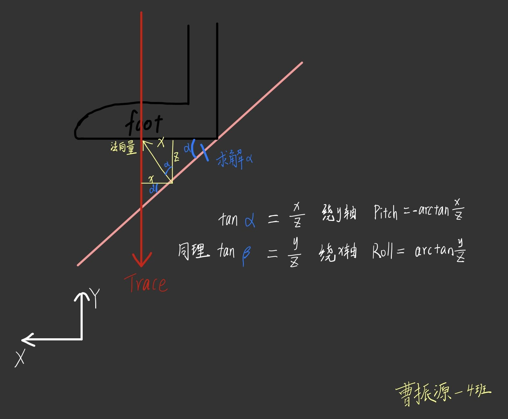
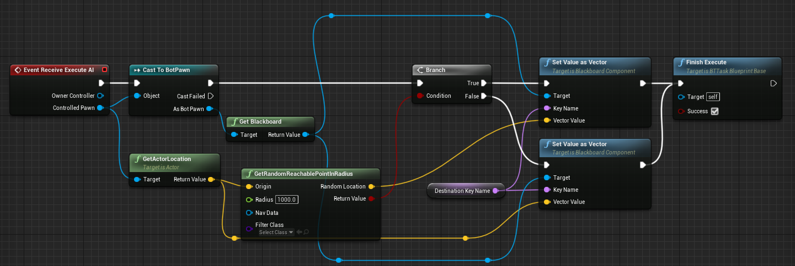

# ShooterGame说明文档

:::info

此项目为"2021腾讯游戏高校公开课"大作品项目说明文档

项目源代码：[gai-zi/ShooterGame: Aurora Studios (github.com)](https://github.com/gai-zi/ShooterGame)

打包游戏链接：https://share.weiyun.com/Lxd5HSw1

:::

:::tip

UE版本：4.26

“如需要进入编辑器或导出应用查看实现效果，请选择'Highrise'地图”

:::

## 游戏模式

### 炮台**使用说明**

 1、玩家贴近炮台，准星对准炮台，按**E键**进入炮台，再按E键退出炮台继续操控原角色

2、**旋转鼠标X轴**，能够旋转炮台朝向方向

3、鼠标左键，发射`BP_Missile`导弹，遇到障碍物或玩家能够爆炸，产生范围伤害

4、使用炮台发射的导弹击杀玩家，能够获得双倍积分


### 题目一

在场景中生成一个炮台

#### 实现效果

创建"BP_Turret"蓝图继承自定义cpp类`ATurret`，置于场景中


#### 解决办法

新建**cpp类 ATurret** 继承自 APawn

头文件声明必要的组件和属性，构造函数定义组件的属性

```cpp
class SHOOTERGAME_API ATurret : public APawn
{
protected:
    UPROPERTY(EditAnywhere,Category=Component)
    UBoxComponent* BoxComponent;
    //最下层底座
    UPROPERTY(EditAnywhere,Category=Component)
    UStaticMeshComponent* Base;
    //可转底座
    UPROPERTY(EditAnywhere,Category=Component)
    UStaticMeshComponent* Base2;
	//发射器
    UPROPERTY(EditAnywhere,Category=Component)
    UStaticMeshComponent* Launcher;
	//相机组件
    UPROPERTY(EditAnywhere,Category=Component)
    UCameraComponent* OurCamera;
    //要生成的发射物蓝图
    TSubclassOf<AShooterProjectile> ProjectileClass;
}
```

BP_Turret蓝图继承此cpp类，将炮台的各个mesh、material赋值，填充新的组件，组件列表如下


- Box Component：盒体碰撞体
  - Base：炮台底部基座
    - Base1：炮台支架，通过旋转此组件实现发射器左右旋转
      - Launcher：发射器，从发射器内发射BP_Missile导弹
      - Our Camera：摄像机组件

### 题目二

炮台可以按照固定频率向固定方向发射炮弹

#### 实现效果

进入炮台后，按鼠标左键能够发射导弹，**间隔时间 1.5s** ；


自定义导弹状发射物**BP_Missile**蓝图，继承自 `AShooter Projectile`，导弹发射和运动能够实现多人同步


#### 解决办法

#### 导弹

自定义蓝图 BP_Missile 继承自 Shooter Projectile 

从网络资源中找到导弹的mesh，新建Static Mesh组件并添加成为BP_Missile的mesh


定义Explpsion Template为ProjRocket_Explosion，添加爆炸粒子效果，当击中物体时产生爆炸


射线检测碰撞，发射一条从基坐标向运动方向的射线，如果触碰到就隐藏Mesh，再跟随根组件一起销毁，避免爆炸完后游戏世界还留有一个空壳炸弹的bug


#### 炮台Pawn控制发射

Turret.h声明必要的属性和方法

```cpp
//控制发射间隔参数
bool bCanFire = true;
float LastFireTime = 0.0f;
float FireRate = 1.5f;
//发射导弹
UFUNCTION()
void Fire();
```

设置鼠标左键按键绑定，绑定Fire()函数

```cpp
PlayerInputComponent->BindAction("Fire",IE_Pressed,this,&ATurret::Fire);
```

构造函数获取导弹蓝图BP_Missile

```cpp
static ConstructorHelpers::FClassFinder<AShooterProjectile> ProjectileBP(TEXT("Blueprint'/Game/Blueprints/Weapons/BP_Missile.BP_Missile_C'"));
if(ProjectileBP.Succeeded())
   ProjectileClass = ProjectileBP.Class;
```

Fire()函数内获取当前发射器旋转和坐标，来定义导弹出生位置的坐标和旋转；

如果条件允许，生成导弹

```cpp
void ATurret::Fire()
{
   if(!bCanFire)  return;
   //获取炮台基座的世界坐标下的旋转
	...//为各个组件的坐标相加，不过多赘述
   FRotator MissileWorldRotator = BaseWorldRotation + Base2WorldRotation;
   FVector MissileWorldLocation = BoxWorldLocation + BaseWorldLocation + Base2WorldLocation + LuncherWorldLocation;
   
   UWorld* World = GetWorld();   
   if(World)
   {
      FActorSpawnParameters SpawnParams;
      SpawnParams.Owner = this;
      SpawnParams.Instigator = GetInstigator();
      if(ProjectileClass)
      {
         AShooterProjectile* Proj= World->SpawnActor<AShooterProjectile>(ProjectileClass,MissileWorldLocation,MissileWorldRotator,SpawnParams);
      }
   }
   bCanFire = false;
   LastFireTime = 0.0f;
}
```

每帧计算当前时间间隔，若超过 1.5s 未发射导弹，将bCanFire置为true，每次发射后在Fire()方法中都会将bCanFire重置为false，重新计时。

```cpp
void ATurret::Tick(float DeltaTime)
{
   Super::Tick(DeltaTime);
   
   if(!bCanFire && LastFireTime <= 1.5f)
   {
      LastFireTime += DeltaTime;
      if(LastFireTime >= 1.5f) bCanFire = true;
   }
}
```

实现发射物按固定间隔1.5s发射导弹

### 题目三

炮弹可以击中角色并产生一定伤害

#### 实现效果

导弹击中敌人产生爆炸效果，同时对敌人造成伤害，伤害值置为50，直接击败敌人


#### 解决办法

通过基类 ShooterProjectile 方法，在发生碰撞后调用Explode()方法产生爆炸效果，并且调用`ApplyRadialDamage`方法造成伤害

```cpp
UGameplayStatics::ApplyRadialDamage(this, WeaponConfig.ExplosionDamage, NudgedImpactLocation, WeaponConfig.ExplosionRadius, WeaponConfig.DamageType, TArray<AActor*>(), this, MyController.Get());
```

### 题目四

玩家可以让角色操控炮台调整左右方向，同时只能一个角色操控

#### 实现效果

能够让玩家操控炮台并左右方向旋转发射器，同时只能有一个角色进入炮台

#### 解决办法

#### 角色控制炮台

ATurret类中定义`CurrentShooterCharacter`，用于存放当前控制自己的角色实例

```cpp
//当前控制此炮台的角色
UPROPERTY(BlueprintReadWrite)
AShooterCharacter* CurrentShooterCharacter;
```

PlayerPawn蓝图中定义：

- PlayerPawn：当前角色的`AShooterCharacter`实例
- PlayerPawnController：当前角色的控制器

按E键，角色从当前相机位置向前发射一条射线，如果碰撞到了Turret，则可以控制该炮台，并且把这个炮台的`CurrentShooterCharacter`赋值为自身


Trace From Camera 方法中发射射线，并且检测是否碰撞的是炮台，将角色蓝图中的Turret赋值，并返回布尔值true


炮台中按E键会让控制器重新控制当前的人物角色`CurrentShooterCharacter`


#### 实现炮台转向

当前炮台拥有两个基座和一个发射器，需要调整左右方向，就需要更改 Base2 的Rotation Z值


在Turret.h中声明TurnRight()方法，将其与鼠标X轴映射绑定，方法代码如下

```cpp
void ATurret::TurnRight(float Value)
{
   //沿着Z轴旋转roll
   float Base2Yaw = Base2->GetRelativeRotation().Yaw;
   if(Value!=0.0f)
   {
      Base2->SetRelativeRotation(FRotator(0.0f,Base2Yaw+Value,0.0f));
   }
}
```

实现左右旋转炮台

### 题目五

玩家操控炮台击中敌方，导致死亡，玩家可以获得双倍积分

#### 实现效果

枪械击杀敌人得分：2分


炮台击杀敌人得分：4分


####  解决办法

在`AShooterCharacter::Die(...)`方法中添加判断，根据Tag判断是否造成伤害的物体为Missile

```cpp
//增加积分并通知死亡事件发生
if(DamageCauser->Tags.Contains(FName("Missile")))
```

如果传入的参数判定为导弹击杀，则将击杀分数乘2

```cpp
KillerPlayerState->ScoreKill(VictimPlayerState, KillScore * 2); 
```

实现操控炮台击败敌方，当前玩家可以获得双倍积分

## UMG界面

### 界面操作

- 按X键呼出3D UI，镜头指向按钮，鼠标右键能够点击3D按钮

- P或Esc键呼出Option菜单

### 题目一

添加一个击杀时醒目UI(屏幕中上方，注意Anchor和Alignment)

#### 实现效果

在玩家击杀一个敌方单位后，屏幕中上方显示击杀图标


#### 解决办法

创建一个继承自UuserWidget的蓝图名为`BP_KillWidget`；

添加Image组件命名为`Kill_Image`；

设定锚点为**正上方**，并给Alignment的X、Y值都赋为**0.5**，保证其在锚点正上方中央位置


在**ShooterHUD.h**中声明蓝图类`KillWidgetClass`

```cpp
/** 击杀后客户端显示的Widget*/
TSubclassOf<UUserWidget> KillWidgetClass;
UUserWidget* KillWidget;
```

在**ShooterHUD.cpp**的构造函数中使用`ConstructorHelpers::FclassFinder`获取到蓝图BP_KillWidget

```cpp
AShooterHUD::AShooterHUD(const FObjectInitializer& ObjectInitializer) : Super(ObjectInitializer)
{
	...
	//获取蓝图资源BP_KillWidget
	static ConstructorHelpers::FClassFinder<UUserWidget> KillWidgetCl(TEXT("WidgetBlueprint'/Game/Blueprints/UI/BP_KillWidget.BP_KillWidget_C'"));
	if(KillWidgetCl.Succeeded())
	{
		KillWidgetClass = KillWidgetCl.Class;
	}
    ...
}
```

在击败敌人后，会调用`AShooterHUD::DrawRecentlyKilledPlayer()`方法，在其中进行保护判断，如果存在`KillWidget`实例则remove，如果不存在就生成实例，将其添加进ViewPort．

```cpp
//创建KillWidget
if(KillWidget)
{
    KillWidget->RemoveFromParent();
    KillWidget = nullptr;
}
if(KillWidgetClass && !KillWidget)
{
    if(AShooterPlayerController* ShooterPC = Cast<AShooterPla yerController>(PlayerOwner))
    {
        KillWidget = CreateWidget<UUserWidget>(ShooterPC,KillWidgetClass);
        if(KillWidget)
        {
            KillWidget->AddToViewport();
        }
    }
}
```

---

### 题目二

为击杀UI添加动画(Fadeln&Out/缩放等均可)

#### 实现效果

题目一中创建的UI在生成后能够FadeOut的效果后消失


#### 解决办法

在`BP_KLillWidget`蓝图中为`Kill_Image`创建Animation，命为"FadeOut_Animation"，添加2个关键帧，定义图片的Alpha值

| 时间（s） | Item          |
| --------- | ------------- |
| 0.00      | Color.A = 1.0 |
| 2.00      | Color.A = 0.0 |

在Event Graph中设定逻辑播放动画，实现FadeOut的效果


---

### 题目三

左上角显示游戏帧数，选项菜单里增加一个选项，作为控制是否显示游戏帧数的开关 

#### 实现效果

在Option选项中添加控制FPS显示的开关，开启后能够在屏幕左上角显示帧数；

选项的数据（包括FPS是否开启显示）会存储在磁盘；

不同客户端会根据自身选项进行显示与否．


#### 解决办法

在**ShooterOptions.h**中声明确定FPS开关的属性和方法

```cpp
/** FPS显示选项*/
TSharedPtr<FShooterMenuItem> FPSOption;	

/** 是否开启FPS显示 */
uint8 bFPSOpt : 1;

/** FPS开关控制器*/
void ToggleFPS(TSharedPtr<FShooterMenuItem> MenuItem, int32 MultiOptionIndex);
```

在`FShooterOptions::Construct()`方法中，在OptionItem中添加一项FPSOption，将ToggleFPS方法绑定到`FOnOptionChanged`代理对象上，当选项被玩家更改后就会调用`SShooterMenuWidget::ChangeOption(int32 MoveBy)`中的`OnOptionChanged.ExecuteIfBound(...)`执行函数`ToggleFPS`．

```cpp
FPSOption = MenuHelper::AddMenuOptionSP(OptionsItem, LOCTEXT("fps", "FPS"), OnOffList, this, &FShooterOptions::ToggleFPS);
```

编写实际运行的**ToggleFPS()**函数，将`bFPSOpt`同步到该客户端的PlayerController的`bFPSEnabled`属性上。其间夹杂`bFPSOpt`、`FPSOption`的默认设置和Get、Set方法的调用不过多赘述．

```cpp
void FShooterOptions::ToggleFPS(TSharedPtr<FShooterMenuItem> MenuItem, int32 MultiOptionIndex)
{
   bFPSOpt = MultiOptionIndex > 0 ? true : false;
   APlayerController* BaseController = Cast<APlayerController>(UGameplayStatics::GetPlayerController(PlayerOwner->GetWorld(), GetOwnerUserIndex()));
    
   AShooterPlayerController* ShooterPlayerController = Cast<AShooterPlayerController>(UGameplayStatics::GetPlayerController(PlayerOwner->GetWorld(), GetOwnerUserIndex()));
    
   ensure(BaseController);
   if(BaseController)
   {
      if (ShooterPlayerController)
      {
         ShooterPlayerController->bFPSEnabled = bFPSOpt;
      }
   }
}
```

当点按 APPLY CHANGES 按钮后，将FPSOption当前index存入UShooterPersistentUser实例对象中，而后`SaveGameToSlot`中用于下次启动游戏加载先前设置．

创建继承自`UUserWidget`的**BP_FPSWidget蓝图**，创建富文本组件命名为`FPSRichText`，蓝图中计算帧数并赋值给`FPSRichText—Content`．


和题目二使用同样方法获取BP_FPSWidget蓝图资源，在`ShooterHUD.cpp`中创建实例，在DrawHUD()方法中根据当前`AShooterPlayerController::bFPSEnabled`正确生成Widget．

```cpp
//显示FPS
if(!FPSWidget)
{
   FPSWidget = CreateWidget<UUserWidget>(MyPC,FPSWidgetClass);    
}
if(FPSWidget->IsInViewport() && MyPC->bFPSEnabled == false)
{
   FPSWidget->RemoveFromViewport();
}
if(!FPSWidget->IsInViewport() && MyPC->bFPSEnabled == true)
{
   FPSWidget->AddToViewport();
}
```

---

### 题目四

将局内的游戏菜单升级为3D UI (WidgetInteractionComponent) ，当菜单显示时，根据玩家位置始终显示在玩家侧前方，且可以正常点击

#### 实现效果

按X键呼出3D UI，并且切换为TPP视角，镜头指向按钮，鼠标右键能够点击3D按钮

实现了3D UI，根据玩家位置始终显示在玩家侧前方，能够正常点击，通过点击3D UI能够在单机模式下播放人物动画


点击进行播放动画


（为了优化原项目TPP视角，将PlayerPawn的各个组件置为新的层级关系，相机组件上添加一个 SpringArm 组件）


（因为原项目UI界面都用HUD实现，时间不够将其全部重写，故实现如上所述的3D UI，未改变升级局内UI）

#### 解决办法

1. 创建一个**widget蓝图**名为 **DanceOption**

   为其添加三个按钮并给每个按钮附着上文字（代表舞蹈的名称）


​		修改按钮的Appearance——Style——Normal、Hovered、Pressed的属性，实现部		分透明的UI控件，更加美观


​		为按钮添加点击事件

2. 为PlayerPawn添加一个**Widget组件**，Widget Class 选定为 **DanceOption** 

   调整其层级关系和相对坐标旋转，置于人物侧前方


3. TPPCamera下添加 **widgetinteraction组件**，设置交互距离

   事件蓝图中使用`Press Pointer Key`节点用鼠标右键模拟左键的按下和释放

   

   实现了角色按X键呼出3D UI且始终显示在玩家侧前方， 并且通过右键点击，进行舞蹈的播放

---

## 基本物理

### 题目一

不同的地面有不同的摩擦力

#### 实现效果

1. 场景内的floor_5_Glass的物理材质被重载为自定义的"M_Glass"

   修改地图此处floor_5_Glass玻璃的物理材质


2. 两个滑块在不同的物理材质表面下滑得到不同的物理效果

   开始下落

   

   结束下落

   

#### 解决办法

自定义的M_Glass的属性如下:


自定义的M_Grass的属性如下:


1. 设置场景中地板floor_5_Glass的物理材质为"M_Glass"


2. 模拟物理后

   - 左边草地附着M_grass物理材质，摩擦力很大，无法平稳下滑

   - 右边草地附着M_glass物理材质，摩擦力为0，能够下滑且速度很快

### 题目二

​	步枪子弹击中垃圾桶，可以把垃圾桶打飞

#### 实现效果

步枪子弹射击垃圾桶，垃圾桶根据不同的受击位置和方向，对应产生被击打的物理效果

击中效果能够多端同步


#### 解决办法

设置垃圾桶物体的一些基本要素

- 给垃圾桶的静态网格体添加简单碰撞
- 设置场景中的实例为"可移动的"
- 勾选"物理——模拟物理"；
- 质量、线性阻尼、角阻尼调整参数
- 为场景中的每个垃圾桶实例添加一个Tag："Trash"

设置组播方法`ProcessTrash()`，处理垃圾桶被子弹击中的效果

```cpp
/** 对垃圾桶做出子弹碰撞反应 */
UFUNCTION(UnReliable,NetMulticast)
void ProcessTrash(const FHitResult& Impact, const FVector& ShootDir);
```

```cpp
void AShooterWeapon_Instant::ProcessTrash(const FHitResult& Impact,const FVector& ShootDir)
{
	Impact.GetComponent()->AddImpulseAtLocation(ShootDir * 5000.0f, Impact.ImpactPoint);
}
```

`AShooterWeapon_Instant::ProcessInstantHit_Confirmed(...)`函数处理子弹射击产生的效果，在其中根据射线返回值判断击中物体的Tag是否包含"Trash"，如果包含则将 HitResult引用和传递方向 ShootDir 传递进方法，并执行

```cpp
void AShooterWeapon_Instant::ProcessInstantHit_Confirmed(const FHitResult& Impact, const FVector& Origin, const FVector& ShootDir, int32 RandomSeed, float ReticleSpread)
{
    ...
	//判断是否击中的为垃圾桶，处理垃圾桶受击反馈
	if(Impact.bBlockingHit)
	{
		if(Impact.GetActor()->Tags.Contains(TEXT("Trash")) 
           && Impact.GetActor()->IsRootComponentMovable())
		{
			ProcessTrash(Impact, ShootDir);
		}
	}
    ...
}
```

---

### 题目三

发射器发射的炮弹，呈抛物线飞行，碰到障碍可以反弹，碰到敌人或者倒计时结束则爆炸

#### 实现效果

角色的炮弹武器，子弹实例能够呈抛物线飞行，倒计时结束时发生爆炸


#### 解决办法

发射器炮弹蓝图继承 AShooterProjectile 类，在其构造函数中修改属性和调参：启用弹力、设置弹性和设置重力

```cpp
AShooterProjectile::AShooterProjectile(const FObjectInitializer& ObjectInitializer) : Super(ObjectInitializer)
{
    ...
    MovementComp->bShouldBounce = true;
	MovementComp->Bounciness = 0.5f;
	MovementComp->ProjectileGravityScale = 0.5f;
    ...
}
```

实现炮弹呈抛物线状发射，并可以在障碍物间反弹，倒计时结束爆炸

---

### 题目四

角色面对墙壁时可以施展蹬墙二段跳，不用表现出蹬墙的动画，只需要满足面对墙壁足够近才能施展这个条件

#### 实现效果

玩家能够在贴近墙体时，能够施展二段跳，且第二跳高度更高


#### 解决办法

玩家类 AShooterCharacter 继承自 ACharacter类，ACharacter类中存在 JumpMaxCount 属性，表示最大跳跃次数

在AShooterCharacter类构造函数中将 `JumpMaxCount `置为2，使角色能够跳跃2次；`bCanDoubleJump`用来判断是否可以进行二段跳

```cpp
/** 是否能进行二段跳 */
UPROPERTY(VisibleDefaultsOnly, Category = Pawn)
bool bCanDoubleJump;

AShooterCharacter::AShooterCharacter(const FObjectInitializer& ObjectInitializer)
	: Super(ObjectInitializer.SetDefaultSubobjectClass<UShooterCharacterMovement>(ACharacter::CharacterMovementComponentName))
{
     ...
    bCanDoubleJump = false;
	JumpMaxCount = 2;
}
```

为场景中的墙体碰撞体积设置Tag为"Wall"

定义`OnHit`函数，将其绑定在多播委托变量OnComponentHit上，根据Tag判断角色的胶囊体是否碰撞了墙体,如果碰撞墙体并且现在进行了第一次跳跃，`bCanDoubleJump = true`，角色可以二段跳

```cpp
/*当角色碰撞物体时会调用的函数。*/
	UFUNCTION()
	void OnHit(UPrimitiveComponent* HitComponent, AActor* OtherActor, UPrimitiveComponent* OtherComponent, FVector NormalImpulse, const FHitResult& Hit);

void AShooterCharacter::BeginPlay()
{
	Super::BeginPlay();

	GetCapsuleComponent()->SetNotifyRigidBodyCollision(true);
	GetCapsuleComponent()->GetBodyInstance()->bNotifyRigidBodyCollision = true;
	GetCapsuleComponent()-> OnComponentHit.AddDynamic(this,&AShooterCharacter::OnHit);
}

void AShooterCharacter::OnHit(UPrimitiveComponent* HitComponent, AActor* OtherActor,
	UPrimitiveComponent* OtherComponent, FVector NormalImpulse, const FHitResult& Hit)
{
	if(JumpCurrentCount == 1 && OtherActor->Tags.Contains("Wall"))
	{
		bCanDoubleJump = true;
	}
}
```

在`OnStartJump()`和`OnStopJump()`方法中定义二段跳的触发条件，并且在第二跳发生时将Z轴速度提高，停止跳跃时将`JumpZVelocity`重置为720.0f

```cpp
void AShooterCharacter::OnStartJump()
{
	AShooterPlayerController* MyPC = Cast<AShooterPlayerController>(Controller);
	if (MyPC && MyPC->IsGameInputAllowed())
	{
		if(JumpCurrentCount == 0)	bPressedJump = true;
		else if(JumpCurrentCount == 1 && bCanDoubleJump)
		{
            GetCharacterMovement()->JumpZVelocity = 1000.0f;
			bPressedJump = true;
		}
	}
}

void AShooterCharacter::OnStopJump()
{
	bPressedJump = false;
	StopJumping();
	if(JumpCurrentCount == 2)
	{
		bCanDoubleJump = false;
		GetCharacterMovement()->JumpZVelocity = 720.0f;
	}
}
```

实现蹬墙二段跳的效果，并且第二条速度更大，使角色能跳上场景中大部分墙体。

---

### 题目五

步枪子弹可以穿过一定厚度的墙，伤害随穿过障碍的厚度递减

#### 实现效果

子弹可以穿墙打击敌人，子弹穿透墙体的伤害会根据在墙体中的移动距离进行衰减

并且在墙体位置仍旧存留弹孔、击中特效等效果


#### 解决办法

在 ShooterWeapon_Instant.h 中声明需要的属性和方法

```cpp
class AShooterWeapon_Instant : public AShooterWeapon
{
    ...
protected:
    /** 子弹穿过墙体递减后的伤害值*/
    UPROPERTY(Replicated)
    int32 AfterDecreaseDamage;

    /** 穿墙是否进行伤害递减*/
    UPROPERTY(Replicated)
    bool bDecreaseDamage;

    /** 处理伤害递减
     * @return 递减后的值
     */
    void DamageDecrease(float CrossLength);
    
    /*判断墙后是否存在Pawn，有的话返回被击中Pawn的HitResult，没有的话返回击中物体*/
FHitResult HavePawnBackWall(const FHitResult& Impact, const FVector& Start, const FVector& End, const FVector& ShootDir);
    ...
}
```

定义`FHitResult HavePawnBackWall(...)`函数,用于判断子弹是否穿过墙体击中了敌人。

1. 从玩家枪口方向**发射一条射线**，定义碰撞通道为OverLap（为了确保Overlap射线检测正确，射线忽略了地图中一些体积，比如`AudioTrigger_Atrium`），防止碰到第一个实体停止检测

2. 根据射线获得的**HitResult数组**，(纯OverLap通道会多次重叠自身的组件和本身)遍历数组先获得需要排除的自身个数SelfNum

3. 根据标签判断下一个重叠的是否是墙体，如果是则继续判断下一个重叠的是否为Pawn

4. 如果为真则从击中pawn的位置反向发射射线

5. 多个Hit结果中可以提取出来穿透墙体的前后两点：击中墙体的位置、反向射线击中墙体的位置，做差，得出`CrossLength`为穿过的长度

   （图中为Debug出穿透的墙体的前后两点，用两个黄点表示出来）


使用公式 $AfterDecreaseDamage = HitDamage - CrossLength / 10.0f$ 

将伤害衰减后存入`AfterDecreaseDamage`，为负则不行进伤害判定

```cpp
FHitResult AShooterWeapon_Instant::HavePawnBackWall(const FHitResult& Impact, const FVector& Start, const FVector& End, const FVector& ShootDir)
{
	TArray<FHitResult> Hits;
	//Trace遍历子弹路径中穿过的物体
	UKismetSystemLibrary::LineTraceMulti(
GetWorld(),Start,End,UEngineTypes::ConvertToTraceType(ECC_GameTraceChannel4),true,ActorsToIgnore,EDrawDebugTrace::None,Hits,true,FLinearColor::Blue,FLinearColor::Red,20.0f
   );
	int SelfNum = 0;
	//检测到几个自己，确定SelfNum值
	for(int i=0;i<Hits.Num();i++)
	{
		//前序碰到的都是自己
		if(!Hits[i].GetActor()->GetName().Compare(this->GetPawnOwner()->GetName()))
		{
			SelfNum++;
		}
		else
			break;
	}
	//检测是否直接击中墙体，若无直接返回原Hit结果
	if(Hits.Num() >= SelfNum-1)
		if(!Hits[SelfNum].GetActor()->Tags.Contains(TEXT("Wall")))
		{
			return Impact;
		}
	if(Hits.Num() >= SelfNum)
		if(Hits[SelfNum + 1].GetActor()->Tags.Contains(TEXT("Player")))
		{
			//UE_LOG(LogTemp,Warning,TEXT("Get Actor!!!"));
			FHitResult Hit; 
			//从击中敌人Pawn的位置向出发点发射Trace，	HitTrace即可
			GetWorld()->LineTraceSingleByChannel(Hit, Hits[SelfNum+1].Location, Start, COLLISION_WEAPON);
			//做差，从而得出子弹穿过墙体的长度
		DamageDecrease(FVector::Distance(Hits[SelfNum].Location,Hit.Location));
			bDecreaseDamage = true;
			return Hits[SelfNum + 1];
		}
	if(AfterDecreaseDamage <= 0.0f)
	{
		bDecreaseDamage = false;
		return Impact;
	}
	return Impact;
}
```

`AShooterWeapon_Instant::DealDamage`中判断是否进行伤害递减，进行伤害最终传入

```cpp
void AShooterWeapon_Instant::DealDamage(const FHitResult& Impact, const FVector& ShootDir)
{
   FPointDamageEvent PointDmg;
   PointDmg.DamageTypeClass = InstantConfig.DamageType;
   PointDmg.HitInfo = Impact;
   PointDmg.ShotDirection = ShootDir;
    
   if(InstantConfig.bDecreaseDamage)
      PointDmg.Damage = InstantConfig.AfterDecreaseDamage;
   else
      PointDmg.Damage = InstantConfig.HitDamage;

   //处理伤害
   Impact.GetActor()->TakeDamage(PointDmg.Damage, PointDmg, MyPawn->Controller, this);
}
```

在`AShooterWeapon_Instant::FireWeapon()`中，判断第一次射线和`HavePawnBackWall()`的返回值是否为一个Hit结果

- 如果两个Hit值相等，则没发射穿墙事件
- 否则发生穿墙事件，在原Impact击中位置生成打击效果

```cpp
const FHitResult Impact = WeaponTrace(StartTrace, EndTrace);
/*查询墙后是否有pawn*/
FHitResult FinalImpact = HavePawnBackWall(Impact,StartTrace,EndTrace,ShootDir);

//墙面依旧留下弹痕
if(Impact.IsValidBlockingHit() && FinalImpact.IsValidBlockingHit())
   if(Impact.GetActor()->GetName().Compare(FinalImpact.GetActor()->GetName()))
   {
      if (GetNetMode() != NM_DedicatedServer)
      {
         SpawnImpactEffects(Impact);
      }
   }
```

实现子弹穿墙打击敌人，子弹穿透墙体的伤害能够根据在墙体中移动的距离进行衰减，墙上仍产生弹孔

---

## 骨骼动画

### 操作说明

1、Ctrl+1/2/3播放三种不同的舞蹈动画

2、X键呼出3D UI，瞄准按钮并点按鼠标右键，能够在单机模式下播放人物动画

3、按Z能够使角色蹲下

### 题目一

按键（ctrl+数字键）可以触发角色不同的表演动作

#### 实现效果

Ctrl+1/2/3播放三种不同的舞蹈动画，并自动切换第三人称


X键呼出3D UI，瞄准按钮并点按鼠标右键，能够在单机模式下播放人物动画


#### 解决办法

##### 修复原项目bug

先修复了原项目出现的bug，第三人称可视第一人称手臂mesh、无法看到第三人称枪械

AShooterCharacter::UpdatePawnMeshes()中添加逻辑判定，在不同模式下，隐藏不需要的人物和枪械mesh

```cpp
void AShooterCharacter::UpdatePawnMeshes()
{
	bool const bFirstPerson = IsFirstPerson();

	//TPP不需要看见人物mesh和枪械mesh
...
	if( this->IsLocallyControlled() == true )
	{
		//切换武器可见性
		if(Inventory.Num()>=2)
		{
			for (int32 i = 0; i < Inventory.Num(); i++)
			{
				if(Inventory[i])
				{
					Inventory[i]->Mesh1P->SetOwnerNoSee(!bFirstPerson);
					Inventory[i]->Mesh3P->SetOwnerNoSee(bFirstPerson);
				}
			}
		}
	}
...
}
```

又通过添加SprinArm和调节一下组件层级关系，修复了第三人称视角怪异的bug

##### 动画素材格式转换

使用Mixamo_Converter软件，获取体重提供的角色3D模型，将其导入到Mixamo网站

选择3种舞蹈动画进行下载，再使用Mixamo_Converter软件将下载的fbx准换为UE4可以使用的格式

将转换好后的动画素材导入到UE4中，为官方小白人模型的动画


##### 骨骼重定向

重定向原项目人物骨骼，对比两个骨骼位置，全部手动添加并调试

(花费了大量时间😭，不一一列举)


再将骨骼节点的 Translation Retarget 选项慢慢调试：为动画或骨骼


经过漫长的调参，尽量保证重定向后骨骼动画不至于拉伸严重

最后终于到了重定向骨骼的一步


得到相对较好的动画资源

将动画资源转为Montage，并且Slot设置为Full Body，并且改为根骨骼移动(防止mesh和collision不在一个位置)

##### 设置输入、播放动画

cpp中使蓝图能够调用`TogglePerspective()`，从而调节TPP和FPP视角；

```cpp
UFUNCTION(BlueprintCallable)
void TogglePerspective();

UPROPERTY(BlueprintReadWrite)
bool IsFPP;
```

在人物蓝图中设置输入并播放动画

输入事件在Dance中播放Montage，并且在播放中禁止任何输入(防止出现边跳舞边开枪的bug)delay相应的跳舞时间后启用输入操作

整体蓝图如下所示


Dance方法实现如下，设置必要的状态参数，并且在播放动画时自动切换第三人称


实现了按键播放人物动画，3D UI 启用动画在UMG中有详细解释

### 题目二

主角静止无输入5秒之后进入idle休闲动画，如耸肩、挠头等

#### 实现效果

主角静止无输入5秒之后进入耸肩动画，同一无操作间隔内只进行一次，且不会与其他动画冲突


#### 解决办法

同题目一步骤制作蒙太奇**耸肩动画**


Tcik计时，无数入进行5秒后，播放耸肩动画，有输入就停止播放

- 跳舞时间内不会播放耸肩动画
- 下蹲时不会播放


### 题目三

蹲姿及其配套的基础移动动作

#### 实现效果

（动画重定向，手臂位置拉伸太大，功能都已实现，动画不适配的bug还未能修复😭）

人物按Z键能够实现蹲姿，同时减慢移动速度和减少胶囊体半高


#### 解决办法

人物移动组件Character movement 中勾选**can crouch** ✔️

修改**移动速度**

（漫长的找素材过程，很遗憾骨骼重定向后人物手臂位置拉伸还是很严重）

通过蹲姿前进、后退、左移、右移等动画制作**混合空间**，设置横纵轴的参数和范围，横轴用来确定方向，纵轴对应人物移动速度


**人物事件蓝图**中设置**按键Z进行下蹲**，并相应的改变FPP相机高度和胶囊体半高


动画蓝图中新建**Crouch状态机**，Entry直连Crouch状态，设置对应的输入值


将原动画缓存为 SavedPose_OriginMovement ，Crouch状态机缓存为 SavedPose_Crouch ，使用波尔值Is Crouch和Blend Poses by Bool节点Blend动画

​	

实现按Z轴切换蹲姿和站立，不同方向的混合移动动画

### 题目四

停步动作，并优化其衔接表现

#### 实现效果

添加跑动结束停步动画

#### 解决办法

导入两只脚的停步动画

定义变量Is Right Foot 用于判断当前为哪只脚准备着地

在跑步动画关键帧中设置Notify事件RightFoot、LeftFoot


在动画蓝图中用Notify事件给Is Right Foot 赋值


在状态机中添加一个状态,并设置相应的转换条件，当Speed<100.0f时进入动画


（导入的动画和跑步动画不适配，表现比较僵硬）

### 题目五

脚部的IK功能

#### 实现效果

实现**脚步IK功能**，人物踏入不同高度的地面脚部会放置在不同高度（稍微有些内八）


并且脚面能够进行**旋转，从而贴合地面**


#### 解决办法

在角色左右脚骨骼添加插槽名为"`LeftFootSocket`"、"`RightFootSocket`"，为了后续获得此点的坐标信息；


构造函数中确定部分定义变量的值

- `Scale`：角色比例
- `Foot Offset`：脚部插槽位置和脚底位置的差，用于解决脚部骨骼的位置并不在脚后跟的下面导致的脚步下陷问题
- `Capsule Half Height`：初始胶囊体半高，用于后续修改胶囊体半长，防止角色上方空出碰撞部分


通过射线检测，确定角色脚部需要抬高的偏移量，从而确定角色的脚实际应该摆放的位置。

角色蓝图中 PlayerPawn 中声明并定义`IK Foot Trace`方法，输入插槽名称和射线长度`TraceDistance`，世界坐标下向脚步下方插槽位置发射一条垂直射线，并返回`IKOffset`(脚部偏移量)


角色Event Graph中， Event Tick 调用`IK Foot Trace`方法，将返回值Lerp后存入`IKoffsetRightFoot`、`IKoffsetLeftFoot`(插值左右脚实际该偏移的长度)中，使值平滑变动。 


获得了上述变量值，进而在动画蓝图中使用两个**Two Bone IK**节点，设置两个节点的`IKBone`、`Effector`、`Joint Target`，确保坐标空间为`Bone Space`,图中展示右脚部分的设置，左脚同理


在动画蓝图中定义`RightFootEffectorLocation`、`LeftFootEffectorLocation`，根据之前求出的左右脚偏移量，将其作为X值，赋值`RightFootEffectorLocation`、`LeftFootEffectorLocation`，根据左右脚的坐标系不同，确定两个变量的X值正负（因为根据的坐标系是基于左右脚的，脚部竖直向上位移的时候，变化的是Effector Location—X轴，并且左右脚还是相反的）


---

**解决角色被碰撞体挡住，不能进行脚步IK问题：**

在碰撞体宽度大的情况下，物体骨骼无法到达下一台阶的位置，也无法使用实现IK，通过**把整体骨骼拉到下一级台阶，同时缩小胶囊体的半高**解决

定义`Mesh Offset Z`变量，其值通过左右脚偏移量做差取绝对值负数获得，从而确定整体骨骼向下的偏移量，使用Transform(Modify) Bone节点将整体骨骼位置拉低，节点控制根骨骼在世界坐标的偏移。


拉低根骨骼的同时，人物上方会空出碰撞区域，同时根据`Mesh Offset Z`将碰撞体半场高修改解决问题


---

**解决脚部插槽高度与脚底高度不同，脚陷入问题：**

在脚底新建插槽，计算插槽与脚部插槽的高度差值`FootOffset`，在偏移量中加入此值，解决脚部有点陷入地面问题

---

**实现脚面贴合不同角度平面：**

在动画蓝图中添加两个`Transform（Modify）Bone`节点，用来更改左右脚的`Rotation`，将其分别关联在两只脚的骨骼上，并且在世界坐标下旋转


根据射线HitResult的法向量信息，求解脚部该旋转的Rotator




将值赋给`Transform（Modify）Bone`节点的Rotation，实现脚面贴合不同角度平面


整体动画蓝图


---

## 渲染基础

### 题目一

使用标准材质，把场景地面修改为砖块或木板等均可

#### 实现效果

将地图中一块地面的材质修改为橡木板材质


#### 解决办法

将此地板的材质—Element2替换为初学者内容包的M_Wood_Oak


---

### 题目二

使用标准材质，把枪械修改为金属

#### 实现效果


#### 解决办法

- 将武器的主体材质替换为标准材质`M_Metal_Burnished_Steel`金属材质;

- 武器瞄准镜部分替换为标准材质`M_Metal_Steel`金属材质;


### 题目三

添加一种后处理效果

#### 实现效果

自定义玻璃材质，修改静态网格体 MainHall_WallGrass_05 的材质，实现屏幕空间反射的后处理效果


#### 解决办法

新建材质Glass，设置参数基础颜色、metallic和粗糙度


生成实例Glass_Inst，赋值颜色为灰色


再生成实例Glass_Inst_Inst并赋值颜色Metallic为1.0，实现屏幕空间反射效果


### 题目四

使用材质编辑器，添加至少一种自定义材质，比如枪械上的UV动画

#### 实现效果

1. 将两种枪械的瞄准镜部分添加了UV动画，使枪械表面产生流动的效果


2. 自定义半透明材质，物体穿过会将轮廓绘制并描绘出亮边


将材质实例应用到Cube上囊括玩家出生点房间，子弹射线不会检测到其中的玩家，但是玩家能够正常穿过这道门，实现**保护玩家在出生点不受外部子弹伤害**的一种机制


#### 解决办法

1. 在武器材质蓝图中，给枪械瞄准镜部分纹理添加Panner节点，速度X设置为0.1，从而实现流动效果


2. 新建自定义材质，命名为**"Transparency"**

   - 混合模式 为 "半透明"
   - 着色模型 为 "无光照"

   材质蓝图中创建各节点和参数并连接

   

   生成材质实例，并在实例中将各个参数启用并赋值

   - Depth：亮边宽度
   - Color：原色
   - Depth_Color：高亮颜色

   

   实现如下效果

   

   最后将材质添加到Cube上，Cube囊括玩家出生地，当有玩家穿过能够高亮轮廓，外面的子弹无法打进出生地，实现一种出生保护机制。

### 题目五

结合游戏玩法丰富技能特效，比如开火、击中或爆炸特效等

#### 实现效果

被击杀的玩家能够不是直接消失，而是先实现消融的材质特效再销毁


#### 解决办法

在人物材质的Blend Mode置为Masked，修改并赋值`EmissiveColor`、`OpacityMask`节点，将Value参数控制溶解程度，编写材质函数Sine_remapped、MF_Appearacne和材质蓝图，调参实现溶解效果


Sine_remapped材质函数


MF_Appearacne材质函数


基于此材质生成材质实例 HeroTPP_Inst，将Pawn的材质替换；

在ShooterCharacter.h中声明函数`LetPawnDissolve()`，使其控制溶解速度

```cpp
public:
	UFUNCTION(BlueprintImplementableEvent)
		void LetPawnDissolve();
```

蓝图中重写`LetPawnDissolve`，延迟五秒后，使用TimeLine实现材质参数根据定义的时间线变化。


人物死亡时调用OnDeath()函数，所以在cpp `AShooterCharacter::onDeath()`函数中调用蓝图方法LetPawnDissolve()

```cpp
void AShooterCharacter::OnDeath(...){
	...
	LetPawnDissolve();
	...
}
```

实现人物在死亡后，出现缓慢溶解的特效，再销毁物体


---

## AI技术介绍

### 题目一

通过设置NavMeshBoundsVolume生成地图的导航网格

#### 实现效果

通过构建网格体边界体积（Navigation Mesh Bounds Volume），实现地图的导航网格


#### 解决办法

添加**寻路网格体边界体积（Navigation Mesh Bounds Volume）**

解决寻路网格体在高度上绘制出现偏差问题，调整绘制寻路网格体的高度偏移将`RecastNavMesh-Common ———— Draw offset `设置为10.0f

### 题目二

基于生成的导航网格让角色从两点间自动寻路

#### 实现效果

AI角色能够在两点间自动寻路，在到达一个目标点后延迟3秒


#### 解决办法

在BotPawn的事件蓝图中添加MoveToA、MoveToB自定义事件，使用`AI Move To`节点，互相调用事件，实现AI角色从A坐标和B坐标基于导航网格来回移动寻路。


### 题目三

在UE4中创建黑板，行为树以及行为树装饰器

#### 实现效果

为AI角色创建黑板、行为树及装饰器等等

AI角色主要有三种行为：

1. 填充弹药：寻找最近子弹位置，移动到最近的子弹填充处进行子弹填充
2. 发现敌人并攻击：如果视野内存在敌人，追逐敌人并攻击
3. 未发现敌人/闲置状态：随机选定巡逻点并移动，实现随机巡逻


黑板关键帧

- Enemy`(Object)`：当前目标敌人，基类ShooterCharacter
- NeedAmmo`(Bool)`：是否需要子弹，用于判定AI角色子弹是否充裕
- Destination`(Vector)`：当前的目的地，可以是追逐玩家的位置、随机巡逻点或子弹填充地
- SelfActor`(Object)`：自己
- HasPlayerInSight`(Bool)`：在AI角色视线内是否存在敌人


#### 解决办法

后续题目将会相应部分的实现进行解释

### 题目四

使用行为树的基本节点（选择器、序列节点、平行节点等）以及角色移动组件实现NPC追逐玩家的任务

#### 实现效果

AI角色在感知并发现敌人后，能够对发现目标进行追逐并攻击


#### 解决办法

由根连接一个Selector，其上挂载`BotSearchEnemyLOS`和`Shoot An Enemy`两个服务


- BotSearchEnemyLOS服务：间隔0.5s，调用ShooterAIController中的cpp方法，找到距离最近的Enemy并且给黑板键`Enemy`赋值，将其设置为当前目标

- BotShooeEnemy服务：调用`AShooterAIController::ShootEnemy()`，根据黑板健`Enemy`、敌人是否存活、当前弹药值等条件判断是否能够进行射击，并且赋值`bCanShoot`变量，间隔0.5s发射子弹

  ```cpp
  void AShooterAIController::ShootEnemy()
  {
  	...
     bool bCanShoot = false;
     AShooterCharacter* Enemy = GetEnemy();
     if ( Enemy && ( Enemy->IsAlive() )&& (MyWeapon->GetCurrentAmmo() > 0) && ( MyWeapon->CanFire() == true ) )
     {
        if (LineOfSightTo(Enemy, MyBot->GetActorLocation()))
        {
           bCanShoot = true;
        }
     }
     if (bCanShoot)
     {
        MyBot->StartWeaponFire();
     }
     else
     {
        MyBot->StopWeaponFire();
     }
  }
  ```

如果黑板的键`Enemy`已设置并且AI感知到敌人在视野之内，说明**发现敌人**，将进入到攻击序列Attack Sequence

在Find Point Near Enemy 任务中找到最近的敌人附近的位置，更新黑板的`Destination`值，**获得AI角色该到达的<u>目的地</u>**(敌人附近)

Move To Enemy 任务**跟随**并攻击玩家，直至玩家死亡。


### 题目五

基于行为树和AI感知组件实现随机巡逻任务

#### 实现效果

(原项目只要地图中存在玩家，就会自动寻路找到玩家并攻击)

AI角色在没有感知到敌人时，进行随机巡逻，当视线内出现敌人后才开始进行攻击和追逐行为


#### 解决办法

行为树中添加新的序列用于随机巡逻，添加两个**装饰器**(继承于BT装饰器蓝图基础)

1. **RandomDes装饰器**：用于找寻随机点，让AI角色进行随即巡逻

​	根据Actor位置，连接`GetRandomReachablePointInRadius`节点，将返回值赋给Destination黑板键后完成执行



2. **FindPlayer装饰器**：重写Perform Condition Check AI，将BotPawn中的`Is Find Player`赋值给黑板键`Is Find Player`


将FindPlayer装饰器添加进攻击敌人的选择器中，如果视线内不存在敌人则不会进行攻击序列

为玩家角色蓝图添加**AI感知刺激源组件**

给AI角色添加**AI感知组件**：视觉感知器官，对参数进行修改，归属检测全部选中


定义`On Target Perception Updated`，如果感知到敌方并且为玩家，则设置Is Find Player为true


实现AI通过视觉发现目标后去追随目标并进入攻击序列