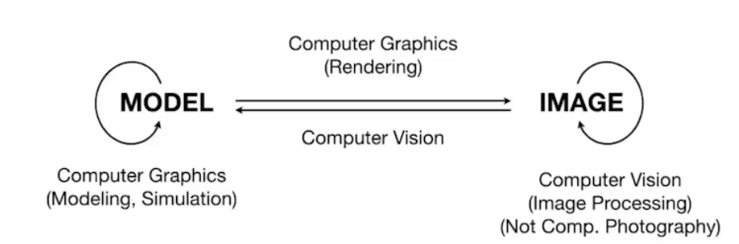

# OverView of Computer Graphics

:::tip

什么是好的游戏画面？

画面是否足够亮？对应全局光照是否足够。

:::

## 图形学应用领域

- Video Games
- Movies
- Animations
- Design : Autodesk Gallary
- Visualization : Science, engineering, medicine, journalism, etc
- Virtual Reality(VR) 虚拟现实
- Augmented Reality(AR) 增强现实
- Digital illustration 数码插画
- Simulation : Black hole, The Dust Bowl phenomena
- Graphical User Interfaces
- Typography 印刷术 : "The Quick Brown Fox Jumps Over The Lazy Dog"

## Technical Challenges

- Math of (perspective) projections, curves, surfaces
- Physics of lighting and shading
- Representing / operating shapes in 3D
- Animation / simulation
- 3D graphics software programming and hardware

## Rasterization 光栅化

:::info

> "把三位空间的几何形体显示在屏幕上"

[光栅化（Rasterization）](https://baike.baidu.com/item/光栅化/10008122?fr=aladdin)是把顶点数据转换为片元的过程，具有将图转化为一个个[栅格](https://baike.baidu.com/item/栅格/7368256)组成的图象的作用，特点是每个元素对应帧缓冲区中的一像素。

:::

实时图形学(达到30fps)利用光栅化

## Curves and Meshes 

如何表示光滑的曲线？曲面？如何使用简单的曲线根据细分获得复杂的曲面？如何保持物体的[拓扑结构](https://baike.baidu.com/item/拓扑结构)？

## Ray Tracing

Trade Off(权衡)如何达到实时的效果并且和光栅化一样快？ —— 实时光线追踪

## CG和CV的区别

- CG 计算机图形学：描述形体、模型、材质、光照等结合编程一张image
- CV 计算机视觉：如何根据image识别出是什么模型

## HomeWork

