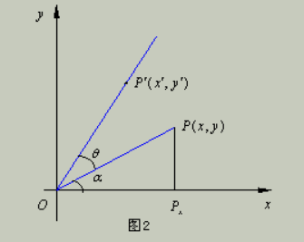

# OverView

:::tip

什么是好的游戏画面？

画面是否足够亮？对应全局光照是否足够。

:::

## 图形学应用领域

- Video Games
- Movies
- Animations
- Design : Autodesk Gallary
- Visualization : Science, engineering, medicine, journalism, etc
- Virtual Reality(VR) 虚拟现实
- Augmented Reality(AR) 增强现实
- Digital illustration 数码插画
- Simulation : Black hole, The Dust Bowl phenomena
- Graphical User Interfaces
- Typography 印刷术 : "The Quick Brown Fox Jumps Over The Lazy Dog"

## Technical Challenges

- Math of (perspective) projections, curves, surfaces
- Physics of lighting and shading
- Representing / operating shapes in 3D
- Animation / simulation
- 3D graphics software programming and hardware

## Rasterization 光栅化

:::info

> "把三位空间的几何形体显示在屏幕上"

[光栅化（Rasterization）](https://baike.baidu.com/item/光栅化/10008122?fr=aladdin)是把顶点数据转换为片元的过程，具有将图转化为一个个[栅格](https://baike.baidu.com/item/栅格/7368256)组成的图象的作用，特点是每个元素对应帧缓冲区中的一像素。

:::

实时图形学(达到30fps)利用光栅化

## Curves and Meshes 

如何表示光滑的曲线？曲面？如何使用简单的曲线根据细分获得复杂的曲面？如何保持物体的[拓扑结构](https://baike.baidu.com/item/拓扑结构)？

## Ray Tracing

Trade Off(权衡)如何达到实时的效果并且和光栅化一样快？ —— 实时光线追踪

## CG和CV的区别

- CG 计算机图形学：描述形体、模型、材质、光照等结合编程一张image
- CV 计算机视觉：如何根据image识别出是什么模型

## 基本运算

### 三角函数

> C++内置函数的返回值是**弧度**，要先把角度$a$换成弧度，弧度$=a*\pi/180.0$

| 角α    | 0°   | 30°  | 45°  | 60°  | 90°  | 120° | 135°  | 150°  | 180° | 270° | 360° |
| ------ | ---- | ---- | ---- | ---- | ---- | ---- | ----- | ----- | ---- | ---- | ---- |
| 弧度制 | 0    | π/6  | π/4  | π/3  | π/2  | 2π/3 | 3π/4  | 5π/6  | π    | 3π/2 | 2π   |
| sinα   | 0    | 1/2  | √2/2 | √3/2 | 1    | √3/2 | √2/2  | 1/2   | 0    | -1   | 0    |
| cosα   | 1    | √3/2 | √2/2 | 1/2  | 0    | -1/2 | -√2/2 | -√3/2 | -1   | 0    | 1    |
| tanα   | o    | √3/3 | 1    | √3   | -    | -√3  | -1    | -√3/3 | 0    | -    | 0    |

### 平面点旋转公式

假设一任意点$A(x,y)$,绕一个坐标点$O(x_0,y_0)$逆时针旋转$\alpha$角度后新的坐标设为(x_1,y_1)：
$$
\begin{cases}
x_1 = (x-x_0)*cos(\alpha)-(y-y_0)*sin(\alpha)+x_0\\
y_1 = (x-x_0)*sin(\alpha)-(y-y_0)*cos(\alpha)+y_0
\end{cases}
$$
绕原点$O(0,0)$逆时针旋转$\alpha$公式为
$$
\begin{cases}
x_1 = x*cos(\alpha)-y*sin(\alpha)\\
y_1 = x*sin(\alpha)-y*cos(\alpha)
\end{cases}
$$

