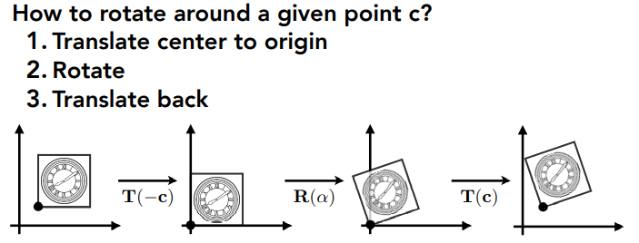

# Transformation

- 2D transformations : rotation, scale,shear(错切)
- Homogeneous coordinates(齐次笛卡尔坐标)
- Composing transforms(组合变换)
- 3D transforms

## Linear Transforms 线性变换

$$
x'=ax+by\\
y'=cx+dy
$$

$$
\left[
\begin{matrix}
x'\\
y'
\end{matrix}
\right]
=
\left[
\begin{matrix}
a & b\\
c & d
\end{matrix}
\right]

\left[
\begin{matrix}
x\\
y
\end{matrix}
\right]
$$

$$
x'=Mx
$$

### Scale

#### Scale Matrix 缩放矩阵

**均匀缩放**
$$
\left[
\begin{matrix}
x'\\
y'
\end{matrix}
\right]
=
\left[
\begin{matrix}
s & 0\\
0 & s
\end{matrix}
\right]

\left[
\begin{matrix}
x\\
y
\end{matrix}
\right]
=
(sx,sy)
$$
**非均匀缩放**
$$
\left[
\begin{matrix}
x'\\
y'
\end{matrix}
\right]
=
\left[
\begin{matrix}
s_x & 0\\
0 & s_y
\end{matrix}
\right]

\left[
\begin{matrix}
x\\
y
\end{matrix}
\right]
$$

#### Reflection Matrix 镜像矩阵

Horizontal relection : 
$$
\left[
\begin{matrix}
x'\\
y'
\end{matrix}
\right]
=
\left[
\begin{matrix}
-1 & 0\\
0 & 1
\end{matrix}
\right]

\left[
\begin{matrix}
x\\
y
\end{matrix}
\right]
=
(-x,y)
$$

#### Shear Matrix 切变矩阵

:::tip

切变：切边是图像非均匀拉伸，但是图像的面积和体积都没变

:::

y坐标无变化，x坐标随高度y进行不同程度的增加
$$
\left[
\begin{matrix}
x'\\
y'
\end{matrix}
\right]
=
\left[
\begin{matrix}
1 & a\\
0 & 1
\end{matrix}
\right]

\left[
\begin{matrix}
x\\
y
\end{matrix}
\right]
=
(x+ay,y)
$$

### Rotate

图像绕<u>**原点**，**逆时针**</u>旋转$\theta$

**推导$R_\theta$旋转矩阵：**

$$
R_\theta
=
\left[
\begin{matrix}
cos\theta & -sin\theta \\
sin\theta & -cos\theta
\end{matrix}
\right]
$$

## Homogeneous coordinates 齐次坐标

:::tip

引入齐次坐标的意义：

- **平移操作不能转化为矩阵形式**，需要一种方法来统一变换操作->把平移操作转化为线性变化
- 用来明确区分向量和点,同时也更易用于进行仿射(线性)几何变换

:::

**增加一个维度**

- **2D Point$=(x,y,1)^T$**

  

  **齐次坐标中的point：**$\left[
  \begin{matrix}
  x\\
  y\\
  w
  \end{matrix}
  \right]$​is the 2D point $\left[
  \begin{matrix}
  x/w\\
  y/w\\
  1
  \end{matrix}
  \right]$​ ,$w\neq0$

- **2D Vector$=(x,y,0)^T$**

  增加的维度设置为0，当进行下方的矩阵相乘时，得到的结果为$\left[
  \begin{matrix}
  x\\
  y\\
  0
  \end{matrix}
  \right]$，保证向量不变

使w值为0/1能够保证如下情况：

1. vector + vector = vector

2. point - point = vector

3. point + vector = point

4. point + point = 表示2个点的中点

   > $(x_1,y_1,1)^T + (x_2,y_2,1)^T = (x_1+x_2,y_1+y_2,2)^T= (\frac{x_1+x_2}{2},\frac{y_1+y_2}{2},1)^T$

### 平移—矩阵形式表示

$$
\left[
\begin{matrix}
x'\\
y'\\
w'
\end{matrix}
\right]
=
\left[
\begin{matrix}
1 & 0 & t_x\\
0 & 1 & t_y\\
0 & 0 & 1
\end{matrix}
\right]

\left[
\begin{matrix}
x\\
y\\
1
\end{matrix}
\right]
=
\left[
\begin{matrix}
x+t_x\\
y+t_y\\
1
\end{matrix}
\right]
$$

## Affine Transformations 仿射变换

- 使用齐次坐标把不同的变换，**统一**成一种表现形式

  **代价**：增加一个维度

- Affine map = linear map + translation

  仿射变换=线性变换+平移（存在顺序：**先线性变换，再平移**）

### 齐次坐标表示

$$
\left[
\begin{matrix}
x'\\
y'\\
1
\end{matrix}
\right]
=
\left[
\begin{matrix}
a & b & t_x\\
c & d & t_y\\
0 & 0 & 1
\end{matrix}
\right]

\left[
\begin{matrix}
x\\
y\\
1
\end{matrix}
\right]
$$

### 2D Transformations 变换

> 第三列$t_x,t_y$非零，表示出现平移操作

#### Scale

$$
S(s_x,s_y)=
\left(
\begin{matrix}
s_x & 0 & 0\\
0 & s_y & 0\\
0 & 0 & 1
\end{matrix}
\right)
$$

#### Rotation

$$
R(\alpha)=
\left(
\begin{matrix}
cos\alpha & -sin\alpha & 0\\
sin\alpha & -cos\alpha & 0\\
0 & 0 & 1
\end{matrix}
\right)
$$

#### Translation 平移

$$
T(t_x,t_y)=
\left(
\begin{matrix}
1 & 0 & t_x\\
0 & 1 & t_y\\
0 & 0 & 1
\end{matrix}
\right)
$$

## Inverse Transform 逆变换

$$
M^{-1}
$$

**在矩阵和几何意义上，$M^{-1}$是M的逆变换**

## Composite Transform 组合变换

> e.g. 如何进行下列变换？

**注意变换顺序**：**旋转**后**平移**

**矩阵的应用**：**从右到左**
$$
T_{(1,0)} \cdot R_{45}\left[\begin{matrix}x\\y\\1\end{matrix}\right]
=
\left[\begin{matrix}1 & 0 & 1\\0 & 1 & 0\\0 & 0 & 1\end{matrix}\right]
\left[\begin{matrix}cos45^\circ & -sin45^\circ & 0\\sin45^\circ & -cos45^\circ & 0\\0 & 0 & 1\end{matrix}\right]
$$

### 结合变换

有一系列仿射变换矩阵$A_1,A_2,A_3,...,A_n$，对一点进行变换操作，根据**结合律**可以把**多变1**
$$
A_n(A_2(A_1(x))) = A_n\cdots A_2\cdot A_1\cdot \left(\begin{matrix}x\\y\\1\end{matrix}\right)
$$

### 分解变换

> e.g. 如何绕给定点$c$进行旋转
>
> - 将图形平移至原点
> - 旋转
> - 平移back
>
> $T(c)\cdot R(\alpha)\cdot T(-c)$

## 3D Transforms

- 3D Point $=(x,y,z,1)^T$

  $\left[\begin{matrix}x\\y\\z\\w\end{matrix}\right]$is the 3D point $\left[\begin{matrix}x/w\\y/w\\z/w\\1\end{matrix}\right]$ ,$w\neq0$

- 3D Vector $=(x,y,z,0)^T$

### 3D仿射变换

4X4矩阵表示变换
$$
\left[\begin{matrix}x'\\y'\\z'\\1\end{matrix}\right]
=
\left[\begin{matrix}
a & b & c & t_x\\
d & e & f & t_y\\
g & h & i & t_z\\
0 & 0 & 0 & 1
\end{matrix}\right]

\left[\begin{matrix}
x\\
y\\
z\\
1
\end{matrix}\right]
$$
