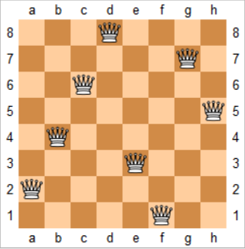
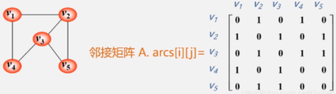
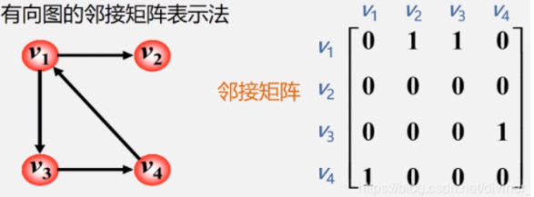
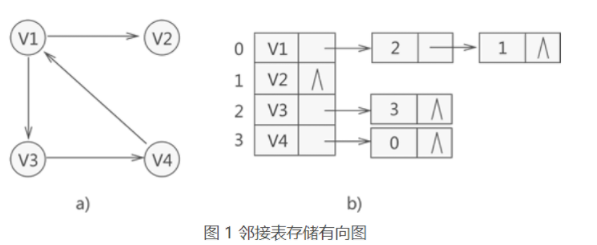
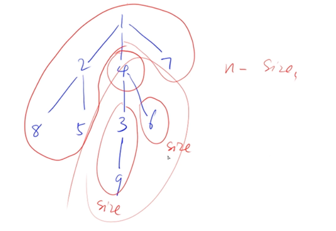
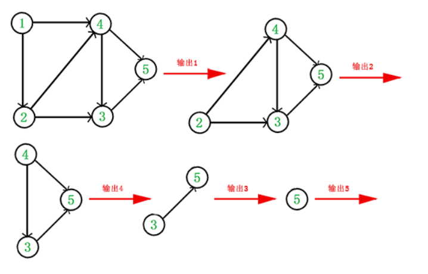
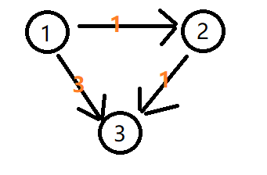

# 搜索与图论

- **稠密图**：邻接矩阵存储
- **稀疏图**：邻接表存储

| 序号 | BFS                                                          | DFS                                                          |
| ---- | ------------------------------------------------------------ | ------------------------------------------------------------ |
| 1    | BFS代表宽度优先搜索                                          | DFS代表深度优先搜索                                          |
| 2    | BFS（宽度优先搜索）使用**队列**数据结构来查找最短路径        | DFS（深度优先搜索）使用**栈**数据结构                        |
| 3    | BFS更适合搜索更接近给定源的顶点                              | 如果有**远离源**的解决方案，则DFS更适合                      |
| 4    | BFS首先考虑所有邻居，因此不适合用于游戏或拼图中的决策树。    | DFS更适用于游戏或拼图问题。我们做出决定，然后探索有关该决定的所有路径。如果这一决定带来获胜局面，我们将停止。 |
| 5    | 当使用邻接表时，BFS的时间复杂度为$O(V+E)$；当使用邻接矩阵时，BFS的时间复杂度为$O(V^2)$，其中$V$表示顶点，$E$表示边。 | 当使用邻接表时，DFS的时间复杂度也是$O(V+E)$，当使用邻接矩阵时，DFS的时间复杂度也是$O(V^2)$，其中$V$表示顶点，$E$表示边。 |

## DFS

- **stack**

- **回溯**：(恢复现场)，回到父节点

- **剪枝**：判断当前分支(子树)不合要求，不再继续`dfs`，剪掉此分支

### [练习 - 842. 排列数字(全排列)](https://www.acwing.com/problem/content/description/844/)

**题目**：给定一个整数$n$，将数字$1∼n$排成一排，将会有很多种排列方法。现在，请你按照字典序将所有的排列方法输出。

**解决办法**：


- 用`path`数组保存排列，当排列的长度为`n`时，是一种方案，输出。
- 用`state`状态数组表示数字是否用过。
- `dfs(i)`表示的含义是：在`path[i]`处填写数字，然后递归的在下一个位置填写数字。
- 回溯：第`i`个位置填写某个数字的所有情况都遍历后， 第`i`个位置填写下一个数字

```cpp
int q[N];       //保存序列
bool state[N];  //状态数组，记录是否当前序列是否已经占用某个数字
int n; 

//深搜，u代表树的第u层
void dfs(int u){
    if(u == n){     //当序列已满，输出
        for(int i = 0;i<n;i++)  cout << q[i] << ' ';
        cout << endl;
        return ;
    }
    //枚举
    for(int i=1;i<=n;i++){
        if(!state[i]){      //如果i未存入序列中
            q[u] = i;       
            state[i] = true;        
            dfs(u+1);       //递归深搜
            state[i] = false;   //恢复现场，取出i，回溯
        }
    }
}
int main(){
    cin >> n;
    dfs(0);
    return 0;
}
```

### [练习 - 843. n-皇后问题](https://www.acwing.com/problem/content/845/)

**题目**：$n$−皇后问题是指将$n$个皇后放在$n×n$的国际象棋棋盘上，使得皇后不能相互攻击到，即任意两个皇后都不能处于同一行、同一列或同一斜线上。现在给定整数$n$，请你输出所有的满足条件的棋子摆法。



**解决办法1**：(DFS按行枚举)，时间复杂度$O(n!)$

类似于**全排列**，但需要**剪枝**。$DFS$操作中**标记数组**记录了棋盘格的列、对角线、斜对角线是否被占用，按行枚举，占用以上标记数组的可以直接**剪枝**。

> 对角线`dg[u+i]`，反对角线`udg[n−u+i]`中的下标`u+i`和`n−u+i`表示的是截距

```cpp
//标记数组 列    对角线   斜对角线    
bool   col[N],  dg[N], udg[N];
char res[N][N]; //保存路径
void dfs(int u){
    //已经搜索了n行，打印
    if(u == n){
        for(int i=0;i<n;i++)    puts(res[i]);
        puts("");
        return ;
    }
    //按行搜索
    for(int i = 0; i<n;i++){
        // 剪枝(对于不满足要求的点，不再继续往下搜索) 
        //此列、对角线、斜对角线均未占用
        //斜对角线udg[n-u+i]中+n保证下标>0
        if(!col[i] && !dg[i+u] && !udg[n-u+i]){ 
            res[u][i] = 'Q';                    
            col[i] = dg[i+u] = udg[n-u+i] = true;
            dfs(u+1);
            //回溯 并 恢复现场
            col[i] = dg[i+u] = udg[n-u+i] = false;
            res[u][i] = '.';
        }
    }
}
int main(){
    cin >> n;
    for (int i = 0; i < n; i ++ )
        for (int j = 0; j < n; j ++ )
            res[i][j] = '.';
    dfs(0);
    return 0;
}
```

**解决办法2**：（DFS按每个元素枚举）时间复杂度$O(2^{n^2})$
**时间复杂度分析**：每个位置都有两种情况，总共有$n2$个位置

```cpp
char g[N][N];
bool row[N], col[N], dg[N], udg[N]; // 因为是一个个搜索，所以加了row
// s表示已经放上去的皇后个数
//x横坐标，y纵坐标
void dfs(int x, int y, int s)
{
    // 处理超出边界的情况
    if (y == n) y = 0, x ++ ;
    if (x == n) { // x==n说明已经枚举完n^2个位置了
        if (s == n) { // s==n说明成功放上去了n个皇后
            for (int i = 0; i < n; i ++ ) puts(g[i]);
            puts("");
        }
        return;
    }
    // 分支1：放皇后
    if (!row[x] && !col[y] && !dg[x + y] && !udg[x - y + n]) {
        g[x][y] = 'Q';
        row[x] = col[y] = dg[x + y] = udg[x - y + n] = true;
        dfs(x, y + 1, s + 1);
        row[x] = col[y] = dg[x + y] = udg[x - y + n] = false;
        g[x][y] = '.';
    }
    // 分支2：不放皇后
    dfs(x, y + 1, s);
}
int main() {
    cin >> n;
    for (int i = 0; i < n; i ++ )
        for (int j = 0; j < n; j ++ )
            g[i][j] = '.';

    dfs(0, 0, 0);

    return 0;
}
```

## BFS

> 利用**queue**，解决**最短路问题**

### [练习 - 844. 走迷宫](https://www.acwing.com/problem/content/846/)

**题目**：给定一个$n×m$的二维整数数组，用来表示一个迷宫，数组中只包含$0$或$1$，其中$0$表示可以走的路，$1$表示不可通过的墙壁。

最初，有一个人位于左上角$(1,1)$处，已知该人每次可以向上、下、左、右任意一个方向移动一个位置。

请问，该人从左上角移动至右下角$(n,m)$处，至少需要移动多少次。

数据保证$(1,1)$处和$(n,m)$处的数字为$0$，且一定至少存在一条通路。

**解决办法**：利用**队列**，每次枚举当前队首周围的所有元素并将，如果符合能够到达，则**距离+1**并且**入队**

```cpp
typedef pair<int,int> PII;
int n, m;
//迷宫数据   点到(0,0)最短距离
int g[N][N], d[N][N];

int bfs(){
    queue<PII> q;               //队列
    d[0][0] = 0, q.push({0,0}); //顶点入队
    
    int dx[4] = {-1, 0, 1, 0}, dy[4] = {0, 1, 0, -1};   //x点周围4个点的横纵坐标偏移量
    while(q.size()){
        auto t = q.front();     //操作队头元素，出队
        q.pop();                                        

        for (int i = 0; i < 4; i ++ ){      //枚举周围4个点
            int x = t.first + dx[i], y = t.second + dy[i];
            //      (x0,y0)紧挨的点(x,y)在迷宫范围内  (x,y)处有道路  (x,y)的最短距离未被计算
            if (x >= 0 && x < n && y >= 0 && y < m && g[x][y] == 0 && d[x][y] == -1){
                d[x][y] = d[t.first][t.second] + 1;     //求得最短距离
                q.push({x, y});                         //(x,y)入队
            }
        }
    } 
    return d[n-1][m-1];
}
int main(){
    cin >> n >> m;
    memset(d,-1,sizeof(d));     //最短距离置为-1
    
    for(int i=0;i<n;i++)
        for(int j=0;j<m;j++)    
            cin >> g[i][j];     
    cout << bfs();
    return 0;
}
```

## 树与图的存储

> 树是一种特殊的图

### 邻接矩阵

**无向图表示法**(可达为1，否则为0)：

- 无向图的邻接矩阵是**对称**的
- 顶点`i`的度=第`i`行(列)中1的个数
- 完全图的邻接矩阵中，对角线原色为0，其余1



**有向图表示法**：

- 顶点的出度 = 第`i`行元素之和
- 顶点的入度 = 第`i`列元素之和
- 顶点的度 = 第`i`行元素之和 +第`i`列的元素之和



### [邻接表存储法](http://data.biancheng.net/view/203.html)

顶点V1，指向V2和V3，因此存储V1的链表中存储的是V2和V3在数组中的位置下标1和2



**入度和出度**

在有向图中，箭头是具有方向的，从一个顶点指向另一个顶点，这样一来，每个顶点被指向的箭头个数，就是它的**入度**。从这个顶点指出去的箭头个数，就是它的**出度**。

## 树与图的深度优先遍历

**定义数据结构** 初始化

```cpp
//N个邻接链表 节点数据   节点下一指针位置     指针
int h[N],    e[N],       ne[N],         idx;
bool state[N];

int main(){
    memset(h, -1, sizeof h);
    ...	//add节点
    dfs(1);
    return 0;
}
```

数组形式**建立邻接表**

```cpp
//头插法, 将b节点置入a链表头
void add(int a, int b){
    e[idx] = b, ne[idx]=h[a], h[a]=idx++;
}
```

**DFS搜索树模板**

```cpp
void dfs(int u){
    state[u] = true;       //标记已经遍历过
    for(int i=h[u];i!=-1;i = ne[i]){
        int j = e[i];
        cout << j << ' ';		
        if(!state[j])   dfs(j);		
    }
}
```

### [练习 - 846. 树的重心](https://www.acwing.com/problem/content/description/848/)

**题目**：给定一颗树，树中包含$n$个结点（编号$1∼n$）和$n−1$条无向边。

请你找到树的重心，并输出将重心删除后，剩余各个连通块中点数的最大值。

> **重心**定义：重心是指树中的一个结点，如果将这个点删除后，剩余各个连通块中点数的最大值最小，那么这个节点被称为树的重心。
>
> 例如下图：
>
> - 假定重心为4，删除节点4后剩余三个连通块，连通块的点数分别是：1、2、5
> - 假定重心为1，删除节点1后剩余三个连通块，连通块的点数分别是：1、3、4
> - ...
> - 总结判断：重心为节点$1$，因为删除节点$1$后剩余连通块种点数最大值为4，在假定删除其他重心后的连通块点数最大值最下
>
> 

```cpp
const int N = 100010;
const int M = 2*N;		//无向图有每个边需要存入两次，所以空间开辟为2N

//N个邻接链表 节点数据 节点下一指针位置     指针
int h[M],    e[M],      ne[M],        idx;
bool state[N];
int ans = N;        //最后结果
int n;              //总节点数

//头插法, 将b节点置入a链表头
void add(int a, int b){
    e[idx] = b, ne[idx]=h[a], h[a]=idx++;
}
//返回以u为根的子树中节点的个数，包括u节点
int dfs(int u) {
    int res = 0; //存储 删掉某个节点之后，最大的连通子图节点数
    state[u] = true; //标记访问过u节点
    int sum = 1; //存储 以u为根的树 的节点数, 包括u，如图中的4号节点

    //访问u的每个子节点
    for (int i = h[u]; i != -1; i = ne[i]) {
        int j = e[i];
        //因为每个节点的编号都是不一样的，所以 用编号为下标 来标记是否被访问过
        if (!state[j]) {
            int s = dfs(j);  // u节点的单棵子树节点数 如图中的size值
            res = max(res, s); // 记录最大连同子图(已u为根节点的连通子图)的节点数
            sum += s; //以j为根的树 的节点数
        }
    }
    //n-sum 如图中的n-size值，不包括根节点4；
    res = max(res, n - sum); // 选择u节点为重心，最大连通子图(整棵树的连通子图)的节点数
    ans = min(res, ans); //遍历过的假设重心中，最小的最大联通子图的 节点数
    return sum;
}
int main(){
    memset(h, -1, sizeof h);
    
    cin >> n;
    for(int i=0;i<n-1;i++)
    {
        int a, b;
        cin >> a >> b;
        add(a, b), add(b, a);   //无向图
    }
    
    dfs(1);
    cout << ans;
    
    return 0;
}
```

## 树与图的广度优先遍历

**定义数据结构** 初始化

```cpp
//N个邻接链表 节点数据   节点下一指针位置     指针
int h[N],    e[N],       ne[N],         idx;
int d[N];		//节点到根的距离数组

int main(){
    memset(h, -1, sizeof h);
    memset(h, -1 ,sizeof h);
    ...	//add节点
    cout << bfs();
    return 0;
}
```

数组形式**建立邻接表**

```cpp
//头插法, 将b节点置入a链表头
void add(int a, int b){
    e[idx] = b, ne[idx]=h[a], h[a]=idx++;
}
```

**BFS搜索树模板**

```cpp
int bfs(){
    q.push(1);		//入队第一个元素
    d[1] = 0;		//树根需要把距离置0
    
    while(!q.empty()){
        int t = q.front();	
        q.pop();	//取出队首元素并出队
        //枚举t节点的邻接表包含的节点
        for(int i=h[t];i!=-1;i=ne[i]){
            int j = e[i];		
            if(d[j]==-1){		
                d[j] = d[t]+1;	//距离更新
                q.push(j);		//入队没被计算的节点
            }
        }
    }
    return d[n];		//返回n处的距离值
}
```

## 拓扑排序

### 拓扑序列

**定义**：

在图论中，拓扑排序（Topological Sorting）是一个**有向无环图**（DAG, Directed Acyclic Graph）的**所有顶点的线性序列**。且该序列必须满足下面两个条件：

- 每个顶点出现且只出现一次。
- 若存在一条从顶点 A 到顶点 B 的路径，那么在序列中顶点 A 出现在顶点 B 的前面。


**如何写出拓扑排序**：

1. 从 DAG 图中选择一个 **没有前驱（即入度为0）**的顶点并输出。
2. 从图中**删除**该顶点和所有以它为起点的有向边。
3. 重复 1 和 2 直到当前的 DAG 图为空或当前图中不存在无前驱的顶点为止。后一种情况说明有向图中必然存在环。



得到拓扑排序后的结果是{$1,2,4,3,5$}

**C++代码实现**：

```cpp
queue<int> q;
int h[N], e[N], ne[N], idx;			//邻接表
int d[N];           				//入度数组
vector<int> res;         			//拓扑排序序列

void add(int a, int b){
    e[idx] = b, ne[idx] = h[a], h[a] = idx++;
}
void topsort(){
    //先将度数为0的节点入队
    for(int i=1;i<=n;i++)
        if(d[i]==0) q.push(i);
    
    while(!q.empty()){
        int t = q.front();
        q.pop();
        res.push_back(t);       //存入拓扑排序序列
        //枚举t邻接表的所有元素
        for(int i=h[t];i!=-1;i=ne[i]){
            int j=e[i];	
            d[j]--;		//将t指向的节点入度-1，如果为0入队
            if(d[j]==0){	
                q.push(j);
            }
        }
    }
}

int main(){
    memset(h,-1,sizeof h);		//邻接表初始化指向空指针-1
	...   //输入有向边
    topsort();
    
    if(res.size()==n)			
        for(auto x : res)   cout << x << ' ';
    else cout << -1;		//否则不存在拓扑排序序列
    
    return 0;
}
```

## 最短路问题

**最短路问题**（点数$n$，边数$m$）

- 单源最短路
  - 边权都是正数
    - **朴素版Dijkstra算法** $O(n^2)$，适用**稠密图**
    - **堆优化版的Dijkstra算法** $O(mlogn)$，适用**稀疏图**
  - 存在负权边
    - **Bellman-Ford算法** $O(nm)$
    - **SPFA算法** 一般$O(m)$，最坏$O(nm)$
- 多源最短路
  - **Floyd算法** $O(n^3)$

### 朴素版Dijkstra模板

**背景**：给定一个$n$个点$m$条边的有向图，图中可能存在重边和自环，所有边权均为正值。请你求出$1$号点到$n$号点的最短距离，如果无法从$1$号点走到$n$号点，则输出$−1$。

```cpp
int n, m;		 //节点数、边数
int e[N][N];     //邻接矩阵
int dist[N];     //用于记录每一个点距离第一个点的距离
bool st[N];      //状态数组，当前节点的最短距离是否已经被确定

int Dijkstra(){
    //n个节点 需要进行n次判断
    for(int i=0;i<n;i++){
        int t = -1;     
        //从未确定最短距离的点中，寻找最小距离的点
        for(int j=1;j<=n;j++){
            if(!st[j] && (t == -1 || dist[t] > dist[j]))
                t = j;
        }
        st[t] = true;       //状态置1
        //使用节点t来更新其他最短距离
        for(int j=1;j<=n;j++){
            dist[j] = min(dist[j], dist[t]+e[t][j]);
        }
    }
    if(dist[n] == 0x3f3f3f3f)   return -1;
    return dist[n];
}
int main(){
    memset(e, 0x3f, sizeof e);              //节点距离初始化为无穷大
    memset(dist, 0x3f, sizeof dist);        //最短距离初始化为无穷大
    dist[1] = 0;                            //节点1 -> 节点1 距离为0
    cin >> n >> m;
    for(int i=0;i<m;i++){
        int x, y, z;
        cin >> x >> y >> z;
        if(x!=y)    e[x][y] = min(z, e[x][y]);          //重边取最短
    }
    cout << Dijkstra();
    return 0;
}
```

### 堆优化版Dijkstra模板

> 适用于稀疏图

**算法思想**：堆优化版的$Dijkstra$是对朴素版$Dijkstra$进行了优化，在朴素版$Dijkstra$中时间复杂度最高的寻找距离最短的点$O(n^2)$可以使用最小堆优化。

1. 一号点的距离初始化为零，其他点初始化成无穷大。
2. 将一号点放入堆中。
3. 不断循环，直到堆空。每一次循环中执行的操作为：
   弹出堆顶（与朴素版$Diijkstra$找到$S$外距离最短的点相同，并标记该点的最短路径已经确定）。
   用该点更新临界点的距离，若更新成功就加入到堆中。

```cpp
typedef pair<int, int> PII;

const int N = 1e6+10;
int n, m;
//  邻接表存储，h[i]==-1为表尾
int h[N], e[N], ne[N], idx;
int w[N];   //边权值
int st[N];  // 如果为true说明这个点的最短路径已经确定
int dist[N];    //最短距离
void add(int a, int b, int c){
    w[idx] = c;         //存入边权
    e[idx] = b, ne[idx] = h[a], h[a] = idx++;       //将节点b插入到a的邻接表
}
int Dijkstra(){
    //初始化最短距离dsit为无穷大0x3f3f3f3f
    memset(dist, 0x3f, sizeof dist);
    dist[1] = 0;
    //定义小根堆，first存入最短距离，second存入节点
    //// 这个顺序不能倒，pair排序时是先根据first，再根据second，这里显然要根据距离排序
    priority_queue<PII, vector<PII>, greater<PII>> heap;
    heap.push({0,1});
    
    while(heap.size()){
        //存储并取出最小(堆顶)元素,距离最短的点
        auto t = heap.top();
        heap.pop();
        int v = t.second, distance = t.first;
        
        if(st[v])   continue;       //求解过直接continue;
        st[v] = true;               //置1，表示此次循环会求得v节点相邻的
        
        //遍历v节点邻接的每个节点，求解每个点的最短距离
        for(int i=h[v]; i!=-1; i = ne[i]){
            int j = e[i];       // i只是个下标，e中存的是i这个下标对应的点j。
            if(dist[j] > distance + w[i]){
                dist[j] = distance + w[i];
                heap.push({dist[j], j});
            }
        }
    }
    
    if( dist[n] == 0x3f3f3f3f ) return -1;
    return dist[n];
}

int main(){
    memset(h, -1, sizeof h);
    
    cin >> n >> m;
    for(int i=0;i<m;i++){
        int x, y, z;
        cin >> x >> y >> z;
        add(x, y, z);
    }
    cout << Dijkstra();
    
    
    return 0;
}
```

### Bellman-Ford算法

Bellman-ford 算法比Dijkstra算法更具普遍性，因为它对边没有要求，可以处理**负权边**与**负权回路**。缺点是时间复杂度过高，高达$O(VE)$, $V$为顶点数，$E$为边数。

检测图中是否有负权边形成了环：遍历图中的所有边，计算 u 至 v 的距离，如果对于 v 存在更小的距离，则说明存在环；

#### [练习 - 853. 有边数限制的最短路](https://www.acwing.com/activity/content/problem/content/922/)

**Last数组的意义**：避免出现串联情况，在边数限制为**一条**的情况下，节点$3$的距离应该是$3$，但是由于串联情况，利用本轮更新的节点$2$更新了节点$3$的距离，所以现在节点$3$的距离是$2$。

正确做法是用上轮节点$2$更新的距离——无穷大，来更新节点$3$， 再取最小值，所以节点$3$离起点的距离是$3$。



**为什么是$dist[n]>0x3f3f3f3f/2$， 而不是$dist[n]>0x3f3f3f3f$**：

$5$号节点距离起点的距离是无穷大，利用$5$号节点更新$n$号节点距离起点的距离，将得到$10^9−2$ 虽然，小于$10^9$, 但并不存在最短路，(在边数限制在k条的条件下)。

```cpp
struct Edge{
    int a, b, c;
}edges[M];      //保存每条边

int n, m, k;
int dist[N];    //最短距离
int last[N];    //备份数组防止串联

void Bellman_Ford(){
    //初始化dist
    memset(dist, 0x3f, sizeof dist);
    dist[1] = 0;
    
    //对k条边进行n-1次松弛操作
    for(int i=0;i<k;i++){
        //last数组更新为上一次循环求得的dist数组
        memcpy(last, dist, sizeof dist);
        //枚举m条边
        for(int j=0;j<m;j++){
            auto e = edges[j];
             //松弛操作(SPFA可以进行优化下一行)下一行
            dist[e.b] = min(dist[e.b], last[e.a]+e.c);     
        }
    }
}
int main(){
    cin >> n >> m >> k;
    for(int i=0;i<m;i++){
        int a, b, c;
        cin >> a >> b >> c;
        edges[i] = {a, b, c};
    }
    
    Bellman_Ford();
    
    if(dist[n] > 0x3f3f3f3f / 2) puts("impossible");
    else cout << dist[n];
    
    
    return 0;
}
```

### SPFA

给定的图**存在负权边**，但不存在负回路，这时类似Dijkstra等算法便没有了用武之地，而Bellman-Ford算法的复杂度又过高，SPFA算法便派上用场了。

> 一、相较于Bellman-Ford算法优化何处？
>
> 对于$O(VE)$次运算来说，不是每一次都会执行松弛操作(`dist[e.b] = min(dist[e.b], last[e.a]+e.c);     `)
>
> 只有当`last[e.a]`变小了，`dist[e.b]`才会变小，从这一行进行切入来优化
>
> ```cpp {5}
> for(int i=0;i<k;i++){
>     memcpy(last, dist, sizeof dist);
>     for(int j=0;j<m;j++){
>         auto e = edges[j];
>         dist[e.b] = min(dist[e.b], last[e.a]+e.c);     
>     }
> }
> ```
>
> 二、$Bellman_ford$算法 与 SPFA算法 区别
>
> - $Bellman_ford$算法里最后`return -1`的判断条件写的是`dist[n]>0x3f3f3f3f/2`;而$SPFA$算法写的是`dist[n]==0x3f3f3f3f`;其原因在于$Bellman_ford$算法会遍历所有的边，因此不管是不是和源点连通的边它都会得到更新；但是$SPFA$算法不一样，它相当于采用了BFS，因此遍历到的结点都是与源点连通的，因此如果你要求的n和源点不连通，它不会得到更新，还是保持的`0x3f3f3f3f`。
> - $Bellman_ford$算法可以存在负权回路，是因为其循环的次数是有限制的因此最终不会发生死循环；但是SPFA算法不可以，由于用了队列来存储，只要发生了更新就会不断的入队，因此假如有负权回路请你不要用$SPFA$否则会死循环

**算法思想**：我们用数组$d$记录每个结点的最短路径估计值，用**邻接表**来存储图G。我们采取的方法是**动态逼近法**：设立一个先进先出的队列用来保存待优化的结点，优化时每次取出队首结点u，并且用u点当前的最短路径估计值对离开u点所指向的结点v进行松弛操作，如果v点的最短路径估计值有所调整，且v点不在当前的队列中，就将v点放入队尾。这样不断从队列中取出结点来进行松弛操作，直至队列空为止

```cpp
const int N = 200010;
int n, m;
int h[N], e[N], ne[N], w[N], idx;       //邻接表
bool st[N];                             //st用来检验队列中是否有重复的点，节点是否应该入队，队列出现重复元素无意义
int dist[N];                            //最短距离
queue<int> que;

void Add(int x, int y, int z){
    w[idx] = z;
    e[idx] = y, ne[idx] = h[x], h[x] = idx++;
}

void SPFA(){
    memset(h, -1, sizeof h);
    memset(dist, 0x3f, sizeof dist);
    //初始节点入队
    que.push(1);
    dist[1] = 0;
    st[1] = true;
    
    while(!que.empty()){
        int u = que.front();    //节点u
        que.pop();
        st[u]=false;            //从队列中取出来之后该节点st被标记为false
        for(int i=h[u];i!=-1;i=ne[i]){
            int j=e[i];     //u邻接的节点，下标i
            if(dist[j] > dist[u]+w[i]){
                dist[j] = dist[u] + w[i];   //w[i]表示u-j的权值
                //入队，st置为true
                if(!st[j]){
                    st[j] = true;
                    que.push(j);
                }
            }
        }
        
    }
    
}

int main(){
	...
    SPFA();
    if(dist[n] == 0x3f3f3f3f) cout << "impossible";
    else cout << dist[n];
    return 0;
}
```

