# Linear Algebra

## Vector

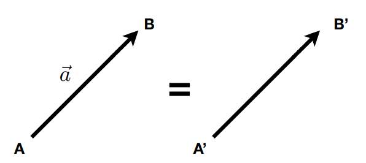

### Vector Normalization 归一化

$$
\widehat a=\frac{\vec a}{||\vec a||}
$$

单位向量表示**方向**，不关心长度

### Vector Addition

- Geometrically : Parallelogram law & Triangle law
- 简单的坐标相加

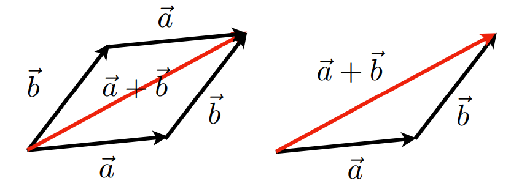

### Cartesian coordinate 笛卡尔坐标/直角坐标

- 默认列向量

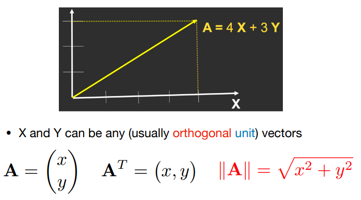

### Dot(scalar) Product 点乘

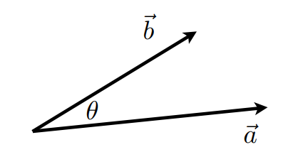
$$
\vec a \cdot \vec b=\lVert\vec a\rVert \lVert\vec b\rVert cos\alpha\\
cos\alpha =\frac{\vec a \cdot \vec b}{\lVert\vec a\rVert \lVert\vec b\rVert}
$$
**For <u>unit vectors</u>单位向量** : $cos\alpha=\vec a · \vec b$

Properties : 

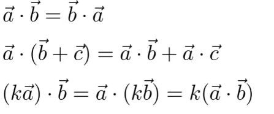

#### Dot Product in Cartesian Coordinates

component-wise multiplication, then adding up

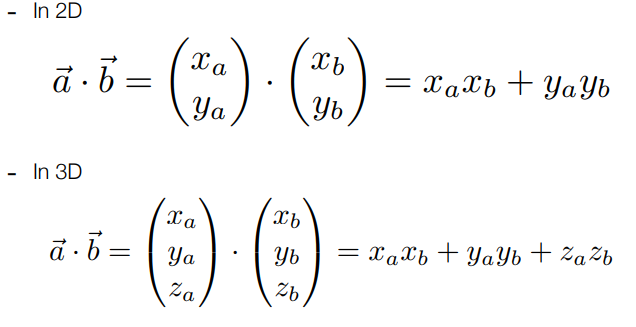

#### Dot Product in Graphics

- 计算两个向量之间的角度
  - e.g. 光源与表面之间角度的余弦

- 计算向量到另一个向量的**Projection(投影)**

##### Dot Product for Projection 投影

投影$\vec b_\bot = k\widehat a = ||\vec b_\bot||\widehat a=||\vec b||cos\alpha \widehat a$

- 计算2个向量有多接近
- 分解向量
- 确定同向>0/反向<0

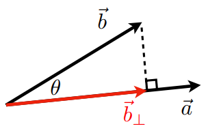

### Cross (vector) Product 向量叉积

- 不满足交换律

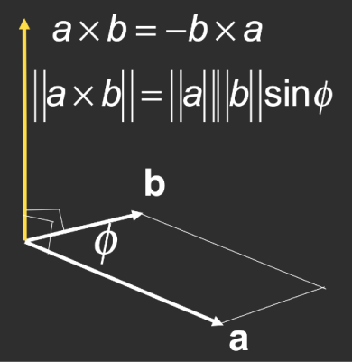

笛卡尔公式

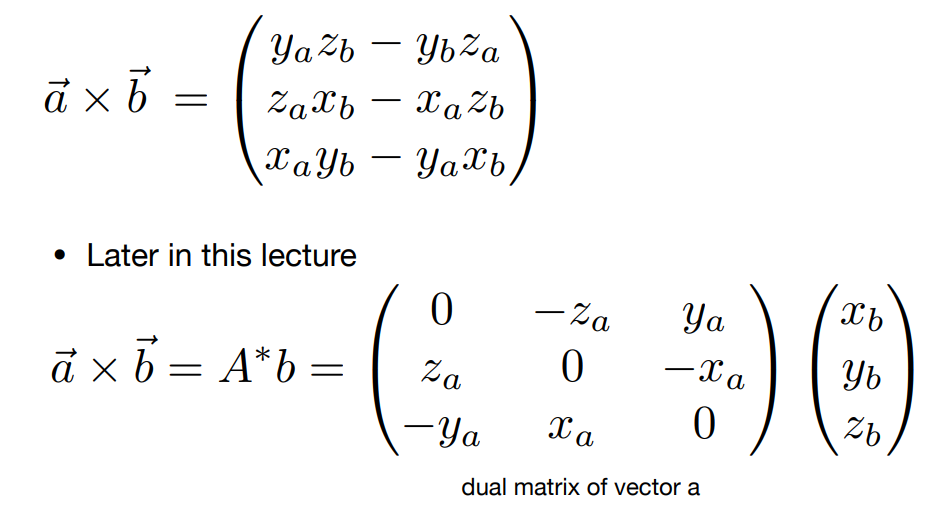

Properties :

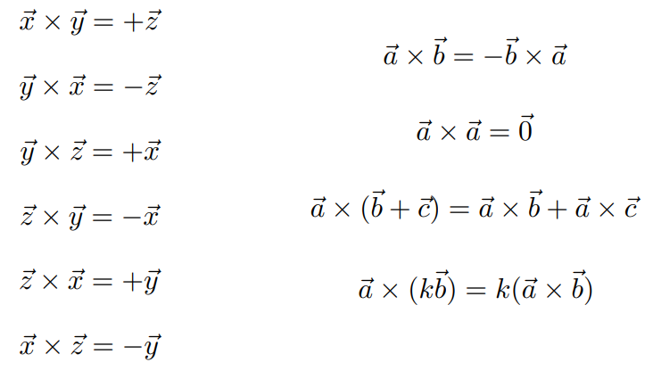

#### Cross Product in Graphics

- **判断左/右**

- **判断内和外**

  - e.g. 判断点P是否在三角形(组成三角形的向量逆时针排列)内？

    $\vec{AB} \cdot \vec{AP}$向外，P在$\vec{AB}$左侧

    $\vec{BC} \cdot \vec{BP}$ 向外，P在$\vec{BC}$左侧

    $\vec{CA} \cdot \vec{CP}$ 向外，P在$\vec{CA}$左侧

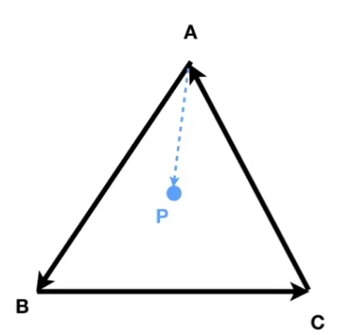

## Matrices

### Matrix-Multiplication

**保证A矩阵的列数=B矩阵的行数**： $(M \times N)(N \times P) = (M \times P)$

[矩阵乘法](https://zhuanlan.zhihu.com/p/158776486)
$$
(AB)_{ij}=\Sigma_{k=1}^pa_{ik}b{kj}=a_{i1}+b_{1j}+...+a_{ip}b_{pj}
$$
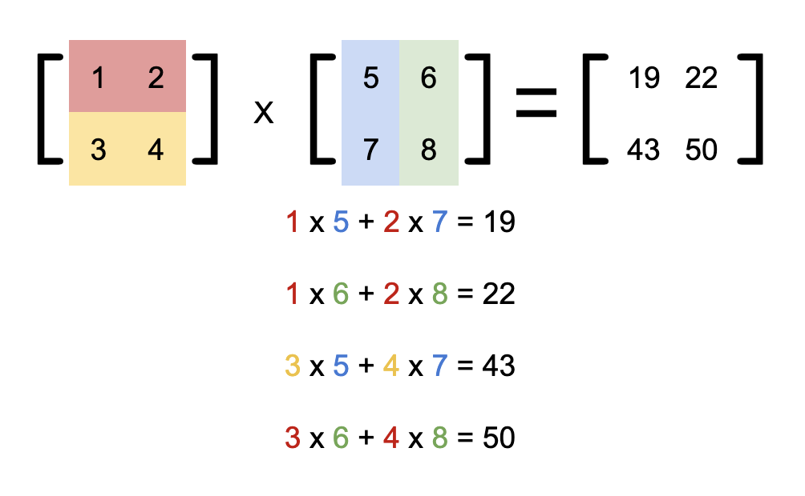

- 无交换律
- $A(BC)=(AB)C$
- $A(B+C)=AB+AC$

#### 变换：2D向量关于y轴对称

$$
\left(
\begin{matrix}
-1&0\\
0&1
\end{matrix}
\right)
\left(
\begin{matrix}
x\\
y
\end{matrix}
\right)
=
\left(
\begin{matrix}
-x\\
y
\end{matrix}
\right)
$$

###  Transpose 转置

$$
\left(
\begin{matrix}
1 & 2\\
3 & 4\\
5 & 6
\end{matrix}
\right)^T
=
\left(
\begin{matrix}
1 & 3 & 5\\
2 & 4 & 6\\
\end{matrix}
\right)
$$

Property : $(AB)^T=B^TA^T$

###  Identity Matrix and Inverses单位矩阵 逆矩阵

$$
I_{3 \times 3}=\left(
\begin{matrix}
1 & 0 & 0\\
0 & 1 & 0\\
0 & 0 & 1
\end{matrix}
\right)
$$

$$
AA^{-1}=A{^-1}A=I\\
(AB)^{-1} = B^{-1}A^{-1}
$$

### 矩阵形式的向量乘法

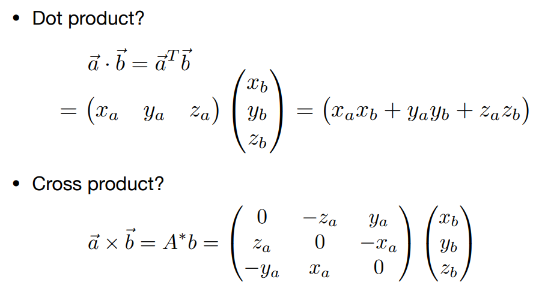

### 范数

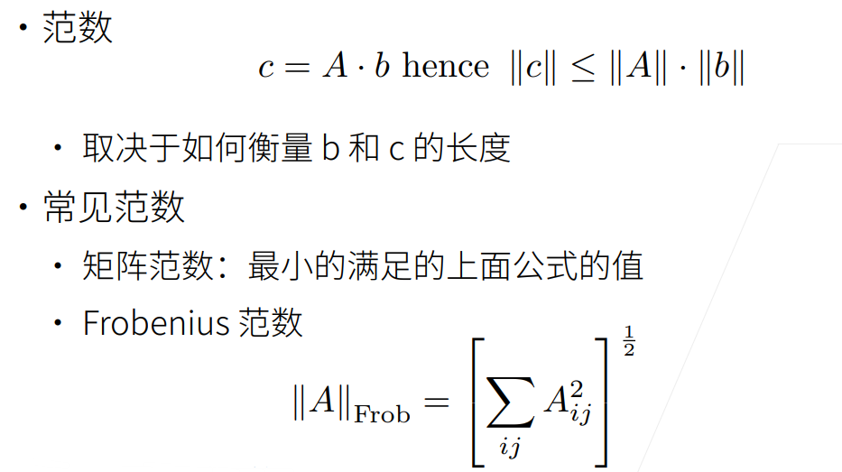

### 特殊矩阵

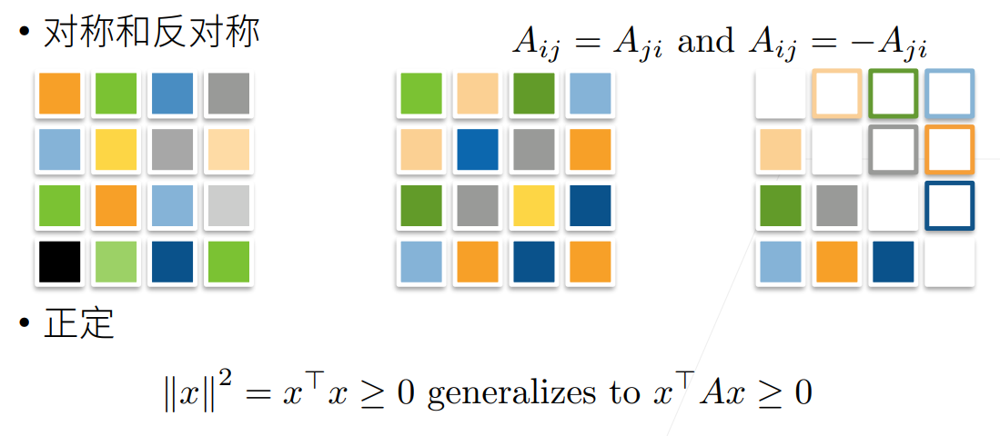

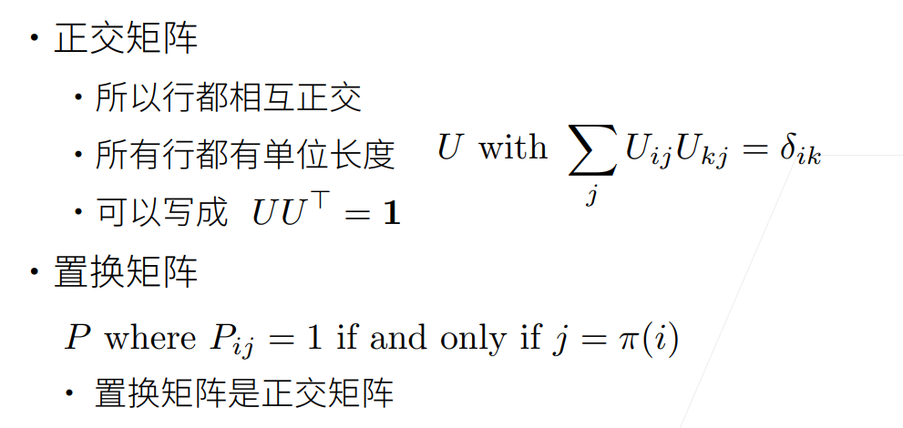

### 特征向量、特征值

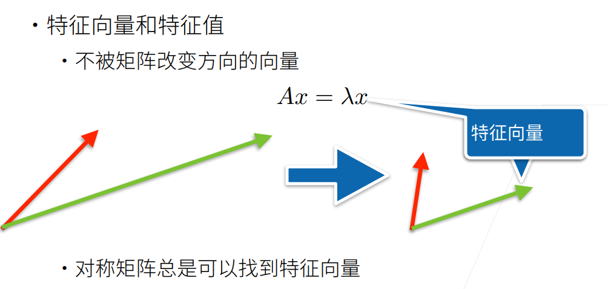