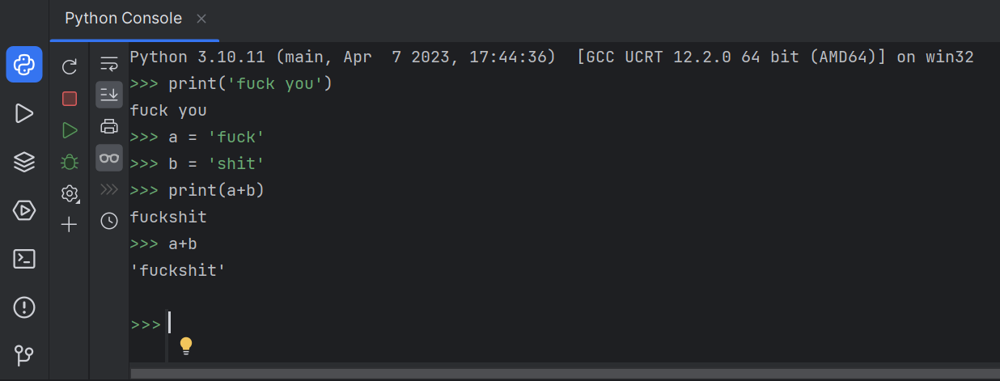
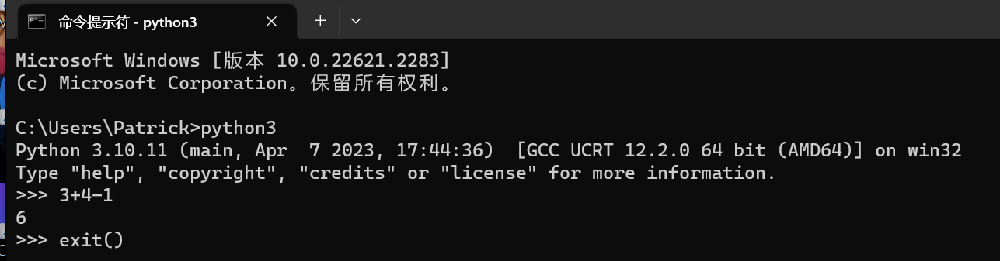

## Python

### 交互模式





### 基基基基本语法

#### math

```python
import math
# math库
a = 3
a**2
math.log(8,2)
```

#### 基本类型

```python
# NoneType
myNonepy = None
print(type(myNonepy))

# String
myStr = 'Fuck you'
print(len(myStr))
print(myStr[0])
print(myStr[-1])
print(myStr[len(myStr)-1])

# bool
t = True
f = False
```

#### input

> 注意转换类型

```python
# input
age = input('How old are you?')
print(age)
print(int(age)+2)
```

#### 判断

```python
# if
mood_index = int(input("Enter a number:\n"))
if mood_index >= 60:
    print(">=60")
elif mood_index ==0:
    print('==0')
else:
    print('<60')
    
# if 多重判断
# 优先级排列not and or
index = int(input('Enter a number:'))
if index%2==0 and index >=10:
    print('index能被2整除且大于10')
```

#### List

```python
# list
index_list = [12,'abc',74.2,True]
for x in index_list:
    print(x,type(x))
index_list.append('shit')
print('\n')
for x in index_list:
    print(x,type(x))
index_list.remove(12)
print('\n')
for x in index_list:
    print(x,type(x))

# list functions
num_list = [1999,23,53,6,999]
max_num = max(num_list)
min_num = min(num_list)
sorted_num = sorted(num_list)

print('the max num is ',max_num, '\nthe min num is', min_num, '\nAfter sorted:', sorted_num)
```

#### Dictionary

```python
contacts = {'Alley': 15304379080,
            'Dracy': 15304379060}
if 'Dracy' in contacts:
    print('Dracy is in contacts')
contacts['Beauty'] = 1424598066

print(contacts)
print('the length of contacts is :' + str(len(contacts)) + '\n')

print(contacts.keys())		# 键
print(contacts.values())	# 值
print(contacts.items())		# 对
```

#### Loop

```python
# loop
for name, number in contacts.items():
    print('Name : ' + name + '      ' + 'Number : ' + str(number))
    
# range
list = [1,2,3,4,5]
sum = 0
for i in range(len(list)):
    sum+=i
print(sum)

# while
list = [1,2,3,4,5,6,7,8]
i, sum = 0, 0
while i<len(list):
    sum+=list[i]
    i = i + 1;
print(sum)
```

#### Format

```python
# format
gpa_dict = {'bob':3.241, 'nb':2.66, 'puppy':3.999}
for name, gpa in gpa_dict.items():
    print('{0}\'s gpa is:{1:.2f}'.format(name, gpa))

print('\n')

for name, gpa in gpa_dict.items():
    print('{current_name}\'s gpa is:{current_gpa}'.format(current_name = name, current_gpa = gpa))
```


[Python函数（上） | 不做代码复读机_哔哩哔哩_bilibili](https://www.bilibili.com/video/BV1944y1x7SW?p=23&vd_source=26b03ede8b59579694c38f4220df6308)

