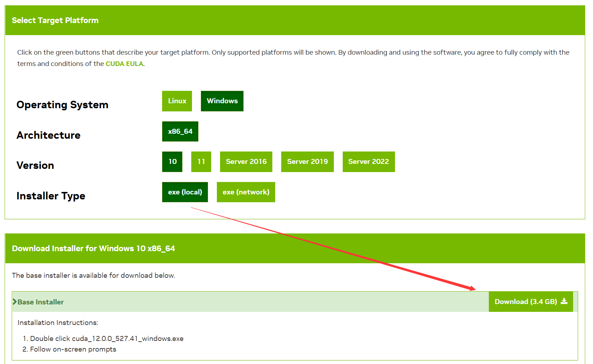

:::note

Windows

:::

## CUDA

[CUDA Toolkit 12.0 Downloads | NVIDIA Developer](https://developer.nvidia.com/cuda-downloads)



**检测安装**

```bash
$ nvidia-smi
```


## Miniconda

[Miniconda — conda documentation](https://docs.conda.io/en/latest/miniconda.html)

Windows installers  —— Python3.8

**检测安装**

```bash
$ python --version
```


## PyTorch

[Start Locally | PyTorch](https://pytorch.org/get-started/locally/)

```bash
$ pip3 install torch torchvision torchaudio --extra-index-url https://download.pytorch.org/whl/cu117
```

取消验证（可选）

```bash
$ conda config --set ssl_verify false
```

conda配置镜像源（可选）

```bash
$ conda config --add channels https://mirrors.tuna.tsinghua.edu.cn/anaconda/pkgs/free/
$ conda config --add channels https://mirrors.tuna.tsinghua.edu.cn/anaconda/pkgs/main/
$ conda config --add channels https://mirrors.tuna.tsinghua.edu.cn/anaconda/cloud/conda-forge/
```

pip配置镜像源（可选）

windows下，直接在user目录中创建一个pip目录，如 `C:\Users\xx\pip`，新建文件`pip.ini`，内容如下：

```bash
[global]  
index-url = https://mirrors.aliyun.com/pypi/simple/
```

检测安装1.0


## jupyter d2l

```bash
$ pip install jupyter d2l
```

### 运行实例

下载[动手学深度学习 2.0.0 documentation (d2l.ai)](https://zh-v2.d2l.ai/chapter_installation/index.html)内的**`Jupyter`记事本**


运行notebook

> 皆在Anaconda Powershell Prompt中输入

```bash
$ jupyter notebook
```

进入一下目录


运行所有


waiting...（可以通过`nvidia-smi`查看GPU使用率）

**成功**

> 电脑比较拉，1187 examples/sec


**参考资料：**

> [Windows 下安装 CUDA 和 Pytorch 跑深度学习](https://www.bilibili.com/video/BV18K411w7Vs/?share_source=copy_web&vd_source=26b03ede8b59579694c38f4220df6308)

