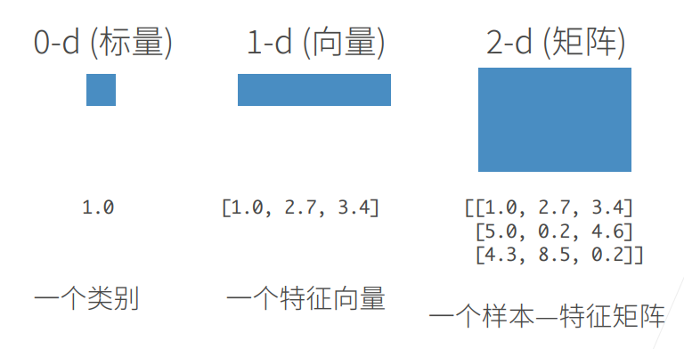
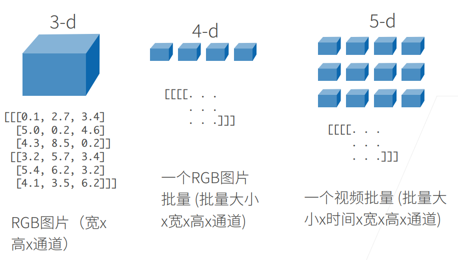
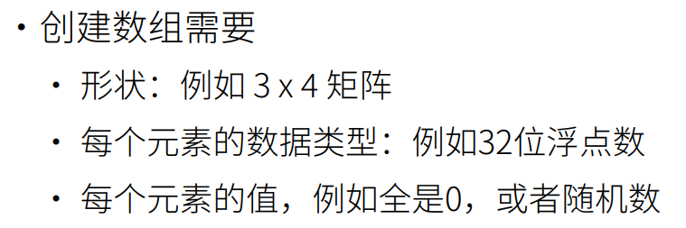
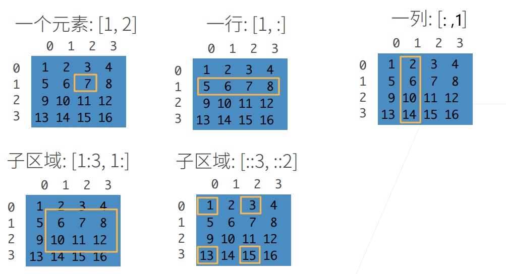
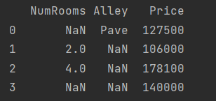
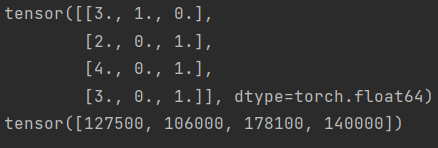

# 数据

## 数据操作

:::note

N维数组是机器学习和神经网络的主要数据结构

:::

N维数组样例(1)



N维数组样例(2)



### 创建数组



### 访问元素

子区域 [1:3,1:] 

​	 "`1:3`为左闭开区间，输出1~2行"

子区域[::3,::2]

​	" `::` 三个参数，前两个左闭右开区间，第三个步长默认为1"



## 数据操作

$𝑛$维数组，也称为*张量*（tensor）

> 无论使用哪个深度学习框架，它的*张量类*（在**MXNet**中为`ndarray`， 在**PyTorch**和TensorFlow中为`Tensor`）都与**Numpy**的`ndarray`类似。 但深度学习框架又比Numpy的`ndarray`多一些重要功能： 首先，GPU很好地支持加速计算，而NumPy仅支持CPU计算； 其次，张量类支持自动微分。 这些功能使得张量类更适合深度学习。 如果没有特殊说明，本书中所说的张量均指的是张量类的实例。

### API

不详细展开，详情查阅

1. [2.1. 数据操作 — 动手学深度学习 2.0.0 documentation (d2l.ai)](https://zh-v2.d2l.ai/chapter_preliminaries/ndarray.html)
2. [Pytorch常用API汇总](https://blog.csdn.net/qq_49134563/article/details/108200828)
3. [Torch Library API — PyTorch master documentation](https://pytorch.org/cppdocs/library.html)

## 数据预处理

>  在Python中常用的数据分析工具中，我们通常使用`pandas`软件包。 像庞大的Python生态系统中的许多其他扩展包一样，`pandas`可以与张量兼容。

```python
import os
import pandas as pd

os.makedirs(os.path.join('..', 'data'), exist_ok=True)
data_file = os.path.join('..', 'data', 'house_tiny.csv')
with open(data_file, 'w') as f:
    f.write('NumRooms,Alley,Price\n')  # 列名
    f.write('NA,Pave,127500\n')  # 每行表示一个数据样本
    f.write('2,NA,106000\n')
    f.write('4,NA,178100\n')
    f.write('NA,NA,140000\n')

data = pd.read_csv(data_file)
print(data)
```



### 处理缺失值

上图“**NaN**”项代表缺失值，**为了处理缺失的数据，典型的方法包括<u>插值法</u>和<u>删除法</u>**

```python
#1.
inputs, outputs = data.iloc[:, 0:2], data.iloc[:, 2]
#2.
inputs = inputs.fillna(inputs.mean())
#3.
inputs = pd.get_dummies(inputs, dummy_na=True)
#4.
x, y = torch.tensor(inputs.values), torch.tensor(outputs.values)
print(x)
print(y)
```

1. 通过位置索引`iloc`，我们将`data`分成`inputs`和`outputs`
2. `inputs.fillna`对于`inputs`中缺少的数值，我们用同一列的均值替换“`NaN`”项
3. [**对于`inputs`中的类别值或离散值，我们将“NaN”视为一个类别。**]
   由于“巷子类型”（“Alley”）列只接受两种类型的类别值“Pave”和“NaN”，`pandas`可以自动将此列转换为两列“Alley_Pave”和“Alley_nan”。
   巷子类型为“Pave”的行会将“Alley_Pave”的值设置为1，“Alley_nan”的值设置为0。缺少巷子类型的行会将“Alley_Pave”和“Alley_nan”分别设置为0和1。
4. 现在`inputs`和`outputs`中的所有条目都是数值类型，它们可以转换为张量格式。

