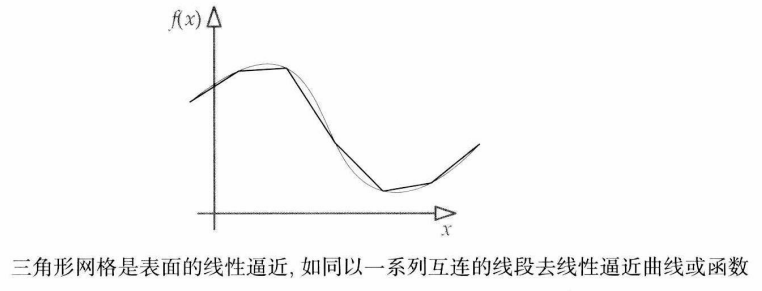
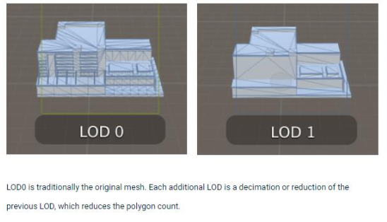
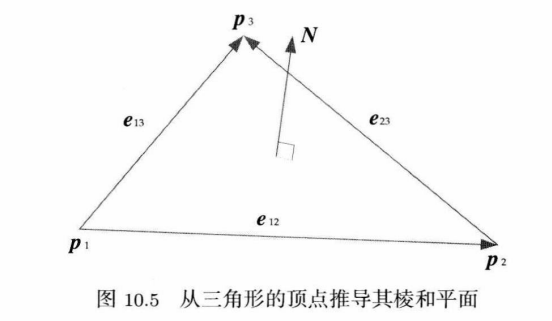
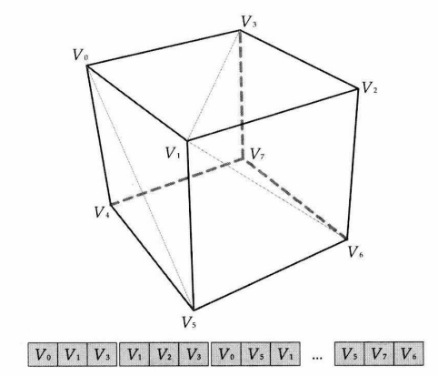
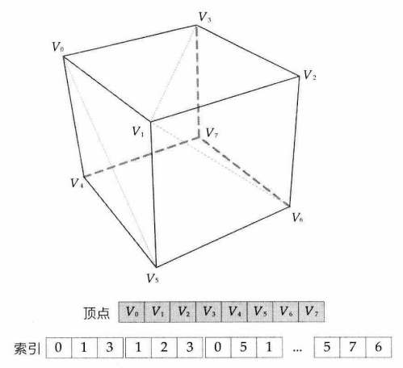
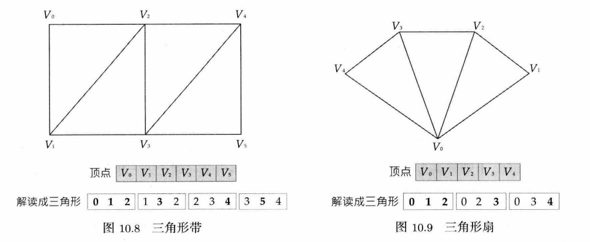

# 第10章 渲染引擎

## 10.1 采用深度缓冲的三角形光栅化基础

:::note

**三维场景渲染的本质**涉及以下几个**基本步骤**：

- **描述一个虚拟场景(virtual scene)**。这些场景一般是以某数学形式表示的三维表面。

- **定位及定向一个虚拟摄像机(virtual camera)，为场景取景。**

  摄像机的常见模型是这样的：摄像机位于一个理想化的焦点(focal point)，在焦点前的近处悬浮着一个影像面(image surface)，而此影像面由多个虚拟感光元件(virtual light sensor)组成，每个感光元件对应着目标显示设备的像素(picture element / pixel)。

- **设置光源(light source)**。光源产生的光线会与环境中的物体交互作用并反射,最终到达虚拟摄像机的感光像面。

- **描述场景中物体表面的视觉特性(visual property)。**这些视觉特性决定光线如何与物体表面产生交互作用。

- 对于每个位于影像矩形内的像素，渲染引擎会找出经过该像素而聚焦于虚拟摄像机焦点的(一条或多条)光线,并计算其颜色及强度(intensity)。此过程称为**求解渲染方程(solving the rendering equation)**，也叫作**着色方程(shading equation)**。

:::

### 10.1.1 场景描述

> **场景中的物体**：透明(transparent)、不透明(opaque)、半透明(translucent)

游戏引擎通常会采用名为**$alpha$的简单不透明度($opacity$)**测量数值表达物体表面有多不透明或透明。

**大多数游戏渲染引擎主要着重于渲染物体的表面**

#### 10.1.1.1 高端渲染软件所用的表示法

理论上，一个表面是由无数三维空间中的点所组成的一张二维薄片。然而,此描述显然无实际用途。为了让计算机处理及渲染任意表面,我们需要以一个紧凑的方式用数学方法表示表面。

有些表面可用 **分析式** 来精确表示，例如，位于原点的球体表面可用$x^2+y^2+z^2=r^2$表示。但是给任意形状建模时分析式不一定好用。

#### 10.1.1.2 三角形网络

从传统上来说，游戏开发者会使用**三角形网格**来为**表面建模**。三角形是**表面的分段线性逼近**(piecewise linear approximation)，如同用多条相连的线段分段逼近一个函数或曲线。

:::tip

在各种多边形中，实时渲染之所以选用三角形，是因为三角形有以下**优点**。

- **三角形是最简单的多边形**。少于3个顶点就不能成为一个表面。
- **三角形必然是平坦的。**含4个或以上顶点的多边形不一定是平坦的,因为其前3个顶点能定义一个平面,第4个顶点或许会位于该平面之上或之下。
- **三角形经多种转换之后仍然维持是三角形，这对于仿射转换和透视转换也成立。**在最坏的情况下，从三角形的边去观看,三角形会退化为线段。在其他角度观察，仍能维持是三角形。
- **几乎所有商用图形加速硬件都是为三角形光栅化而设计的。**从早期的PC三维图形加速器开始，渲染硬件几乎一直只专注为三角形光栅化而设计。

:::

**镶嵌**（术语）：**镶嵌(tessellation)**是指把表面分割为一组离散多边形的过程，这些多边形通常是三角形或四边形(quadrilateral，简称quad )的。**三角化(triangulation)**专指把表面镶嵌为三角形。

这种三角形网格在游戏中有一个**常见问题**：

​	就是其镶嵌程度是由制作的美术人员决定的，不能中途改变。固定的镶嵌会使物体的轮廓边缘显得不光滑，<u>此问题在摄像机接近物体的时候会更加明显</u>。

**如何解决？**

> 理想下，我们希望有一个方案能按物体与虚拟摄像机距离的缩减而增加密铺程度。

- **层次细节**：

  游戏开发者经常会尝试以一串不同版本的三角形网格链去逼近此理想的三角形对像素密度，每一版本称为一个**层次细节**(level-of-detail, **LOD**)。

  第一个LOD通常称为LOD 0，代表最高程度的镶嵌，在物体非常接近摄像机时使用。后续的LOD 的镶嵌程度不断降低。当物体逐渐远离摄像机时，引擎就会把网格从LOD 0换为LOD 1、LOD2等。这样渲染引擎便可以花费更多时间在接近摄像机的物体上(即占据屏幕中更多像素的物体)，进行顶点的转换和光照运算。

  

- **动态镶嵌**：

  有些游戏引擎会将**动态镶嵌(dynamic tessellation)**技术应用到可扩展的网格上，例如水面和地形。在这种技术中，网格通常以高度场(height field)来表示，而高度场则在某种规则栅格模式上定义。<u>接近摄像机的网格区域会以栅格的最高分辨率来镶嵌，距摄像机较远的区域则会使用较少的栅格点来进行镶嵌。</u>

- **渐进网格**：**另一种动态镶嵌及层次细节技术**。运用此技术时,当物体接近摄像机时采用单个最高分辨率网格。(这本质上就是LOD 0网格)，当物体远离摄像机时，这个网格就会自动密铺,其方法是把某些棱收缩为点。**自动生成半连续的LOD链**。

#### 10.1.1.3 构造三角形网格

三角形任何两条棱的叉积，归一化后都能定义为**三角形的单位面法线(face normal)** $N$:
$$
N=\frac{e_{12} \times e_{13}}{\vert e_{12} \times e_{13}\vert }
$$

##### **缠绕顺序(winding order)**

**定义**：分为**顺时针方向(clockwise, CW)**、**逆时针方向(counterclockwise, CCW)**，用来定义面法线的方向，也是定义三角形的哪一面是正面(物体表面)，哪一面是背面(物品之内)。

> wind 作为动词是指缠绕。可这么想象，把3根有序号的钉子钉在墙上，然后用绳子按序号缠绕钉子来做出三角形

**作用**：多数底层图形API提供了基于缠绕顺序来剔除背面三角形(back face triangle culling)的方法。
**背面剔除**的重要性在于，我们通常不需要浪费时间渲染看不见的三角形。而且，渲染透明物体的背面还会造成视觉异常。可以随意选择两种缠绕顺序之一，只要整个游戏的资产都是一致的就行。**不一致的缠绕顺序是三维建模新手的常见错误。**

##### **三角形表**

定义网格的最简单方法是以每3个顶点为一组列举，其中每3个顶点对应一个三角形。此数据结构称为三角形表(triangle list)

##### **索引化三角形表**(indexed triangle list)

> 三角形表中有许多重复的顶点，而且经常重复多次。每个顶点要存储颇多的元数据,因此在三角形表中重复的数据会浪费内存。这同时也会浪费GPU的资源,因为重复的顶点会计算变换及光照多次。

其基本思想就是每个顶点仅列举一次，然后用轻量级的顶点索引(通常每个索引只占16位)来定义组成三角形的3个顶点。在 DirectX下,顶点存储在**顶点缓冲**(vertex buffer)中,在OpenGL下则称其为**顶点数组**(vertex array)。而索引会存储于另一单独缓冲，称为**索引缓冲**(index buffer)或**索引数组**(index array)。

##### **三角形带与三角形扇**

这两种数据结构**不需要索引缓冲，但同时能降低某顶点的重复程度**。它们之所以有这些特性，其实是通过预先定义顶点出现的次序，并预先定义顶点组合成三角形的规则。

**顶点缓存优化**

当GPU处理索引化三角形表时，每个三角形能引用顶点缓冲内的任何顶点。为了在光栅化阶段保持三角形的完整性，顶点必须按照其位于三角形中的次序来处理。**当顶点着色器处理每个顶点后，其结果会被缓存以供重复使用。**若之后的图元引用到存于缓存的顶点，就能直接使用结果,而无须重复处理该顶点。

使用三角形带及三角形扇的一个原因是能节省内存(无须索引缓冲)，另一个原因是基于它们往往能**改善GPU存取显存时的缓存一致性(cache coherency)**。我们甚至可以使用索引化三角形带及索引化三角形扇以消除所有顶点重复(这样通常比不用索引缓冲更省内存)，而同时仍能受益于三角形带及三角形扇次序所带来的缓存一致性。
除了次序受限的三角形带及三角形扇，我们也可以优化索引化三角形表以提升缓存一致性。**顶点缓存优化器(vertex cache optimizer)**就是为此而设的一种离线几何处理工具,它能重新排列三角形的次序，以优化缓存内的顶点复用。