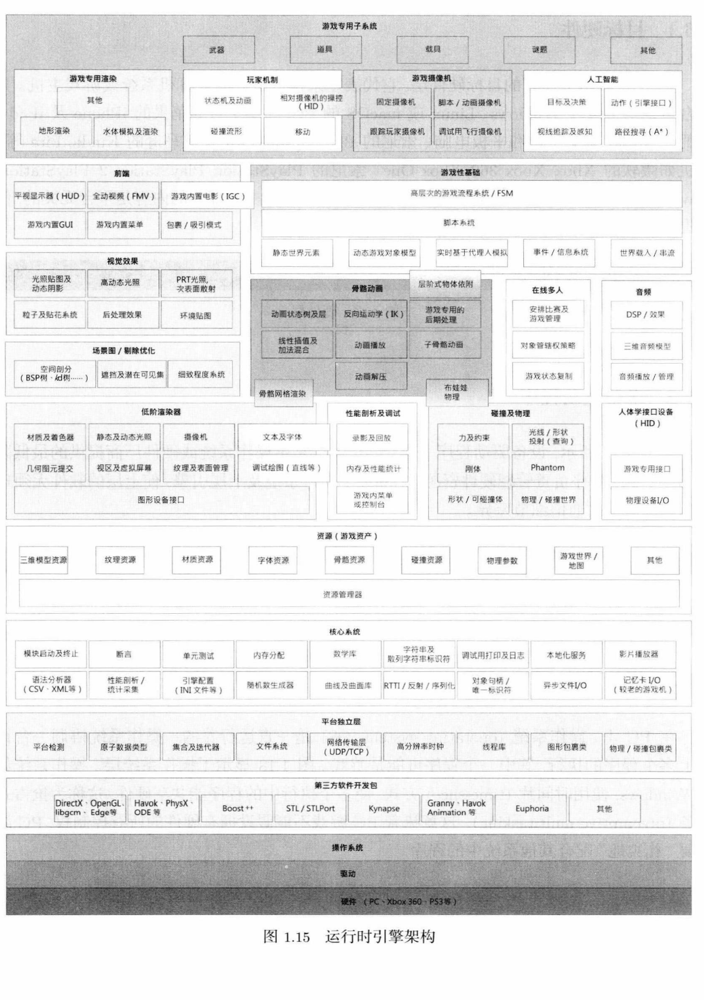

# 第1章 导论

:::note

游戏引擎现今都已变成**具有完整功能的可复用软件开发套件**

:::

## 典型游戏团队的结构

  
    
工程师
  
        <li>tool programmer：游戏性 | 脚本编程</li>
        <li>tool programmer</li>
    
资深工程师->首席工程师->首席技术官

  
    
艺术家
  
        <li>概念艺术家</li>
        <li>纹理艺术家</li>
        <li>灯光师</li>
    	<li>动画师</li>
    	<li>动画捕捉演员</li>
    	<li>音效设计师</li>
    	<li>配音演员</li>
    	<li>作曲家</li>

  
    
游戏设计师
  
	

        负责设计玩家体验的互动部分
    

  
    
制作人
  
	

		不同工作室不尽相同。可以管理开发进度、承担人力资源经理的职责或者做资深游戏设计师工作
    

  
    
其他工作人员
  
	

		包括工作室的行政管理团队、市场策划团队、行政人员及IT部门等等
    

  
    
发行商及工作室
  
	
游戏的市场策划、制造及分销，通常由发行商负责，而非开发游戏的工作室本身。

    

        第一方开发商(first-party developer)是指游戏工作室直接隶属于主机生厂商(Microsoft、Sony)。例如顽皮狗是Sony的第一方开发商。
    

## 游戏是什么

> 游戏为一种互动体验，为玩家提供一连串渐进式挑战，玩家最终能通过学习而精通该游戏。
>
> ​		———《A Theory of Fun for Game Design》Raph Koster
>
> “Koster的命题把学习及精通作为游戏的乐趣”

大部分二维或三维的电子游戏，会被计算机科学家称为 **软实时互动基于代理的计算机模拟** 

- 软实时：指系统即使错过期限也不会造成灾难性后果
- 硬实时：错过期限可能导致操作者损伤甚至死亡，例如核能发电厂的控制棒系统
- 基于代理：模拟游戏中载具、人物角色等等多个独立的实体一起互动

:::note

一个主"游戏循环"不断执行，在循环的每次迭代中，多个游戏系统，例如人工智能、游戏逻辑、物理模拟等，就会有机会计算或更新其下一个离散时步的状态。这些结果渲染成图形显示、发出音效或者输出至其他设备，例如游戏手柄的力反馈(force feedback)

:::

## 游戏引擎是什么

  
    
游戏引擎是什么？
  
	

        可扩展的软件，并且不需要大量的修改就能成为多款游戏软件的基础
    

  
    
Mod是什么？
  
	

        一些特殊游戏玩家组成的小组，或小规模的独立游戏工作室，利用原开发商提供的工具箱修改现有的游戏，从而创作出新的游戏
    

## 游戏引擎概览

:::note

一般认为，首个三位第一人称射击游戏(FPS)是《德军总部》，由美国德克萨斯州的id Software公司制作，它引领游戏工业进入令人兴奋的新方向。

> 《雷神之锤2》[源代码](https://github.com/id-Software/Quake-2)

:::

- 虚幻引擎
- Source引擎：《半条命2》
- DICE的寒霜引擎
- CryEngine：《孤岛惊魂》、《孤岛危机》
- 索尼的PhyreEngine：《黑暗之魂》《风之旅人》
- 微软的XNA Game Studio
- Unity：容易开发及跨平台游戏开发
- 供非程序员使用的二维游戏引擎：图形用户界面创作游戏
- 其他商业引擎
- 专有内部引擎
- 开源引擎

## 游戏引擎架构

游戏引擎通常由**工具套件**和**运行时组件**两部分构成的。

游戏引擎也是以软件层构建的：通常上层依赖下层，下层不依赖上层。（当下层依赖上层时，成为**循环依赖**，软件系统中应极力避免，否则导致系统间复杂耦合，致使软件难以测试并妨碍代码重用）

### 运行时引擎架构

- **操作系统**

  游戏主机上的操作系统通常只是一个轻量级的库，连接到游戏的执行文档里，不需要像PC一样时间片轮转抢占，主机上的游戏几乎能够跟拥有整个机器

:::info

PC上有高级的**虚拟内存系统**，游戏主机上只有有限的虚拟内存系统，而且缓存命中失败的代价极高，因此游戏开发者最好能编写自定义的数据结构，保证其是可预期和/或有限的内存分配模式

:::

- **第三方软件开发包(SDK)和中间件**

  - SDK提供基于函数或基于类的接口，一般称为应用程序接口

  - 数据结构算法：例如Unreal Engine重写了C++的各种数据结构，有时候减少或完全消除动态内存分配，并保证在目标平台上的运行效率为最优

  - 图形：[OpenGL](https://www.opengl.org//)、DirectX

  - 碰撞和检测：[Havok](https://www.havok.com/)、[PhysX](https://developer.nvidia.com/physx-sdk)（NVIDIA提供免费下载)

  - 角色动画：Granny、Havok Animation

  - 人工智能：Kynapse

  - 生物力学角色模型：Endorphin和Euphoria(GTA)利用真实人类运动的高阶生物力学模型去产生动作

  - **核心系统**：断言、内存分配、数学库、自定义数据结构及算法

  - 资源管理器

  - 渲染引擎

    - 低阶渲染器：着重考虑高速渲染丰富的图元集合，并不太考虑哪些场景部分是否可见
    - 场景图/剔除优化
      - 小游戏世界只需要简单的**平截头体剔除算法**
      - 大游戏世界可能使用**空间细分数据结构**，空间分割包括二元空间分割树、四叉树、八叉树、kd树、包围球树等

    - 前端：HUD、GUI、游戏内置电影(IGC)、全动视频系统(FMV)

- **刨析和调试工具**

  PS4提供**核心转储设施**协助程序员调试崩溃的问题，PS4会一直录制最后15s游戏视频，程序员会获得崩溃时完整调用的堆栈信息和那一刻屏幕截图。

- **在线多人/网络游戏**

  单屏多人、切割屏多人、网络多人、大型多人在线游戏(MMOG)

- **事件系统**

  **事件驱动架**构常用于典型图形用户界面，也常用于对象间通信

  