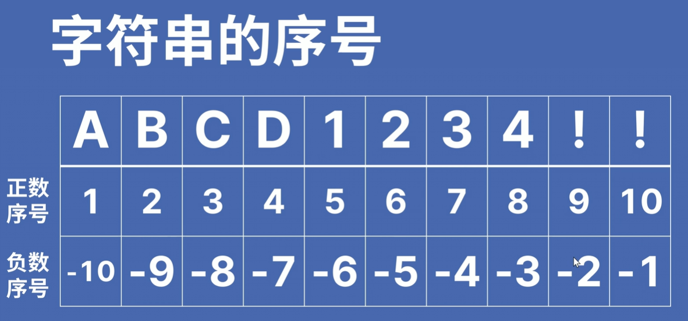
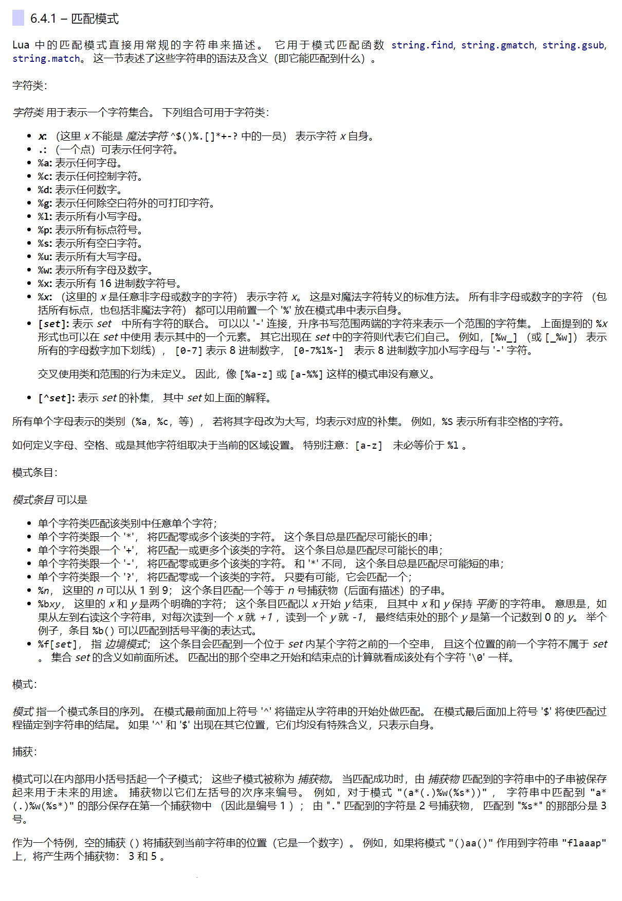
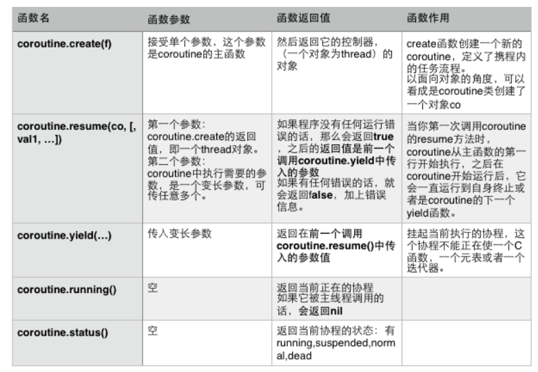
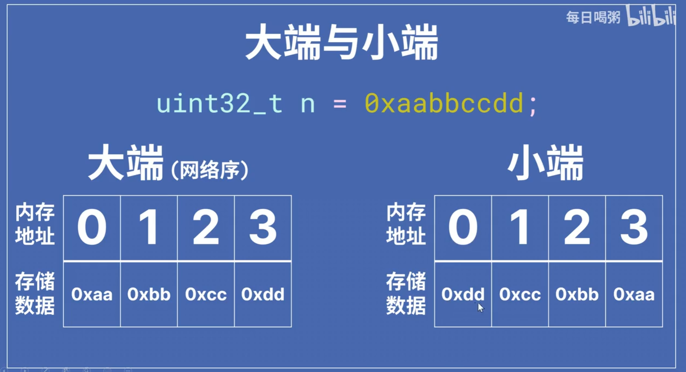
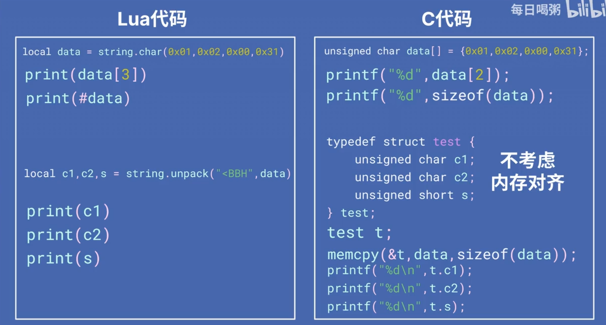

# Lua Basic

:::tip

- [LuatOS 文档](https://wiki.luatos.com/)

  API函数参数加中括号为可选输入

- [Lua 5.3 参考手册 - 目录 (luatos.com)](https://wiki.luatos.com/_static/lua53doc/contents.html)

:::

## 变量

**赋值变量等于直接声明变量**

```lua
a = 1
b = 2
-- 局部变量，只能在当前代码块作用
local c = 1
-- 多重赋值（f==nil）
d,e,f = 0x11,2e10
```

### 布尔

**lua中只有`nil`和`false`代表假，其他(包括0)都代表真**

```lua
a = true
b = false
print(1>2)
print(1<2)
print(1<=2)
print(1>=2)
print(1==2)
print(1~=2)
print(a and b)
print(a or b)
print(not b)
```

### 短路求值 

> 短路求值是指`$$`和`||`都是先求左侧运算对象的值，当左侧运算对象的值无法确定表达式的结果时才计算右侧运算对象的值。
>
> 1. 对于`$$`，当且仅当左侧运算对象为真时才对右侧运算对象求值。
> 2. 对于`||`，当且仅当左侧运算对象为假时才对右侧运算对象求值。

lua的判断表达式不会直接返回`true` 或 `false`，而是直接返回短路运算结束的值

```lua
a = nil
b = 0
print(b>-1 and "yes" or "no")	--Output: yes
print(b>10 and "yes" or "no")	--Output: no
```

### nil

> 相当于C语言的NULL，Lua中未被声明的都是nil

```lua
print(d)
-- Output: nil
```

## 字符串

> 字符串库中的所有函数都在表 `string` 中。 它还将其设置为字符串元表的 `__index` 域。 因此，你可以以面向对象的形式使用字符串函数。 例如，`string.byte(s,i)` 等效`s:byte(i)`



**单行文本**

```lua
-- 支持转义字符
a = "abcd\nefg"
print(a)

-- Output:abcd
-- efg
```

**多行文本**[[]]

`[[]]`会把原始值和格式存入字符串

```lua
c = [[abcd
efg
hij		k]]
print(c)
-- Output:[14:42:45] abcd
-- efg
-- hij		k
```

### 字符串连接

使用`..`连接字符串

```lua
a = "123"
b = "234"
c = a..b
print(c)

-- Output:123234
```

### 字符串转换

```lua
c = tostring(10)
-- 转换数字失败输出nil
n = tonumber("10")	
-- 输出字符串长度
print(#c)
```

### string.char & string.byte

```lua
local b = string.char(0,0,1,2,3)
-- 1~-1等效从table开始至末尾
print(b:byte(-1,1))
```

### sub

```lua
local s = "12345678"
-- 返回左闭右闭的子串
print(s:sub(4,-2))
```

### 正则表达式

[Lua正则在线测试工具 (luatos.com)](https://wiki.luatos.com/_static/string-match/index.html)



## If

```lua
if 1>10 then 
    print("1>10")
elseif 1<10 then
    print("1<10")
else
    print("10")
end
```

## 循环

### for

```lua
-- var 从 exp1 变化到 exp2，每次变化以 exp3 为步长递增 var，并执行一次 "执行体"。exp3 是可选的，如果不指定，默认为1。
for var=exp1,exp2,exp3 do  
    <执行体>  
end
```

```lua
for i=10,1,-1 do
    print(i)
    if(i==5) then break end
end   
```

### while

```lua
while(condition)
do
   statements
end
```

## 函数

### **函数定义格式**

```lua
function function_name( ... )
    -- body
end
```

**举例:**

```lua
function fun(a,b,c)
    print(a,b,c)
end

fun(1,2)

-- Output:1	2 nil
```

### **函数返回值**

**可以返回多个值，对应多个赋值语句**

```lua
function f(a,b,c)
    	return a,b
end

i,j = f(1,2)
```

## Table

相当于关联型数组，**下标从1开始**，可以用任意类型的值来作数组的索引

```lua
-- 初始化表
mytable = {}

-- 指定值
mytable[1]= {1,"lua",{22,33}}

-- 移除引用
mytable = nil
-- lua 垃圾回收会释放内存

-- 获取数组长度
print(#mytable)
```

Table中可以存放**键值对**

```lua
mytable = {
    a = 1,
    b = "字母"
}
mytable["test"] = "测试"
print(mytable["a"],mytable["b"],mytable["test"])

-- Output:1	字母	测试
```

### Table操作

| 序号 | 方法 & 用途                                                  |
| :--- | :----------------------------------------------------------- |
| 1    | **table.concat (table [, sep [, start [, end]]]):**concat是concatenate(连锁, 连接)的缩写. table.concat()函数列出参数中指定table的数组部分从start位置到end位置的所有元素, 元素间以指定的分隔符(sep)隔开。 |
| 2    | **table.insert (table, [pos,] value):**在table的数组部分指定位置(pos)插入值为value的一个元素. pos参数可选, 默认为数组部分末尾. |
| 3    | **table.remove (table [, pos])**返回table数组部分位于pos位置的元素. 其后的元素会被前移. pos参数可选, 默认为table长度, 即从最后一个元素删起。 |
| 4    | **table.sort (table [, comp])**对给定的table进行升序排序。   |

```lua
fruits = {"banana","orange","apple"}
-- 返回 table 连接后的字符串
print("连接后的字符串 ",table.concat(fruits))
-- 指定连接字符
print("连接后的字符串 ",table.concat(fruits,", "))
-- 指定索引来连接 table
print("连接后的字符串 ",table.concat(fruits,", ", 2,3))

fruits = {"banana","orange","apple"}

-- 在末尾插入
table.insert(fruits,"mango")
print("索引为 4 的元素为 ",fruits[4])
-- 在索引为 2 的键处插入，后续元素后移一位
table.insert(fruits,2,"grapes")
print("索引为 2 的元素为 ",fruits[2])

print("最后一个元素为 ",fruits[5])
-- 返回移除的值
table.remove(fruits)
print("移除后最后一个元素为 ",fruits[5])
```

## `_G`

特殊的Table，表示全局表，**存放所有的全局变量**

```lua
a = 2 
-- 输出a的值，table的insert函数的地址
print(_G["a"],_G["table"]["insert"])
--Output:2	function: 0xc1
```

## require

**执行其他代码**

- 运行指定文件
- 末尾不带扩展名
- 目录层级用"`.`"分隔
- 只会运行一次
- 从`package.path`中的路径里查找

<u>test.lua</u>

```lua
require("hello")
```

<u>hello.lua</u>

```lua
print("Hello Lua")
```

Output：Hello Lua

### package.path

- 可以在代码中重写`package.path = package.path..";./path/?.lua"`

### 迭代器

**原始写法**

```lua
t = {"a","b","c","d","e"}
for i=1,#t do
    print(i,t[i])
end
```

**利用`ipairs()`函数**

遍历表t中所有的数组元素对(1, t[1])，(2, t[2])… 一直到**数字索引不存在(nil)**的一个元素。

```lua
for i,j in ipairs(t) do
    print(i,j)
end
```

**利用`pairs()`函数**

遍历表 t 中所有的元素对

> 内部调用`next (table [, index])`函数：第一个参数是要遍历的表，第二个参数是表中的某个键。 `next` 返回该键的下一个键及其关联的值。 

```lua
t ={
    apple = "a"
    banana = "b"
    eraser = "c"
    water = "d"
}
for i,j in pairs(t) do
    print(i,j)
end
```

## 元表

Lua 中的每个值都可以有一个 *元表*。 这个 *元表* 就是一个普通的 Lua 表， 它用于**定义原始值在特定操作下的行为**。 **如果你想改变一个值在特定操作下的行为，你可以在它的元表中设置对应域。** 

> 例如，当你对非数字值做加操作时， Lua 会检查该值的元表中的 "`__add`" 域下的函数。 如果能找到，Lua 则调用这个函数来完成加这个操作。在元表中事件的键值是一个双下划线（`__`）加事件名的字符串； 键关联的那些值被称为 *元方法*。 在上一个例子中，`__add` 就是键值， 对应的元方法是执行加操作的函数。

使用 [`setmetatable (table, metatable)`](https://wiki.luatos.com/_static/lua53doc/manual.html#pdf-setmetatable) 来替换一张表的元表。

```lua
t = {
    a = 1
}

mt = {
    __add = function(a,b)
        return t.a+1
    end
}

setmetatable(t, mt)
print(t+1)
```

### 元表操作

#### __index

**索引** `table[key]`。 当 `table` 不是表或是表 `table` 中不存在 `key` 这个键时，这个事件被触发。

```lua
t = {
    a = 1
}

mt = {
    __index = {
        b = 2
    }
}

setmetatable(t, mt)
print(t["b"])
```

#### __newindex

**索引赋值** `table[key] = value` 。 和索引事件类似，它发生在 `table` 不是表或是表 `table` 中不存在 `key` 这个键的时候。 此时，会读出 `table` 相应的元方法。

这个事件的**元方法**即可以是**函数**，也可以是一张表。 如果是一个函数， 则以 `table`、 `key`、以及 `value` 为参数传入。 如果是一张表， Lua 对这张表做索引赋值操作。(这个索引过程是走常规的流程，而不是直接索引赋值， 所以这次索引赋值有可能引发另一次元方法。）)

```lua
t = {
    a = 1
}

mt = {
    __newindex = function(t,k,v)
        -- 使用rawset赋值防止递归
        rawset(t,k,v)
    end
}

setmetatable(t, mt)
t["abc"] = 1
print(t["abc"])
```

## 语法糖

`v.name(v,args)`等效于`v:name(args)`

## 面向对象

> 能够实现，但不是很好用

```lua
bag = {}
bagmt = {
    -- 插入元素（默认字符串）
    put = function(t,item)
        table.insert(t.items,item)
    end,
    
    -- 取出元素（默认字符串）
    take = function(t)
        return table.remove(t.items,item)
    end,
    
    -- 列出元素（默认字符串，逗号分割）
    list = function(t)
        return table.concat(t.items,",")
    end,

    -- 清空元素
    clear = function(t)
        t.items ={}
    end,

}

-- 当键不存在时，寻找元表对应的元方法
bagmt["__index"] = bagmt

-- 构造函数
function bag.new()
    local t = {
        items = {}
        
    }
    setmetatable(t,bagmt)
    return t
end

-- 生成对象
local b = bag.new()
b:put("apple")
b:put("apple")
b:put("apple")
b:put("apple")
-- print(b:take())
-- b:clear()
print(b:list())
```

## 协程

Lua 支持协程，也叫 *协同式多线程*。 一个协程在 Lua 中代表了一段独立的执行线程。 然而，与多线程系统中的线程的区别在于， 协程仅在**显式调用一个让出（yield）函数时才挂起当前的执行**。

- **`coroutine.resume()`函数**

用来首次启动或再次启动一个协程，使其由挂起状态变成运行状态。也可以这么说，`resume`函数相当于在执行协程中的方法。参数Val1...是执行协程co时传递给协程的参数。

1. **首次调用resume执行协程co时，参数Val1...会赋值给协程co的函数，作为函数参数**
2. **以后再调用resume执行协程co时，参数Val1...会赋值给协程co中上一次yield的返回值**
   - resume函数的返回有3种情况：
     - 如果协程co的函数执行完毕，协程正常终止，resume 返回 true和函数的返回值。
     - 如果协程co的函数执行过程中，协程让出了（调用了yield()方法），那么resume返回true和协程中调用yield传入的参数。
     - 如果协程co的函数执行过程中发生错误，resume返回false与错误消息。

> 可以看到resume无论如何都不会导致程序崩溃。它是在保护模式下执行的

- **`coroutine.yield()`函数**

使正在执行的协程挂起，注意是执行该函数中会使协程挂起，该函数并未执行结束，下次`resume()`时才会执行完毕

1. **yeild的参数会作为resume的第二个返回值**
2. **如果对该协程不是第一次执行resume，resume函数传入的参数将会作为yield的返回值**



**举例**：

```lua
co = coroutine.create(function (value1,value2)
   local tempvar3 =10
   print("coroutine section 1", value1, value2, tempvar3)
   -- coroutine.resume(co, 3, 2)返回main true + 
   -- 第1次yield暂停的参数4,3
   local tempvar1 = coroutine.yield(value1+1,value2+1)      --第2个resume传入12,14

   tempvar3 = tempvar3 + value1     -- 10+3
   print("coroutine section 2",tempvar1 ,tempvar2, tempvar3)
   -- coroutine.resume(co, 12, 14)返回main true + 
   -- 第2次yield暂停的参数5,1
   local tempvar1, tempvar2= coroutine.yield(value1+value2, value1-value2)  --第3个resume传入5,6

   tempvar3 = tempvar3 + value1     -- 13+3
   print("coroutine section 3",tempvar1,tempvar2, tempvar3)
   return value2, "end"
end)

print("main", coroutine.resume(co, 3, 2))
print("main", coroutine.resume(co, 12,14))
print("main", coroutine.resume(co, 5, 6))
print("main", coroutine.resume(co, 10, 20))		--协程也进行结束
```

**输出**：

```lua
[20:30:14] 虚拟机初始化完毕
[20:30:14] coroutine section 1	3	2	10
[20:30:14] main	true	4	3
[20:30:14] coroutine section 2	12	nil	13
[20:30:14] main	true	5	1
[20:30:14] coroutine section 3	5	6	16
[20:30:14] main	true	2	end
[20:30:14] main	false	cannot resume dead coroutine
[20:30:14] 虚拟机已停止运行
```

## 二进制数据打包与解析



**打包、解包举例**

```lua
-- 小端对齐 打包
local data = string.pack("<L",888)      --1101111000

print("Len:",#data)
print(data:byte(1))     -- 01111000
print(data:byte(2))     -- 00000011
print(data:byte(3))     -- 00000000
print(data:byte(4))     -- 00000000

-- 解包
local r = string.unpack("<L",data)

print(r)
```

**C语言对应Lua**


