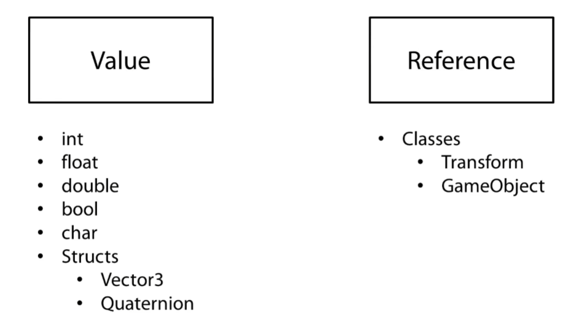

# CS Basic


## Debug

```cs
print("Hello World");
Debug.Log("Hello World");
Debug.LogWarning("This is a warning message!");
Debug.LogError("This is an error message!");
```

### 格式化输出

```C#
int a = 100;
float b = 0.6f;
Debug.Log(string.Format("a is: {0}, b is {1}", a, b));
Debug.Log(string.Format("a is: {0}, b is {1}", a, b));

Debug.Log("The a is:" + a);
```

### 彩色打印

```csharp
Debug.LogFormat("This is <color=#ff0000>{0}</color>", "red");
Debug.LogFormat("This is <color=#00ff00>{0}</color>", "green");
Debug.LogFormat("This is <color=#0000ff>{0}</color>", "blue");
Debug.LogFormat("This is <color=yellow>{0}</color>", "yellow");
```

> [日志存储与上传 | 日志开关 | 日志双击溯源](https://blog.csdn.net/linxinfa/article/details/119280053)

## Slerp 球形插值

> 曲线上插值，开始慢，中间快

```csharp
//重力轨道，物体绕心转动并逼近
public class GravityScript : MonoBehaviour 
{
    public Transform target;

    void Update () 
    {
        Vector3 relativePos = (target.position + new Vector3(0, 1.5f, 0)) - transform.position;
        //目标旋转
        Quaternion rotation = Quaternion.LookRotation(relativePos);
		//当前旋转
        Quaternion current = transform.localRotation;

        transform.localRotation = Quaternion.Slerp(current, rotation, Time.deltaTime);
        transform.Translate(0, 0, 3 * Time.deltaTime);	//向前移动
    }
}
```

## Lerp 线性插值

> 提供均匀变化

在制作游戏时，有时可以在两个值之间进行线性插值。这是通过 Lerp 函数来完成的。线性插值会在两个给定值之间找到某个百分比的值。例如，我们可以在数字 3 和 5 之间按 50% 进行线性插值以得到数字 4。这是因为 4 是 3 和 5 之间距离的 50%。

在 Unity 中，有多个 Lerp 函数可用于不同类型。对于我们刚才使用的示例，与之等效的将是 Mathf.Lerp 函数，如下所示：

```csharp
// 在此示例中，result = 4
float result = Mathf.Lerp (3f, 5f, 0.5f);
```

Mathf.Lerp 函数接受 3 个 float 参数：一个 float 参数表示要进行插值的起始值，另一个 float 参数表示要进行插值的结束值，最后一个 float 参数表示要进行插值的距离。在此示例中，插值为 0.5，表示 50%。如果为 0，则函数将返回“from”值；如果为 1，则函数将返回“to”值。

Lerp 函数的其他示例包括 Color.Lerp 和 Vector3.Lerp。这些函数的工作方式与 Mathf.Lerp 完全相同，但是“from”和“to”值分别为 Color 和 Vector3 类型。在每个示例中，第三个参数仍然是一个 float 参数，表示要插值的大小。这些函数的结果是找到一种颜色（两种给定颜色的某种混合）以及一个矢量（占两个给定矢量之间的百分比）。

让我们看看另一个示例：

```csharp
Vector3 from = new Vector3 (1f, 2f, 3f);
Vector3 to = new Vector3 (5f, 6f, 7f);

// 此处 result = (4, 5, 6)
Vector3 result = Vector3.Lerp (from, to, 0.75f);
```

在此示例中，结果为 (4, 5, 6)，因为 4 位于 1 到 5 之间的 75% 处，5 位于 2 到 6 之间的 75% 处，而 6 位于 3 到 7 之间的 75% 处。

使用 Color.Lerp 时适用同样的原理。在 Color 结构中，颜色由代表红色、蓝色、绿色和 Alpha 的 4 个 float 参数表示。使用 Lerp 时，与 Mathf.Lerp 和 Vector3.Lerp 一样，这些 float 数值将进行插值。

在某些情况下，可使用 Lerp 函数使值随时间平滑。请考虑以下代码段：

```csharp
void Update (){
    light.intensity = Mathf.Lerp(light.intensity, 8f, 0.5f);
}
```

如果光的强度从 0 开始，则在第一次更新后，其值将设置为 4。下一帧会将其设置为 6，然后设置为 7，再然后设置为 7.5，依此类推。因此，经过几帧后，光强度将趋向于 8，但随着接近目标，其变化速率将减慢。请注意，这是在若干个帧的过程中发生的。如果我们不希望与帧率有关，则可以使用以下代码：

```csharp
void Update (){
    light.intensity = Mathf.Lerp(light.intensity, 8f, 0.5f * Time.deltaTime);
}
```

这意味着强度变化将按每秒而不是每帧发生。

请注意，在对值进行平滑时，通常情况下最好使用 SmoothDamp 函数。仅当您确定想要的效果时，才应使用 Lerp 进行平滑。

## 引用



```csharp
//引用，获取地址直接改变地址中的数据
Transform tran = transform;
tran.localScale = new Vector3(3f, 3f, 3f);
```

## 关键字

## Foreach

```csharp
foreach(var item in strings){
    print (item);
}
```

### as

在程序中，进行类型转换时常见的事，csharp支持基本的强制类型转换方法，比较低效的方法：

```csharp
Object obj1 = new NewType();
NewType newValue = (NewType)obj1;
//这样强制转换的时候，这个过程是不安全的，因此需要用try-catch语句进行保护，这样一来，比较安全的代码方式应如下所示：
Object obj1 = new NewType（）;
NewType newValue = null;
try{
    undefined newValue = （NewType）obj1；
}
catch (Exception err)
{
    undefined MessageBox.Show（err.Message）;
}
```

**高效的方法：**

```csharp
Object obj1 = new NewType（）；
NewTYpe newValue = obj1 as NewType；
```

### statics

静态成员是跨类的所有实例共享的成员

- **静态方法**：无需实例化就可以使用
- **静态变量**：所有实例共享
- **静态类**：不能实例化

#### **静态构造函数**

静态构造函数在类的静态成员第一次访问或第一个类实例创建之前由系统调用

```csharp
class SimpleClass{     
    static readonly long baseline;      
    
    static SimpleClass(){         
        baseline = DateTime.Now.Ticks;     
    } 
} 
```

### base(Inheritance)

使用 `base` 关键字，可以从派生类中调用基类的 `Getinfo` 方法

```csharp
public class Person
{
    protected string ssn = "444-55-6666";
    protected string name = "John L. Malgraine";

    public virtual void GetInfo()
    {
        Console.WriteLine("Name: {0}", name);
        Console.WriteLine("SSN: {0}", ssn);
    }
}
class Employee : Person
{
    public string id = "ABC567EFG";
    public override void GetInfo()
    {
        // Calling the base class GetInfo method:
        base.GetInfo();
        Console.WriteLine("Employee ID: {0}", id);
    }
}

class TestClass
{
    static void Main()
    {
        Employee E = new Employee();
        E.GetInfo();
    }
}
/*
Output
Name: John L. Malgraine
SSN: 444-55-6666
Employee ID: ABC567EFG
*/
```

使用关键字`base`：指定在创建派生类实例时调用的基类构造函数

```csharp
public class BaseClass
{
    int num;

    public BaseClass()
    {
        Console.WriteLine("in BaseClass()");
    }

    public BaseClass(int i)
    {
        num = i;
        Console.WriteLine("in BaseClass(int i)");
    }

    public int GetNum()
    {
        return num;
    }
}

public class DerivedClass : BaseClass
{
    // This constructor will call BaseClass.BaseClass()
    public DerivedClass() : base()
    {
    }

    // This constructor will call BaseClass.BaseClass(int i)
    public DerivedClass(int i) : base(i)
    {
    }

    static void Main()
    {
        DerivedClass md = new DerivedClass();
        DerivedClass md1 = new DerivedClass(1);
    }
}
/*
Output:
in BaseClass()
in BaseClass(int i)
*/
```

### partial

**将一个类的定义拆分到不同的文件中**，容易实现对类进行扩展的操作

```csharp
// 需要在同一个程序集中的同一个命名空间 
namespace QFramework.Partial 
{     
    // 类名 和 访问权限 要完全一致 
    public partial class PartialClass     
    {         
        public string A { get; set; }     
    } 
}  
namespace QFramework.Partial 
{     
    // 加上 abstract 关键字，那么 PartialClass 则变成抽象类型 
    public abstract partial class PartialClass     
    {         
        public string B { get; set; }     
    } 
} 
```

**用 partial 关键字把一个静态类拆分到了几个文件中**

`Observable.XXX.cs`

```csharp
public static partial Observable 
{     
    public static IObserver<TSource> Create() {}     
    ... 
} 
```

`Observable.YYY.cs`

```csharp
public static partial Observable 
{     
    public static IObserver<TSource> Timer() {}     
    ... 
} 
```

### yield

yield 实质是一个**语法糖**，它让程序员能够更方便的去使用迭代器，通过 yield 你可以直接使用迭代器操作而不需要去实现 IEnumerable 和 IEnumerator，也不需要一个临时的 Collection 来完成迭代。

**yield 有两种格式声明**

```csharp
yield return <expression>; 
yield break; 
```

我们把包含 yield 语句的方法或属性称为迭代块。

```csharp
public class YieldDeepExample : MonoBehaviour   
    {     
        private void Start()     
        {       
            var enumeratorTest = new IEnumeratorTest();        
            
            foreach(var item in enumeratorTest)       
            {         
                Debug.Log(item);       
            }     
        }        
        
        class IEnumeratorTest     
        {       
            public IEnumerator GetEnumerator()       
            {         
                yield return 1;         
                
                yield return 2;         
                
                yield return "枚举器";       
            }     
        }   
    } 
```

## 属性

可以单独给`get` or `set`设置访问权限`public` or `private`

```csharp
private int experience;
public int Experience
{
    get
    {
        //othering
        return experience;
    }
    set
    {
        //othering
        experience = value;
    }
}
//自动实现prop
public int Health { get; set; }
```

## 泛型

泛型是一种特征，通过该特征**类可以作为参数**传递给类和方法等。

允许在不了解所处理数据的确切类型的情况下进行一般编程

```csharp
//这是一个泛型方法。注意通用
//类型“T”。该“T”将在运行时替换为实际类型。
//限定T只能为SomeohterClass或其衍生类
public T GenericMethod<T>(T param) where T : SomeohterClass
{
    return param;
}

//这是一个泛型类。注意通用类型“T”。
//“T”将被替换为实际类型，同样，
//该类中使用的“T”类型实例也将被替换。
public class GenericClass <T>
{
    T item;

    public void UpdateItem(T newItem)
    {
        item = newItem;
    }
}
```

在 C# 实现泛型之前，我们只能使用 ArrayList 来充当不定长的数组。

而 **ArrayList** 所存储的元素都需要转换成 object 类型，其中也包括值类型，而值类型转换成 object 需要做装箱操作，这样会造成**性能的消耗**。

而 ArrayList 所存储的 object 类型，是**类型不安全的**，因为ArrayList 可以存储任何类型，可以同时存储 int 和 string 甚至是自己创建的对象，也就是说你从 ArrayList 中拿到一个元素，那么这个元素的类型是不确定的，没有约束的。

那么有没有什么方式避免 ArrayList 存储值类型造成的性能消耗么，同时也能约束存储的类型。

答案就是**泛型**。

在 C# 添加了泛型这个特性之后，`List<T>` 就成为了 ArrayList 的替代，`List<T>` 不管是存储值类型还是引用类型，它的性能都是非常高的，而一旦确定了 T 是什么类型，那么 List 中只能添加类型为 T （或者继承于 T）的元素。

### 泛型接口-继承

```csharp
public interface Base<T> where T : Base<T>{     
    T Value { get; set; }   
}    

public class SomeClass : Base<SomeClass>{     
    public SomeClass Value { get; set; }   
} 
```

### 协变、逆变

基类的变量赋值给派生类对象的实例 叫做赋值兼容性

- 如果某个返回的类型可以由其派生类类型替换，那么这个类型就是支持协变的
- 如果某个参数类型可以由其基类替换，那么这个类型就是支持逆变的


- 协变就是父接口的泛型是只读的，用 out 关键字修饰即可
- 逆变就是父接口的泛型是只写的，用 in 关键字继续是即可

> 在C#4.0之前的泛型都是不支持协变和逆变的

```csharp
// 用 in 表示只写 
public interface Base<in T>     
{       
    T Value { set; } 
    // 不能声明 get     
}      

public class Sub<T> : Base<T>     
{       
    public T Value { get; set; }     
}      

private void Awake()     
{       
    // 完全合法       
    Base<string> baseObject = new Sub<object>();        
    baseObject.Value = "hello";      
} 
```

```csharp
public class GenericExample : MonoBehaviour   
{     
    public interface Base<out T>     
    {          

    }      

    public class Sub<T> : Base<T>     
    {          

    }      

    private void Awake()     
    {       
        // 完全合法 发生了协变       
        Base<object> baseObject = new Sub<string>();     
    }   
} 
```

## 成员隐藏 Member Hiding

在子类中重新创建，即重新声明父类成员的过程被称为**成员隐藏**

```csharp
public class Humanoid
{
    //Yell 方法的基版本
    public void Yell()
    {
        Debug.Log ("Humanoid version of the Yell() method");
    }
}

public class Enemy : Humanoid
{
    //这会隐藏 Humanoid 版本。
    new public void Yell()
    {
        Debug.Log ("Enemy version of the Yell() method");
    }
}

public class WarBand : MonoBehaviour 
{
    void Start () 
    {
        Humanoid human = new Humanoid();
        Humanoid enemy = new Enemy();

        //注意每个 Humanoid 变量如何包含
        //对继承层级视图中
        //不同类的引用，但每个变量都
        //调用 Humanoid Yell() 方法。
        human.Yell();
        enemy.Yell();
    }
}
```

## 覆盖 Overriding

```csharp
public class Fruit 
{
    public Fruit (){...}
    //这些方法是虚方法，因此可以在子类中
    //将它们覆盖
    public virtual void Chop ()
    {
        Debug.Log("The fruit has been chopped.");        
    }
}
public class Apple : Fruit 
{
    public Apple (){...}
    //这些方法是覆盖方法，因此
    //可以覆盖父类中的任何
    //虚方法。
    public override void Chop ()
    {
        base.Chop();
        Debug.Log("The apple has been chopped.");        
    }
}

public class FruitSalad : MonoBehaviour 
{    
    void Start () 
    {
        Apple myApple = new Apple();

        //请注意，Apple 版本的方法
        //将覆盖 Fruit 版本。另外请注意，
        //由于 Apple 版本使用“base”关键字
        //来调用 Fruit 版本，因此两者都被调用。
        myApple.Chop();    

        //“覆盖”在多态情况下也很有用。
        //由于 Fruit 类的方法是“虚”的，
        //而 Apple 类的方法是“覆盖”的，因此
        //当我们将 Apple 向上转换为 Fruit 时，
        //将使用 Apple 版本的方法。
        Fruit myFruit = new Apple();
        myFruit.Chop();
    }
}
```

## 接口 Interface

跨越多个不想关的类，定义通用的功能

```csharp
//这是只有一个必需方法的基本
//接口。
public interface IKillable
{
    void Kill();
}

//这是一个通用接口，其中 T 是
//将由实现类提供的数据类型的
//占位符。
public interface IDamageable<T>
{
    void Damage(T damageTaken);
}

public class Avatar : MonoBehaviour, IKillable, IDamageable<float>
{
    //IKillable 接口的必需方法
    public void Kill()
    {
        //执行一些有趣操作
    }

    //IDamageable 接口的必需方法
    public void Damage(float damageTaken)
    {
        //执行一些有趣操作
    }
}
```

## 扩展类

给类添加功能，不需要改变原始类型。

适用于：需要向类添加功能，但不能编辑类的情况。（Unity内置的Transform类）

```csharp
//创建一个包含所有扩展方法的类是很常见的做法。此类必须是静态类。
public static class ExtensionMethods
{
    //扩展方法即使像普通方法一样使用，
    //也必须声明为静态。请注意，第一个参数具有“this”关键字，后跟一个 Transform变量。
    //此变量表示扩展方法会成为哪个类的一部分。
    public static void ResetTransformation(this Transform trans)
    {
        trans.position = Vector3.zero;
        trans.localRotation = Quaternion.identity;
        trans.localScale = new Vector3(1, 1, 1);
    }
}

public class SomeClass : MonoBehaviour 
{
    void Start () {
        //请注意，即使方法声明中
        //有一个参数，也不会将任何参数传递给
        //此扩展方法。调用此方法的
        //Transform 对象会自动作为
        //第一个参数传入。
        transform.ResetTransformation();
    }
}
```

## namespace

类的容器，帮助组织脚本，避免脚本之间发生冲突

```cs
using UnityEngine;			//namespace	
using System.Collections;	//namespace

namespace SampleNamespace
{
    public class SomeClass : MonoBehaviour 
    {
        void Start () 
        {

        }
    }
}
```

## List & Dictionaries

**List**：大小动态变化的数组

```csharp
using UnityEngine;
using System.Collections;
using System; //这允许 IComparable 接口

//将存储在不同集合中的类。
//为了使用集合的 Sort() 方法，此类需要实现 IComparable 接口。
public class BadGuy : IComparable<BadGuy>
{
    public string name;
    public int power;

    public BadGuy(string newName, int newPower)
    {
        name = newName;
        power = newPower;
    }

    //IComparable 接口需要
    //此方法。
    public int CompareTo(BadGuy other)
    {
        if(other == null)
        {
            return 1;
        }

        //返回力量差异。
        return power - other.power;
    }
}

--------------------------------
public class SomeClass : MonoBehaviour
{
    void Start () 
    {
        //这是创建列表的方式。注意如何在
        //尖括号 (< >) 中指定类型。
        List<BadGuy> badguys = new List<BadGuy>();

        //这里将 3 个 BadGuy 添加到列表
        badguys.Add( new BadGuy("Harvey", 50));
        badguys.Add( new BadGuy("Magneto", 100));
        badguys.Add( new BadGuy("Pip", 5));

        badguys.Sort();

        foreach(BadGuy guy in badguys)
        {
            print (guy.name + " " + guy.power);
        }

        //这会清除列表，使其
        //为空。
        badguys.Clear();
    }
}
```

**Dictionary**

```csharp
//这是创建字典的方式。注意这是如何采用两个通用术语的。
//在此情况中，您将使用字符串和BadGuy 作为两个值。
Dictionary<string, BadGuy> badguys = new Dictionary<string, BadGuy>();

BadGuy bg1 = new BadGuy("Harvey", 50);
BadGuy bg2 = new BadGuy("Magneto", 100);

//可以使用 Add() 方法将变量放入字典中。
badguys.Add("gangster", bg1);
badguys.Add("mutant", bg2);

BadGuy magneto = badguys["mutant"];

BadGuy temp = null;

//这是一种访问字典中值的更安全但缓慢的方法。
if(badguys.TryGetValue("birds", out temp))
{
    //成功！
}
else
{
    //失败！
}
```

## 协程 Coroutines

> Coroutine 其实是一个 迭代器模式 + 定时器的一种实现。

**协同程序**：按时间间隔执行的函数，这类函数与特殊的`Yield`语句搭配使用，`Yield`语句从函数中返回代码执行，Then，当函数继续时，将从上次停止的地方开始执行

### **开始协程**

`StartCoroutine`的重载方式：

- `StartCoroutine（string methodName）`：这种是没有参数的情况，直接通过方法名（字符串形式）来开启协程
- `StartCoroutine（IEnumerator routine）`：通过方法形式调用
- `StartCoroutine（string methodName，object values)`:带参数的通过方法名进行调用

### **结束协程**

`StopCoroutine`与`StopAllCoroutines`两种方式，但是需要注意的是，两者的使用需要遵循一定的规则，在介绍规则之前，同样介绍一下关于**`StopCoroutine`重载**：

`StopCoroutine（string methodName）`：通过方法名（字符串）来进行
`StopCoroutine（IEnumerator routine）`:通过方法形式来调用
`StopCoroutine(Coroutine routine)`：通过指定的协程来关闭
前两种结束协程方法的使用上，如果我们是使用`StartCoroutine（string methodName）`来开启一个协程的，那么结束协程就**只能**使用`StopCoroutine（string methodName）`和`StopCoroutine(Coroutine routine)`来结束协程

### **yield**

- `yield return null;`暂停协程等待下一帧继续执行
- `yield return 0 or otherNum;` 暂停协程等待下一帧继续执行
- `yield return new WairForSeconds(time);` 等待规定时间后继续执行
- `yield return StartCoroutine("string methodName");`开启一个协程（嵌套协程)

特殊情况

- `yield return GameObject; `：当游戏对象被获取到之后执行
- `yield return new WaitForFixedUpdate()`：等到下一个固定帧数更新
- `yield return new WaitForEndOfFrame()`：等到所有相机画面被渲染完毕后更新
- `yield break; `：跳出协程对应方法，其后面的代码不会被执行


```csharp
public class CoroutinesExample : MonoBehaviour
{
    public float smoothing = 1f;
    public Transform target;

    void Start ()
    {
        StartCoroutine(MyCoroutine(target));		//开始协程
    }


    IEnumerator MyCoroutine (Transform target)
    {
        while(Vector3.Distance(transform.position, target.position) > 0.05f)
        {
            transform.position = Vector3.Lerp(transform.position, target.position, smoothing * Time.deltaTime);

            yield return null;
        }

        print("Reached the target.");

        yield return new WaitForSeconds(3f);

        print("MyCoroutine is now finished.");
    }
}
```

提高代码效率，**与属性结合**发挥的作用更佳

```csharp
public class PropertiesAndCoroutines : MonoBehaviour
{
    public float smoothing = 7f;
    public Vector3 Target
    {
        get { return target; }
        set
        {
            target = value;

            StopCoroutine("Movement");
            StartCoroutine("Movement", target);
        }
    }

    private Vector3 target;

    IEnumerator Movement (Vector3 target)
    {
        while(Vector3.Distance(transform.position, target) > 0.05f)
        {
            transform.position = Vector3.Lerp(transform.position, target, smoothing * Time.deltaTime);

            yield return null;
        }
    }
}

//点击鼠标物体移动
public class ClickSetPosition : MonoBehaviour
{
    public PropertiesAndCoroutines coroutineScript;

    void OnMouseDown ()
    {
        Ray ray = Camera.main.ScreenPointToRay(Input.mousePosition);
        RaycastHit hit;

        Physics.Raycast(ray, out hit);

        if(hit.collider.gameObject == gameObject)
        {
            Vector3 newTarget = hit.point + new Vector3(0, 0.5f, 0);
            coroutineScript.Target = newTarget;
        }
    }
}
```

## 四元数 Quaternion

**定义对象可能需要的任何旋转**

Unity要将四元数转换为欧拉角，欧拉角要遵从**万向节锁**，万向节锁会妨碍增量旋转正常工作，所以Unity将旋转存储为四元数，不受万向节锁的影响。

## 委托 Delegate

> 允许在脚本中创建可靠且复杂的行为

C#通过委托来实现**回调函数**：回调函数是一种很有用的编程机制，可以被广泛应用在观察者模式中

相当于**函数的容器**，可以进行传递，或像变量一样使用，可以向委托分配值，并且这些值可以在运行时更改。（但前提是委托和对应**传递方法的签名得是相同的**，签名指的是他们的参数类型和返回值类型）

```csharp
public class DelegateScript : MonoBehaviour 
{    
    delegate void MyDelegate(int num);
    MyDelegate myDelegate;

    void Start () 
    {
        myDelegate = PrintNum;
        myDelegate(50);

        myDelegate = DoubleNum;
        myDelegate(50);
    }

    void PrintNum(int num)
    {
        print ("Print Num: " + num);
    }

    void DoubleNum(int num)
    {
        print ("Double Num: " + num * 2);
    }
}
```

**支持多播**：允许单个委托变量同时代表多个方法

```csharp
public class MulticastScript : MonoBehaviour 
{
    delegate void MultiDelegate();
    MultiDelegate myMultiDelegate;

    void Start () 
    {
        myMultiDelegate += PowerUp;
        myMultiDelegate += TurnRed;

		myMultiDelegate -= TurnRed;
        
        if(myMultiDelegate != null)
        {
            myMultiDelegate();
        }
    }

    void PowerUp()
    {
        print ("Orb is powering up!");
    }

    void TurnRed()
    {
        renderer.material.color = Color.red;
    }
}
```

### 委托的三种简化方式

#### 1. Action & Func

- Action提供的是**无返回值**的委托类型，它提供了从从**无参数到最多5个参数**的定义形式
- 而Func提供的是**有返回值**的委托类型，在Action的基础上，每种形式又指定了一个返回值类型

```csharp
	// 声明一个委托类型
	public delegate void MyHandler(int a);
	// 声明了委托类型的实例
	public MyHandler myHandler;

	// 声明一个Action类型的实例
	public Action<int> myHandler2;
	
	// 声明一个Func类型的实例
	public Func<int, int> myHander3;

	private void Start()
	{		
		myHandler2 += PrintNum;
		myHander3 += PrintNumDouble;
	}

	private void Update()
	{
		if (Input.GetMouseButtonDown(0))
		{
			myHandler2(5);
			myHander3(10);
		}
	}

	void PrintNum(int a)
	{
		Debug.Log(a);
	}

	int PrintNumDouble(int b)
	{
		Debug.Log(b * 2);
		return b * 2;
	}
```

#### 2. 匿名方法

**匿名方法的价值在于简化代码**

```csharp
private void Start()
{

    // 将匿名方法用于Action委托类型
    Action<int> printNumAdd = delegate(int a)
    {
        int b = 3;
        Debug.Log(a + b);
    };

    printNumAdd(2);
}
```

#### 3. Lambda表达式

**lambda表达式是匿名方法的进一步演化和简化，但是本身并非委托类型，不过它可以通过多种方式隐式或显式转换成一个委托实例。**

```csharp
// 将lambda表达式用于Action委托类型
Action<int> printNumDouble = (int a) =>
{
    Debug.Log(a * a);
};

printNumDouble(3);
```

**注意事项：**

- 注册委托 和 注销委托 最好成对出现

- 委托有可能为 null，所以最好在声明委托变量时，设置一个初始值，可以减少空指针异常的风险，如下：

  ```csharp
  public Action<int> OnAgeChanged = (age)=>{}; 
  ```

## 事件 Events

> 只能在所声明的类内部Invoke

特殊的委托，**提醒其他类发生了某个事件**

事件可以视为广播系统，对事件感兴趣的任何类，都可以将方法订阅到事件。发生这个特定情况时，调用事件，进而调用已订阅类的方法。

```csharp
public class EventManager : MonoBehaviour 
{
    public delegate void ClickAction();
    public static event ClickAction OnClicked;


    void OnGUI()
    {
        if(GUI.Button(new Rect(Screen.width / 2 - 50, 5, 100, 30), "Click"))
        {
            if(OnClicked != null)
                OnClicked();
        }
    }
}

public class TeleportScript : MonoBehaviour 
{
    void OnEnable()
    {
        EventManager.OnClicked += Teleport;		//订阅Teleport方法
    }


    void OnDisable()
    {
        EventManager.OnClicked -= Teleport;		//退订
    }


    void Teleport()
    {
        Vector3 pos = transform.position;
        pos.y = Random.Range(1.0f, 3.0f);
        transform.position = pos;
    }
}
```

## 特性 Attributes

> 要获取并增强现有代码，或通过某种方式更改代码。

可以在声明方法、变量或类时为其附加信息。

```csharp
[Range(-100, 100)] public int speed = 0;
```

```csharp
//引擎编辑状态下就会执行此脚本
[ExecuteInEditMode]
public class ColorScript : MonoBehaviour 
{
    void Start()
    {
        renderer.sharedMaterial.color = Color.red;
    }
}
```

- 自定义 Attribute 只需要继承 System.Attribute
- 自定义 Attribute 通常需要与反射配合
