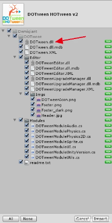
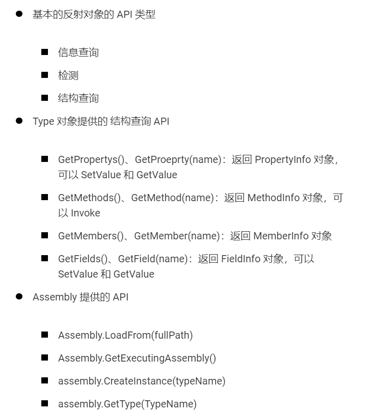

# CS知识体系构建

> 笔记出处：[C# 知识体系构建（第二版）](https://learn.u3d.cn/tutorial/csharp_map_build)

Unity 支持的 C# 版本如下:

- Unity 4.x 支持到 C# 2.0
- Unity 5.x 支持到 C# 3.0，
- Unity 2017.x 支持到 C# 6.0
- Unity 2018.4 ~ 2019.x 到 C# 7.3。
- Unity 2020.3 ~ 2021.1 到 C#8.0
- Unity 2022.x 到 C#9.0

## C# 1.0


### 类

:::note

面向对象编程 == 建模

:::

> 没有类会怎么样?
>
> 如果没有类，在 Unity 中就无法方便地写脚本了，因为 Unity 中的脚本需要继承 MonoBehaviour 类。
>
> 我们知道 MonoBehaviour 中包含了 transform、gameObject 的引用，也有一些生命周期方法，比如：Awake、Start、Update、OnDestory、OnEnable、OnDisable、OnTriggerEnter 等，提供了丰富的功能 和 API。
>
> 而我们写 Unity 脚本的时候，只需要简单地继承 MonoBehaviour 类就可以拥有以上所说的所有功能和 API。
>
> 也就是说类的继承这个功能，让用户更方便地复用代码，更方便地使用引擎的功能。
>
> 以上仅仅是一个小例子，大家可以从自己的编程经验出发，简单思考下没有类会怎么样？

**面向对象和面向过程的区别**

- 面向对象编程是以对象为基础进行设计的，而面向过程是以功能（函数）为基础进行思考的。
- 面向对象更擅设计，而面向过程更擅长实现。

**类的访问权限**

访问权限有：`internal`、`private`、`public`。

`internal`：同一程序集中的任何代码都可以访问该类型或成员，但其他程序集中的代码不可以。 换句话说，`internal` 类型或成员可以从属于同一编译的代码中访问。

internal class 一般在打 dll 的时候作用很大，可以控制有些类不让用户访问到，也可以配合 Unity 的 Assembly Definition 功能使用。

private class 用得不多，一般作为内部类存在。

**类的命名**

类的命名一般是名词，当然有的时候也是动词，比如写一个行为树，那可能会有类似 Wait 这样的类名。

**抽象类 与 接口**

抽象类中有的时候需要些抽象方法，抽象方法需要在子类中覆写。

不能 new 一个抽象类。

实现接口可以显式实现和隐式实现，显式实现可以控制方法的访问权限

**内部类**

有的时候需要在类内部创建一些只需要在类内部使用的对象，这时候可以用内部类。

**partial 关键字**

`paritial`可以实现类的逻辑拆分到不同的文件。

```csharp
// A1.cs 文件中 
public partial class A 
{     
    public void Say()     
    {         
        Debug.Log("Say Hello");     
    } 
}  
// A2.cs 文件中 
public partial class A 
{     
    public void Say2()     
    {         
        Debug.Log("Say Hello2");     
    } 
}
// 测试 
var a = new A(); 
a.Say(); 
a.Say2(); 
```

**泛型类**

类需要适配不同的类型的时候，可以用泛型类，比如单例的模板。

**引用类型 和 值类型**

- 引用类型，用类创建的类型就是引用类型。
- 值类型包含基础类型 和 结构体（struct）还有枚举创建出来的类型。

:::tip

盛传一句话，能用好 struct 的都是高手。

:::

### 反射

:::info

反射的核心就是使用各种 Type 相关的 API。

:::

> 提供封装程序集、模块和类型的对象

**反射(Reflection)**提供以下对象：

- 封装了程序集的对象
- 封装了模块的对象
- 封装了类型的对象

```csharp
void Start()
{
    // var type = typeof(Reflection_Info);

    var type = gameObject.AddComponent<Reflection_Info>().GetType();

    Debug.LogFormat("FullName:{0}", type.FullName);             
    Debug.LogFormat("IsClass:{0}", type.IsClass);             
    Debug.LogFormat("Namespace:{0}", type.Namespace);             
    // 是否是抽象的（抽象类、接口）             
    Debug.LogFormat("IsAbstract:{0}", type.IsAbstract);             
    // 是否是值类型             
    Debug.LogFormat("IsValueType:{0}", type.IsValueType);
	//获取方法数量(public)
    Debug.LogFormat("Methods Length:{0}", type.GetMethods().Length);
    //获取所有字段
    Debug.LogFormat("Fields Length:{0}", type.GetFields().Length);         
    //获取所有属性器
    Debug.LogFormat("Properties Length:{0}", type.GetProperties().Length); 
    //获取成员数量
    Debug.LogFormat("Members Length:{0}", type.GetMembers().Length);
}
```

Type的API：

- 类信息查询 API：获取各种名字。
- 检测 API：判断 type 是否是某一个事物（比如是否是抽象的，等等）
- 类结构查询 API：获取父类类型、获取方法、获取构造、获取成员变量等等。

#### GetMember()

```csharp
using System.Reflection; 

using UnityEngine;  

namespace QFramework.Example.CSharp{     
    public class ReflectionExample : MonoBehaviour{         
        public class SomeClass{             
            public void MethodA(){}              
            
            private void MethodB(){}
            
            public string FieldA;              
            
            public string PropertyA { get; set; }         
        }          
        
        void Start(){
			var type = typeof(SomeClass);
            //获取到了不包含父类的、包含非 public 的所有成员。
            var members = type.GetMembers(                 
                            BindingFlags.Instance |  	//搜索实例成员
                            BindingFlags.NonPublic |	//搜索非Public 
                            BindingFlags.Public |		//搜索public
                            BindingFlags.DeclaredOnly);	//不搜索父类  
                            
            Debug.LogFormat("Member Length:{0}", members.Length);              
            foreach (var memberInfo in members){                 
                Debug.LogFormat("Member Name:{0}", memberInfo.Name);
            }
        }     
    } 
}  

// 输出结果: 
// Member Length:8 
// Member Name:MethodA
// Member Name:MethodB
// Member Name:get_PropertyA
// Member Name:set_PropertyA
// Member Name:.ctor
// Member Name:PropertyA
// Member Name:FieldA
// Member Name:<PropertyA>k__BackingField
```

**获取到了不包含父类的、包含非 public 的所有成员。**

```
var members = type.GetMembers(                 
    BindingFlags.Instance |                 
    BindingFlags.NonPublic |                 
    BindingFlags.Public |                 
    BindingFlags.DeclaredOnly);        
```

**`<PropertyA>k__BackingField `**：`PropertyA { get; set; } `自动生成的一个私有变量

#### MethodInfo对象的Invoke方法

```csharp
using UnityEngine;  

namespace QFramework.Example.CSharp 
{     
    public class ReflectionExample : MonoBehaviour     
    {         
        public class SomeClass         
        {             
            public void SayHello()             
            {                 
                Debug.Log("Say Hello");             
            }              
            
            public string NumberToString(int number)             
            {                 
                return number.ToString();             
            }         
        }          
        
        void Start()         
        {             
            // 通过对象的 GetType 获取对象 
            var someObj = new SomeClass();              
            
            var type = someObj.GetType();             
            
            // 获取 SayHello 的 MethodInfo 
            var sayHelloMethodInfo = type.GetMethod("SayHello");                
            
            // 调用 someObj 的 SayHello 方法 
            // null 是指没有参数的意思             
            sayHelloMethodInfo.Invoke(someObj, null);              
            
            // 获取 NumberToString 的 MethodInfo 
            var numberToStringMethodInfo = type.GetMethod("NumberToString");              
            
            // 调用 someObj 的 NumberToString 方法 
            // 参数为 100 
            // 返回值用 numberString 接收,返回的是 object 类型的对象 
            var numberString = numberToStringMethodInfo.Invoke(someObj, new object[] {100});                        
            
            // 输出 numberString             
            Debug.Log(numberString);         
        }     
    } 
} 

// 输出: 
// SayHello 
// 100 
```

#### 语法糖

1. is 可以判断一个对象是否是一个类。

   ```csharp
   var someObj = new SomeClass();                          
         
   if (someObj is BaseClass){                 
       Debug.Log("someObj is BaseClass");             
   }
   ```

#### 结合Attribute使用

```csharp
public class AttributeExample : MonoBehaviour  
{     
  void Start ()     
  {         
    // 创建 SomeClass 对象          
    var someObject = new SomeClass();          
    // 获取 SomeClass 的类型         
    var type = someObject.GetType(); 
    // typeof(SomeClass) 亦可          
    // 获取所有成员变量         
    var members = type.GetMembers();          
    // 获取所有标记 AutoSetHelloWorld 的成员变量         
    var markedMembers = 
      members.Where(m => m.GetCustomAttributes(typeof(AutoSetHelloWorldAttribute), false).Length != 0);          
    // 设置 Hello World         
    foreach (var markedMember in markedMembers)         
    {             
      var fieldInfo = markedMember as FieldInfo;              
      fieldInfo.SetValue(someObject, "Hello World");         
    }          
    
    // 输出         
    Debug.Log(someObject.Text);     
  } 
} 
// 输出内容 
// Hello World 
```

#### Assembly

一个可执行的代码包，在 Assembly 中，有一些类型定义和代码。可以供我们通过反射或者引用到项目中进行调用。

当然 Assembly 中的代码，都是通过 C# 编译过后可直接在 .Net 环境中执行的代码。

 DOTween 安装之后，会导入一些 dll 文件到工程中



这个 dll 文件就是 Assembly 了，也就是所谓的程序集了。

如果程序集直接安装到项目中，我们就可以直接访问程序集提供的 API。

但是如果需要我们在运行时去加载程序集，我们就需要通过反射才可以完成。

#### 反射调用dll文件内函数

- Assembly.GetExecutingAssembly()
- assembly.CreateInstance(typeName)

```csharp
namespace QFramework.Example 
{     
    public class ReflectionExample : MonoBehaviour     
    {         
        private void Start()         
        {             
            // 通过 dll 的完整路径加载 dll 
            var assembly = Assembly.LoadFile(Application.streamingAssetsPath + "/Android/hotfix/hotfix.dll");              
            // 获取 SayHelloWorld 类 
            var type = assembly.GetType("ReflectionExample.SayHelloWorld");              
            // 创建对象 
            var sayHelloWorldObj = Activator.CreateInstance(type);              
            // 获取 Say 方法 
            var say = type.GetMethod("Say");              
            // 调用 sayHelloWorldObj 的 Say 方法             
            say.Invoke(sayHelloWorldObj,null);         
        }     
    } 
} 

// 输出内容: 
// Say Hello World 
```

**另一种方法**

```csharp
using System.Reflection; 

using UnityEngine;  

namespace QFramework.Example 
{     
    public class ReflectionExample : MonoBehaviour     
    {         
        private void Start()         
        {             
            // 获取当前的 Assembly 
            var assembly = Assembly.GetExecutingAssembly();              
            // 获取 SayHelloWorld 类 
            var sayHelloWorldObj = assembly.CreateInstance("ReflectionExample.SayHelloWorld");                        
            // 获取 Say 方法 
            var say = sayHelloWorldObj.GetType()                 
                    .GetMethod("Say");              
            // 调用 sayHelloWorldObj 的 Say 方法             
            say.Invoke(sayHelloWorldObj,null);         
        }     
    } 
} 
// 输出内容: 
// Say Hello World 
```

