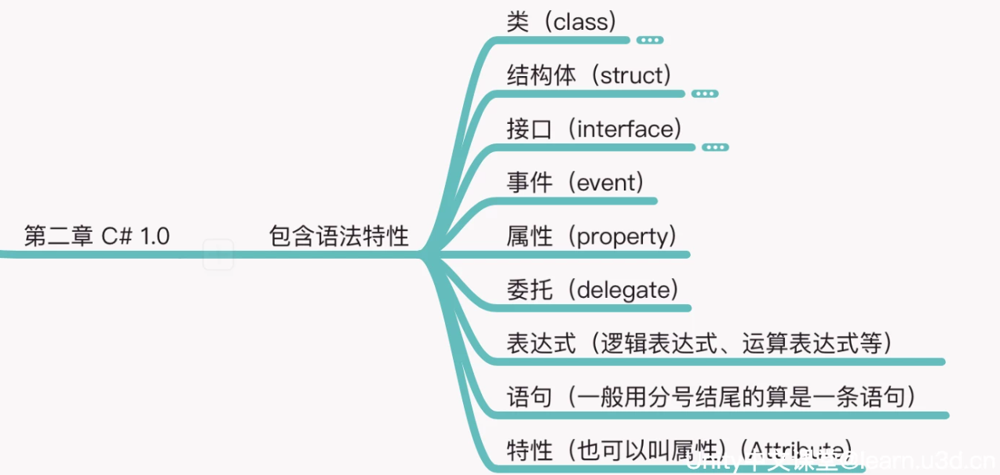

# CS知识体系构建

> 笔记出处：[C# 知识体系构建（第二版）](https://learn.u3d.cn/tutorial/csharp_map_build)

Unity 支持的 C# 版本如下:

- Unity 4.x 支持到 C# 2.0
- Unity 5.x 支持到 C# 3.0，
- Unity 2017.x 支持到 C# 6.0
- Unity 2018.4 ~ 2019.x 到 C# 7.3。
- Unity 2020.3 ~ 2021.1 到 C#8.0
- Unity 2022.x 到 C#9.0

## C# 1.0



### 类

:::note

面向对象编程 == 建模

:::

> 没有类会怎么样?
>
> 如果没有类，在 Unity 中就无法方便地写脚本了，因为 Unity 中的脚本需要继承 MonoBehaviour 类。
>
> 我们知道 MonoBehaviour 中包含了 transform、gameObject 的引用，也有一些生命周期方法，比如：Awake、Start、Update、OnDestory、OnEnable、OnDisable、OnTriggerEnter 等，提供了丰富的功能 和 API。
>
> 而我们写 Unity 脚本的时候，只需要简单地继承 MonoBehaviour 类就可以拥有以上所说的所有功能和 API。
>
> 也就是说类的继承这个功能，让用户更方便地复用代码，更方便地使用引擎的功能。
>
> 以上仅仅是一个小例子，大家可以从自己的编程经验出发，简单思考下没有类会怎么样？

**面向对象和面向过程的区别**

- 面向对象编程是以对象为基础进行设计的，而面向过程是以功能（函数）为基础进行思考的。
- 面向对象更擅设计，而面向过程更擅长实现。

**类的访问权限**

访问权限有：`internal`、`private`、`public`。

`internal`：同一程序集中的任何代码都可以访问该类型或成员，但其他程序集中的代码不可以。 换句话说，`internal` 类型或成员可以从属于同一编译的代码中访问。

internal class 一般在打 dll 的时候作用很大，可以控制有些类不让用户访问到，也可以配合 Unity 的 Assembly Definition 功能使用。

private class 用得不多，一般作为内部类存在。

**类的命名**

类的命名一般是名词，当然有的时候也是动词，比如写一个行为树，那可能会有类似 Wait 这样的类名。

**抽象类 与 接口**

抽象类中有的时候需要些抽象方法，抽象方法需要在子类中覆写。

不能 new 一个抽象类。

实现接口可以显式实现和隐式实现，显式实现可以控制方法的访问权限

**内部类**

有的时候需要在类内部创建一些只需要在类内部使用的对象，这时候可以用内部类。

**partial 关键字**

`paritial`可以实现类的逻辑拆分到不同的文件。

```csharp
// A1.cs 文件中 
public partial class A 
{     
    public void Say()     
    {         
        Debug.Log("Say Hello");     
    } 
}  
// A2.cs 文件中 
public partial class A 
{     
    public void Say2()     
    {         
        Debug.Log("Say Hello2");     
    } 
}
// 测试 
var a = new A(); 
a.Say(); 
a.Say2(); 
```

**泛型类**

类需要适配不同的类型的时候，可以用泛型类，比如单例的模板。

**引用类型 和 值类型**

- 引用类型，用类创建的类型就是引用类型。
- 值类型包含基础类型 和 结构体（struct）还有枚举创建出来的类型。

:::tip

盛传一句话，能用好 struct 的都是高手。

:::

### 反射

:::info

反射的核心就是使用各种 Type 相关的 API。

:::

> 提供封装程序集、模块和类型的对象

**反射(Reflection)**提供以下对象：

- 封装了程序集的对象
- 封装了模块的对象
- 封装了类型的对象

```csharp
void Start()
{
    // var type = typeof(Reflection_Info);

    var type = gameObject.AddComponent<Reflection_Info>().GetType();

    Debug.LogFormat("FullName:{0}", type.FullName);             
    Debug.LogFormat("IsClass:{0}", type.IsClass);             
    Debug.LogFormat("Namespace:{0}", type.Namespace);             
    // 是否是抽象的（抽象类、接口）             
    Debug.LogFormat("IsAbstract:{0}", type.IsAbstract);             
    // 是否是值类型             
    Debug.LogFormat("IsValueType:{0}", type.IsValueType);
	//获取方法数量(public)
    Debug.LogFormat("Methods Length:{0}", type.GetMethods().Length);
    //获取所有字段
    Debug.LogFormat("Fields Length:{0}", type.GetFields().Length);         
    //获取所有属性器
    Debug.LogFormat("Properties Length:{0}", type.GetProperties().Length); 
    //获取成员数量
    Debug.LogFormat("Members Length:{0}", type.GetMembers().Length);
}
```

Type的API：

- 类信息查询 API：获取各种名字。
- 检测 API：判断 type 是否是某一个事物（比如是否是抽象的，等等）
- 类结构查询 API：获取父类类型、获取方法、获取构造、获取成员变量等等。

#### GetMember()

```csharp
using System.Reflection; 

using UnityEngine;  

namespace QFramework.Example.CSharp{     
    public class ReflectionExample : MonoBehaviour{         
        public class SomeClass{             
            public void MethodA(){}              
            
            private void MethodB(){}
            
            public string FieldA;              
            
            public string PropertyA { get; set; }         
        }          
        
        void Start(){
			var type = typeof(SomeClass);
            //获取到了不包含父类的、包含非 public 的所有成员。
            var members = type.GetMembers(                 
                            BindingFlags.Instance |  	//搜索实例成员
                            BindingFlags.NonPublic |	//搜索非Public 
                            BindingFlags.Public |		//搜索public
                            BindingFlags.DeclaredOnly);	//不搜索父类  
                            
            Debug.LogFormat("Member Length:{0}", members.Length);              
            foreach (var memberInfo in members){                 
                Debug.LogFormat("Member Name:{0}", memberInfo.Name);
            }
        }     
    } 
}  

// 输出结果: 
// Member Length:8 
// Member Name:MethodA
// Member Name:MethodB
// Member Name:get_PropertyA
// Member Name:set_PropertyA
// Member Name:.ctor
// Member Name:PropertyA
// Member Name:FieldA
// Member Name:<PropertyA>k__BackingField
```

**获取到了不包含父类的、包含非 public 的所有成员。**

```
var members = type.GetMembers(                 
    BindingFlags.Instance |                 
    BindingFlags.NonPublic |                 
    BindingFlags.Public |                 
    BindingFlags.DeclaredOnly);        
```

**`<PropertyA>k__BackingField `**：`PropertyA { get; set; } `自动生成的一个私有变量

#### MethodInfo对象的Invoke方法

```csharp
using UnityEngine;  

namespace QFramework.Example.CSharp 
{     
    public class ReflectionExample : MonoBehaviour     
    {         
        public class SomeClass         
        {             
            public void SayHello()             
            {                 
                Debug.Log("Say Hello");             
            }              
            
            public string NumberToString(int number)             
            {                 
                return number.ToString();             
            }         
        }          
        
        void Start()         
        {             
            // 通过对象的 GetType 获取对象 
            var someObj = new SomeClass();              
            
            var type = someObj.GetType();             
            
            // 获取 SayHello 的 MethodInfo 
            var sayHelloMethodInfo = type.GetMethod("SayHello");                
            
            // 调用 someObj 的 SayHello 方法 
            // null 是指没有参数的意思             
            sayHelloMethodInfo.Invoke(someObj, null);              
            
            // 获取 NumberToString 的 MethodInfo 
            var numberToStringMethodInfo = type.GetMethod("NumberToString");              
            
            // 调用 someObj 的 NumberToString 方法 
            // 参数为 100 
            // 返回值用 numberString 接收,返回的是 object 类型的对象 
            var numberString = numberToStringMethodInfo.Invoke(someObj, new object[] {100});                        
            
            // 输出 numberString             
            Debug.Log(numberString);         
        }     
    } 
} 

// 输出: 
// SayHello 
// 100 
```

#### 语法糖

1. is 可以判断一个对象是否是一个类。

   ```csharp
   var someObj = new SomeClass();                          
         
   if (someObj is BaseClass){                 
       Debug.Log("someObj is BaseClass");             
   }
   ```

#### 结合Attribute使用

```csharp
public class AttributeExample : MonoBehaviour  
{     
  void Start ()     
  {         
    // 创建 SomeClass 对象          
    var someObject = new SomeClass();          
    // 获取 SomeClass 的类型         
    var type = someObject.GetType(); 
    // typeof(SomeClass) 亦可          
    // 获取所有成员变量         
    var members = type.GetMembers();          
    // 获取所有标记 AutoSetHelloWorld 的成员变量         
    var markedMembers = 
      members.Where(m => m.GetCustomAttributes(typeof(AutoSetHelloWorldAttribute), false).Length != 0);          
    // 设置 Hello World         
    foreach (var markedMember in markedMembers)         
    {             
      var fieldInfo = markedMember as FieldInfo;              
      fieldInfo.SetValue(someObject, "Hello World");         
    }          
    
    // 输出         
    Debug.Log(someObject.Text);     
  } 
} 
// 输出内容 
// Hello World 
```

#### Assembly

一个可执行的代码包，在 Assembly 中，有一些类型定义和代码。可以供我们通过反射或者引用到项目中进行调用。

当然 Assembly 中的代码，都是通过 C# 编译过后可直接在 .Net 环境中执行的代码。

 DOTween 安装之后，会导入一些 dll 文件到工程中


这个 dll 文件就是 Assembly 了，也就是所谓的程序集了。

如果程序集直接安装到项目中，我们就可以直接访问程序集提供的 API。

但是如果需要我们在运行时去加载程序集，我们就需要通过反射才可以完成。

#### 反射调用dll文件内函数

- Assembly.GetExecutingAssembly()
- assembly.CreateInstance(typeName)

```csharp
namespace QFramework.Example 
{     
    public class ReflectionExample : MonoBehaviour     
    {         
        private void Start()         
        {             
            // 通过 dll 的完整路径加载 dll 
            var assembly = Assembly.LoadFile(Application.streamingAssetsPath + "/Android/hotfix/hotfix.dll");              
            // 获取 SayHelloWorld 类 
            var type = assembly.GetType("ReflectionExample.SayHelloWorld");              
            // 创建对象 
            var sayHelloWorldObj = Activator.CreateInstance(type);              
            // 获取 Say 方法 
            var say = type.GetMethod("Say");              
            // 调用 sayHelloWorldObj 的 Say 方法             
            say.Invoke(sayHelloWorldObj,null);         
        }     
    } 
} 

// 输出内容: 
// Say Hello World 
```

**另一种方法**

```csharp
using System.Reflection; 

using UnityEngine;  

namespace QFramework.Example 
{     
    public class ReflectionExample : MonoBehaviour     
    {         
        private void Start()         
        {             
            // 获取当前的 Assembly 
            var assembly = Assembly.GetExecutingAssembly();              
            // 获取 SayHelloWorld 类 
            var sayHelloWorldObj = assembly.CreateInstance("ReflectionExample.SayHelloWorld");                        
            // 获取 Say 方法 
            var say = sayHelloWorldObj.GetType()                 
                    .GetMethod("Say");              
            // 调用 sayHelloWorldObj 的 Say 方法             
            say.Invoke(sayHelloWorldObj,null);         
        }     
    } 
} 
// 输出内容: 
// Say Hello World 
```


## C# 2.0

### 匿名方法

**匿名方法（Anonymous methods）** 提供了一种传递代码块作为委托参数的技术。匿名方法是没有名称只有主体的方法。

在匿名方法中您不需要指定返回类型，它是从方法主体内的 return 语句推断的。

```csharp
delegate void NumberChanger(int n);
...
NumberChanger nc = delegate(int x)
{
    Console.WriteLine("Anonymous Method: {0}", x);
};
```

### null值类型

> 可空值类型的成员变量，不会在 Unity 的 Inspector 上显示。

有了可空值类型这个特性，就比较容易判断一个 number 是否是初始化过了。

```csharp
int? number = null;
```

### 迭代器

#### 迭代器模式

在不知道集合内部细节的情况下，提供一个按序方法存取的一个对象集合体的每一个单元。
提供一种方法顺序访问一个集合对象中的各个元素，又不暴露该对象的内部表示

#### IEnumerator

**集合访问器**，使用foreach语句遍历集合或数组时，就是调用 Current、MoveNext()的结果。

```csharp
public interface IEnumerator{
    // 返回结果: 集合中的当前元素。
    object Current { get; }

    // 返回结果: 如果枚举数成功地推进到下一个元素，则为 true；
    //          如果枚举数越过集合的结尾，则为 false。
    bool MoveNext();

    // 调用结果:将枚举数设置为其初始位置，该位置位于集合中第一个元素之前。
    void Reset();
}
```

#### IEnumerable

> 可枚举的

利用 GetEnumerator() 返回 IEnumerator 集合访问器。

```csharp
public interface IEnumerable
{
    // 返回结果: 可用于循环访问集合的IEnumerator对象。
    IEnumerator GetEnumerator();
}
```

#### 举例实现

```csharp
public class IEnumeratorExample : MonoBehaviour     
{         
    private class ForEachable : IEnumerable{             
        public IEnumerator GetEnumerator()             
        {                 
            return new FiveTimes();             
        }         
    }            

    private class FiveTimes : IEnumerator         
    {             
        private int mCount = 5;                

        public bool MoveNext()             
        {                 
            mCount--;                 

            return mCount >= 0;             
        }              

        public void Reset()             
        {                 
            mCount = 5;             
        }              

        public object Current             
        {                 
            get { return string.Empty; }             
        }         
    }          

    private void Start()         
    {             
        var foreachAble = new ForEachable();              

        foreach (var empty in foreachAble)             
        {                 
            Debug.Log("A");             
        }         
    }     
} 
```

### 委托判断

**方法组转换（委托）**

方法组转换的重点是方法组，方法组实际上就是方法名，可以把一个方法组直接设置给一个同类型同返回值的委托变量上，在这个直接设置值的过程中，方法组本身发生了方法组转换。

```csharp
public class CSharpExample 
{     
    public delegate void SomeDelegate();      
    
    void SomeFunc()     
    {     
    }      
    
    void Example()     
    {         
        // C# 1.0 只能这样写，要使用 new 关键字         
        SomeDelegate delegateA = new SomeDelegate(SomeFunc);          
        
        // C# 2.0 可以直接这样写          
        SomeDelegate delegateB = SomeFunc;     
    } 
} 
```

**委托推断**意思就是，通过委托的返回值和参数去匹配方法组。

```csharp
public class CSharpExample 
{     
    public delegate void SomeDelegate();      
    
    void SomeFunc()     
    {     
    }      
    
    void Example()     
    {         
        // C# 1.0 只能这样写，要使用 new 关键字         
        SomeDelegate delegateA = new SomeDelegate(SomeFunc);          
        
        // C# 2.0 可以直接这样写          
        SomeDelegate delegateB = SomeFunc;     
    } 
} 
```

## C# 3.0

### **lambda 表达式**

```csharp
public class LambdaExpressionExample 
{     
    void Func()     
    {     
    }      
    
    void Main()     
    {         
        // C# 1.0         
        Action action1 = new Action(Func);          
        
        // C# 2.0          
        Action actionB = delegate {  };            
        
        // C# 3.0         
        
        Action acionC = () => { };     
    } 
} 
```

### 表达式树

```csharp
public class ExpressionTreeExample : MonoBehaviour     
{         
    void Start()         
    {             
        // 创建表达式树               
        Expression<Func<int, bool>> expr = num => num < 5;                  

        // 将表达式树编译为一个委托               
        Func<int, bool> result = expr.Compile();                  

        // 执行表达式树的委托             
        Debug.Log(result(4));         
    }     
} 

// 输出结果 
// True 
```

通过表达式树可以构造一个委托出来，当执行委托的时候，就执行表达式树所表达的代码。

```csharp
public class ExpressionTreeExample : MonoBehaviour     
{         
    void Start()         
    {             
        // 创建一个 num 参数 
        var num = Expression.Parameter(typeof(int), "num");             

        // 创建一个 常数 5 
        var five = Expression.Constant(5, typeof(int));             

        // 创建一个表达式 
        num < 5 var numLessThan5 = Expression.LessThan(num, five);             

        // 创建一个 labmda 表达式 (num)=>num < 5 
        var labmda = Expression.Lambda<Func<int, bool>>(numLessThan5, new ParameterExpression[]             
                                                        {                 
                                                            num             
                                                        });                

        // 将表达式树编译为一个委托               
        Func<int, bool> result = labmda.Compile();                  

        // 执行表达式树的委托             
        Debug.Log(result(4));         
    }     
}  

// 输出结果 
// True 
```

### [扩展方法](https://docs.microsoft.com/zh-cn/dotnet/csharp/programming-guide/classes-and-structs/extension-methods)

扩展方法使你能够向现有类型“添加”方法，而无需创建新的派生类型、重新编译或以其他方式修改原始类型。
扩展方法是一种特殊的静态方法，但可以像扩展类型上的实例方法一样进行调用。对于用 C# 和 Visual Basic 编写的客户端代码，
调用扩展方法与调用在类型中实际定义的方法之间没有明显的差异。

　　扩展方法被定义为静态方法，但它们是通过实例方法语法进行调用的。它们的第一个参数指定该方法作用于哪个类型，
并且该参数以 this 修饰符为前缀。仅当你使用 using 指令将命名空间显式导入到源代码中之后，扩展方法才位于范围中。

下面的示例演示为 System.String 类定义的一个扩展方法。  请注意，它是在非嵌套的、非泛型静态类内部定义的：

```csharp
namespace ExtensionMethods
{
    public static class MyExtensions
    {
        public static int WordCount(this String str)
        {
            return str.Split(new char[] { ' ', '.', '?' }, 
                             StringSplitOptions.RemoveEmptyEntries).Length;
        }
    }   
}
```

可使用此 **using** 指令将 WordCount 扩展方法置于范围中：

```csharp
using ExtensionMethods;
```

#### 链式API

链式的 API 的核心就是返回自己（return this），可以把写死，也可以用泛型约束做成稍微通用一点的链式 API。

```csharp
using UnityEngine;  

namespace QFramework.Master 
{    
    public class ExtensionsExample : MonoBehaviour   
    {      
        // 不用扩展方法的方式定义 
        public ExtensionsExample SayHello()     
        {       
            Debug.Log("Hello");       
            
            return this;     
        }      
        
        public ExtensionsExample SayGoodBye()     
        {       
            Debug.Log("Goodbye");       
            
            return this;     
        }      
        
        void Start()     
        {       
            this.SayHello()         
                .DoSomething()         
                .SayGoodBye();     
        }   
    }    
    
    /// <summary> 
    /// 扩展方法的方式定义 
    /// </summary> 
    public static class MonoExtensions   
    {     
        /// <summary> 
        /// 使用泛型约束 
        /// </summary> 
        /// <param name="self"></param> 
        /// <typeparam name="T"></typeparam> 
        /// <returns></returns> 
        public static T DoSomething<T>(this T self) where T : MonoBehaviour     
        {       
            self.name = "DoSomething";       
            
            return self;     
        }   
    }    
} 
```

#### 流式API

核心就是通过泛型约束和接口的继承，来强制让 API 按照一定顺序的调用。

```csharp
using UnityEngine;  

namespace QFramework.Master 
{   
    public interface IStageStart : IStageA   
    {   
    }    
    
    public interface IStageA : IStageB   
    {   
    }    
    
    public interface IStageB : IStageBase   
    {   
    }    
    
    public interface IStageBase   
    {     
        void ExecuteStage();   
    }    
    
    public static class StageExtensions   
    {     
        public static IStageA EnterStageA<T>(this T self) where T : IStageStart     
        {       
            return self;     
        }      
        
        public static IStageB EnterStageB<T>(this T self) where T : IStageA     
        {       
            return self;     
        }   
    }    
    
    public class ExtensionsExample : MonoBehaviour, IStageStart   
    {     
        void Start()     
        {       
            this.EnterStageA()         
                .EnterStageB()         
                .ExecuteStage();            
            
            this.EnterStageB()         
                .ExecuteStage();            
                
            this.ExecuteStage();        
            
            // 这个会报编译错误 因为顺序不对 
            // this.ExecuteStage() 
            // .EnterStageB();      
        }      
        
        public void ExecuteStage()     
        {      
        }   
    } 
} 
```

#### 查询表达式(LINQ)

> - LINQ = IEnumerable + Operator + foreach/ForEach/Single/First/ToList/ToDictionary/ToHashSet等等
>
> IEnumerable 实际上就是集合，C# 中的 Array、Dictionary、List、Stack、Queue 都是集合，都是可以用 LINQ 的。
>
> Operator 是操作符：比如 Where、Select、GroupBy、Distinct 都是操作符。
>
> 而以上公式的第三个部分就是具体的操作了，一般情况下，经过 LINQ 操作符操作后得到的是一个集合，这个集合可以直接用 foreach 进行遍历，也可以转换成 List 或则 Dictionary 等数据结构。
>
> 如果想要从头到尾只用一行代码，那么就可以直接 ToList ，然后调用 List 的 ForEach，笔者在上一小节的示例代码就是这么做的。

查询表达式是用上了之后会离不开的一个特性，它主要做的一个事情就是**对数据集合的查询**。

- [LINQ 教程](https://docs.microsoft.com/zh-cn/dotnet/csharp/linq/)
- [Enumerable 方法(操作符大全)](https://docs.microsoft.com/zh-cn/dotnet/api/system.linq.enumerable.aggregate?view=netframework-3.5)

```csharp
using System.Collections.Generic; 
using System.Linq; 
using UnityEngine;  

namespace QFramework.Master 
{   
    public class LINQExample : MonoBehaviour   
    {     
        public class Student     
        {       
            public string Name { get; set; }        
            public int Age { get; set; }     
        }      
        
        void Start()     
        {       
            var students = new List<Student>()      
            {         
                new Student() {Name = "凉鞋", Age = 18},         
                new Student() {Name = "hor", Age = 16},         
                new Student() {Name = "天赐", Age = 17},         
                new Student() {Name = "阿三", Age = 18}       
            };        
            
            // 1.基本的遍历       
            students.ForEach(s => Debug.Log(s.Name));        
            // 2.基本的条件过滤（Age > 5)       
            students.Where(s => s.Age > 5)         
                .ToList()         
                .ForEach(s => Debug.Log(s.Name));
                        
            // 与以上代码等价       
            (from s in students           
                where s.Age > 5 select s)         
                    .ToList()         
                    .ForEach(s => Debug.Log(s.Name));        
            
            // 3.基本的变换（student 转换成 name）       
            students.Select(s => s.Name)         
                    .ToList()         
                    .ForEach(name => Debug.Log(name));        
                    
            // 与以上代码等价       
            (from s in students           
                    select s.Name)         
                        .ToList()         
                        .ForEach(name => Debug.Log(name));        
            // 4.基本的分组（使用学生的名字分组）       
            students.GroupBy(s => s.Name)         
                    .ToList()         
                    .ForEach(group => Debug.Log(group.Count()));        
            
            // 与以上代码等价       
            (from s in students           
                group s by s.Name)         
                    .ToList()         
                    .ForEach(group => Debug.Log(group.Count()));            
            // 等等     
        }   
    } 
} 
```

