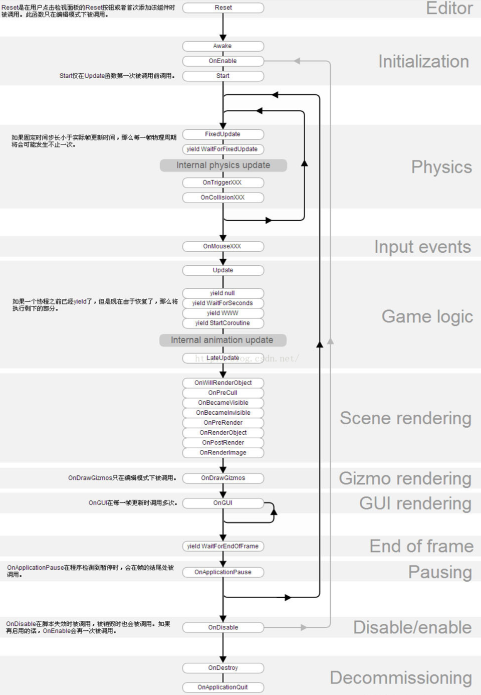
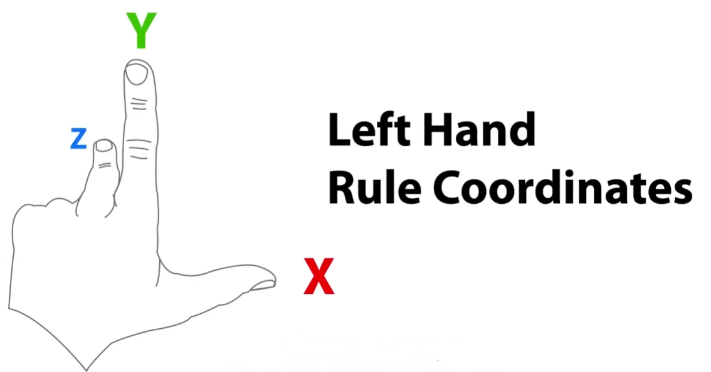
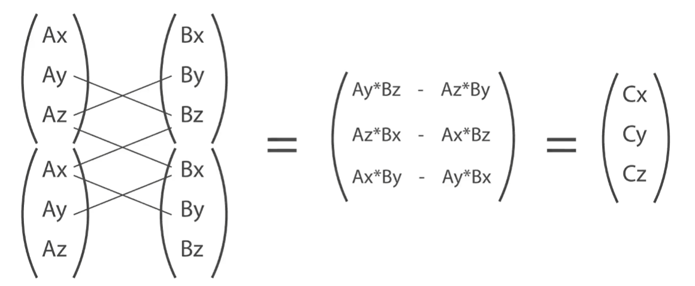

# Script

## 生命周期

### 1. 编辑器阶段
- **Reset()方法**：当脚本第一次添加到对象时会调用该方法，用于初始化脚本的属性。

### 2. 场景首次加载（脚本首次加载）
- **Awake()方法**：在Start方法之前调用，<u>只要脚本附加到游戏对象中，哪怕不勾选</u>，依旧会执行Awake函数中的代码

- **OnEnable()方法**：该方法在对象激活状态下可用（`MonoBehaviour`实例被创建时）。

  > **注意**： 当前场景中所有的Awake()和OnEnable()方法会在所有Start()等方法之前调用。

### 3. 首帧更新前
- > **Start()方法**：如果脚本实例为可用，则在首帧更新之前被调用。
  > **注意**： 同上，Start方法在所有Update方法之前调用。
  > Awake()、OnEnable()、Start()三个方法共同完成了一个Unity脚本的初始化工作。

### 4. 执行阶段
该阶段就是当前帧执行完毕后需要开始执行下一帧的阶段，该阶段可能触发的方法如下：

- **OnApplicationPause()方法**：当检测到暂停时，在当前帧结束后调用。

### 三种Update顺序
- **FixedUpdate()方法**

  按固定时间调用

  该方法运行单位不是帧，而是基于系统的定时器，它的调用很稳定而且不受帧率影响，所以大都用来处理**物理**相关的逻辑。

- **Update()方法**

  该方法每一帧被调用一次，实现游戏按帧更新。

  Update()并**不是按固定时间调用的**，如果某一帧比下一帧的处理时间长，那么Update()调用的时间间隔就会不同

- **LateUpdate()方法**：和Update一样，但是LateUpdate()在Update()方法所有计算执行完毕后才会被调用，大都用来处理Update之后，相机渲染之前的逻辑。




## Vector

Unity采用“左手坐标系”



```c#
Vector3.Magnitude(VectorA)		//标量
Vector.Dot(VectorA, VectorB);	//点积
Vector.Cross(VectorA, VectorB);	//叉积
```

**叉积计算方法**：



## Time

### Time.deltaTime

```c#
void Update(){
    //物体沿着自身Z轴方向，每秒移动物体10米运动
    transform.Translate(0, 0, Time.deltaTime * 10); 
}
```

假设游戏运行时，1秒是60帧。如果电脑，或者手机帧数没有到60帧，时而30帧，时而50帧，那么就会出现，有时候1秒移动了500米 有时候300米，总之每秒都不一样。

引入了**增量时间**的概念，增量时间是实时变动的，而且每一帧都在变动

- 1秒30帧，那增量时间就是 1/30 秒
- 1秒60帧，那增量时间就是 1/60 秒
- 1秒166帧，那增量时间就是 1/166 秒

这样的设计理念，就保证了无论帧率是多是少，我们让物体1秒移动10米，最后1秒移动的就一定是10米