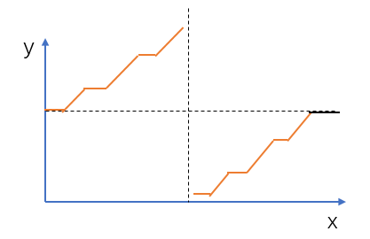

# 剑指Offer

## Week 1

### [13. 找出数组中重复的数字](https://www.acwing.com/problem/content/14/)

**解决办法**：注意读题，数据为n且数字范围0~n-1，可以保证"**一个萝卜一个坑**"，把每个数放到对应的位置上，即让`nums[i] = i`

- 如果`nums[x] != x`，那我们就把x交换到正确的位置上，即`swap(nums[x], nums[i])`，交换完之后如果`nums[i] != i`，则重复进行该操作。由于每次交换都会将一个数放在正确的位置上，所以swap操作最多会进行$n-1$次，不会发生死循环。
- 如果`x != i && nums[x] == x`，则说明`x`出现了多次，直接返回`x`即可

**时间复杂度分析**：每次`swap`操作都会将一个数放在正确的位置上，最后一次`swap`会将两个数同时放到正确位置上，一共只有$n$个数和$n$个位置，所以`swap`最多会进行$n−1$次。所以总时间复杂度是 $O(n)$

```cpp
class Solution {
public:
    int duplicateInArray(vector<int>& nums) {
        int n = nums.size();
        if(!n)    return -1;
        //首先遍历一遍，找出不符合条件的数据返回-1
        for(auto x : nums)    if(x < 0 || x >= n) return -1;
        for(int i=0;i<n;i++){
            // 如果没有重复元素，经过这一步操作，0位置将会存储0， i位置将会存储i
            while (nums[nums[i]] != nums[i]) swap(nums[i], nums[nums[i]]);
            // 多个萝卜占不下一个坑，有重复元素
            if (nums[i] != i) return nums[i];
        }
        return -1;
    }
};
```

### [14. 不修改数组找出重复的数字](https://www.acwing.com/problem/content/15/)

**题目**：给定一个长度为$n+1$的数组`nums`，数组中所有的数均在`1~n`的范围内，其中$n\geqslant1$。请找出数组中任意一个重复的数，但不能修改数组。

**解决办法**：一共有n+1一个数，每个数取值范围1~n，肯定存在一个数出现两次。

分治思想解决，将每个数的**取值**的区间[1,n]划分为[1,n/2]喝[n/2+1, n]两个子区间，然后分别统计两个区间中数的个数。划分之后，左右两个区间里一定至少存在一个区间，区间中数的个数大于区间长度。
因此我们可以把问题划归到左右两个子区间中的一个，而且由于区间中数的个数大于区间长度，根据抽屉原理，在这个子区间中一定存在某个数出现了两次。依次类推，每次我们可以把区间长度缩小一半，直到区间长度为1时，我们就找到了答案。

**时间复杂度**：每次会将区间长度缩小一半，一共会缩小$O(logn)$次。每次统计两个子区间中的数时需要遍历一次，时间复杂度为$O(n)$。所以总时间复杂度是$O(nlogn)$

**空间复杂度**：没有额外数组，空间复杂度$O(1)$

```cpp
class Solution {
public:
    int duplicateInArray(vector<int>& nums) {
        int l = 1, r = nums.size() - 1;
        while (l < r) {
            int mid = l + r >> 1; // 划分的区间：[l, mid], [mid + 1, r]
            int s = 0;
            //每次能够划分出来多一个坑的区间
            for (auto x : nums)
                s += (x >= l && x <= mid);
            //判断重复的数字在哪一边，更新区间
            if (s > mid - l + 1) r = mid;
            else l = mid + 1;
        }
        //最后返回的就是多出坑的位置
        return r;
    }
};
```

### [15. 二维数组中的查找 ](https://www.acwing.com/problem/content/16/)

**题目**：在一个二维数组中，每一行都按照从左到右递增的顺序排序，每一列都按照从上到下递增的顺序排序。

请完成一个函数，输入这样的一个二维数组和一个整数，判断数组中是否含有该整数。

**解决办法**：

根据题目给定的二维数组性质，从矩阵**右上角**开始枚举，当前枚举的是x

- `x` == `target` ，找到`target`
- `x` < `target` ，左边的数一定小于`target`，直接排除一行
- `x` > `target` ，下边的数一定大于`target`，直接排除一列

**时间复杂度**：每一步排除**一行**或**一列**，最多进行$n+m$次。所以时间复杂度$O(m+n)$

```cpp
class Solution {
public:
    bool searchArray(vector<vector<int>> array, int target) {
        
        int n = array.size();
        if(n==0)    return false;
        int m = array[0].size();
        int i = 0,j = m-1;                  //从数组右上角开始遍历
        
        for(;i<n && j>0;)
        {
            if(array[i][j] == target)   return true;
            if(array[i][j] > target) j++;   //删除一列不符合的元素
            if(array[i][j] < target) i++;   //删除一行
        }
        
        return false;
    }
};
```

### [16. 替换空格](https://www.acwing.com/problem/content/description/17/)

**题目**：请实现一个函数，把字符串中的每个空格替换成`"%20"`。

```cpp
class Solution {
public:
    string replaceSpaces(string &str) {
        string res;
        for(auto &x : str){
            if(x==' ')  res += "%20";
            else res+=x;
        }
        return res;
    }
};
```

### [17. 从尾到头打印链表](https://www.acwing.com/problem/content/18/)

**题目**：输入一个链表的头结点，按照 **从尾到头** 的顺序返回节点的值。返回的结果用数组存储。

```cpp
class Solution {
public:
    vector<int> printListReversingly(ListNode* head) {
        vector<int> arr;
        while(head){
            arr.push_back(head->val);
            head = head -> next;
        }
        reverse(arr.begin(), arr.end());
        return arr;
    }
};
```

### [18. 重建二叉树](https://www.acwing.com/activity/content/problem/content/213/)

**题目**：输入一棵二叉树前序遍历和中序遍历的结果，请重建该二叉树。

- 二叉树中每个节点的值都互不相同；
- 输入的前序遍历和中序遍历一定合法；


**解决办法**：**DFS递归**，$O(n)$

递归建立整棵二叉树：先递归创建左右子树，然后创建根节点，并让指针指向两棵子树。

1. 先利用前序遍历**找根节点**：前序遍历的第一个数，就是根节点的值；
2. 在**中序遍历中找到根节点的位置**$k$，则$k$左边是左子树的中序遍历，右边是右子树的中序遍历；
3. 假设左子树的中序遍历的长度是$l$，则在前序遍历中，根节点后面的$l$个数，是左子树的前序遍历，剩下的数是右子树的前序遍历
4. 有了**左右子树的前序遍历和中序遍历**，我们可以先递归创建出左右子树，然后再创建根节点；

> 如何确定左子树和右子树区间？
>
> ​	
>
> 1. 假设本次的`pre`数组的范围是`[pl,pr]`，而in数组的范围是`[il,ir]`
> 2. `pre`数组的第一个数,，这就是剩下所有的子树的根，找到其在中序数组中所在的位置，记为`k`
> 3. 那么，左子树的`pre`数组范围是`[pl+1,pl+k-il]`，因为在左子树的起始点肯定从`pl+1`开始；左子树的终点=`pl`+左子树长度(图中左子树长度=`pIndex-inLeft`对应`k-il`)，所以终点为pl+k-il；
> 4. 左子树的in数组范围是`[il,k-1]`，刚好在k号点之前的元素，这个很简单不需要解释。
> 5. 右子树的pre数组的范围是`[pl+k-il+1,pr]`，也就是刚好是剩下的那些点。
> 6. 右子树的in数组的范围是`[k+1,ir]`，也就是剩下的点。
>
> 

```cpp
class Solution {
public:
    unordered_map<int, int> hash;     //hash表记录中序遍历数组中每个元素的下标
    vector<int> preorder, inorder;
    TreeNode* buildTree(vector<int>& _preorder, vector<int>& _inorder) {
        preorder = _preorder, inorder = _inorder;
        int n = preorder.size();
        for(int i=0;i<n;i++)   hash[inorder[i]] = i;    //记录(inorder[i],i)
        return dfs(0, n-1, 0, n-1);
    }
    //dfs参数：两个遍历数组的双指针
    TreeNode* dfs(int pl, int pr, int il, int ir){
        if(pl > pr) return nullptr;
        TreeNode* root = new TreeNode(preorder[pl]);    //每个子树的前序遍历第一个节点为根
        int k = hash[root->val];                //根节点在中序遍历的下标,由此确定左右子树区间
        //找到左右子节点
        root->left = dfs(pl+1, pl+k-il, il, k-1);        
        root->right = dfs(pl+k-il+1, pr, k+1, ir);
 
        return root;
    }
};
```

### [19. 二叉树的下一个节点](https://www.acwing.com/problem/content/31/)

**题目**：给定一棵二叉树的其中一个节点，请找出中序遍历序列的下一个节点。

- 如果给定的节点是中序遍历序列的最后一个，则返回空节点;
- 二叉树一定不为空，且给定的节点一定不是空节点；

**解决办法**：依照二叉树中序遍历逻辑

1. 如果当前节点有右儿子，则右子树中最左侧的节点就是当前节点的后继。比如F的后继是H；
2. 如果当前节点没有右儿子，则需要沿着father域一直向上找，找到第一个是其father左儿子的节点，该节点的father就是当前节点的后继。比如当前节点是D，则第一个满足是其father左儿子的节点是F，则C的father就是D的后继，即F是D的后继。


```cpp
class Solution {
public:
    TreeNode* inorderSuccessor(TreeNode* p) {
        if(p->right)    //有右孩子
        {   
            p = p->right;
            while(p->left)  p = p->left;    //右子树的最左儿子
            return p;
        } 
        else  if(p->father)   //没有右孩子，则回溯父节点
        {
            if(p == p->father->right)   return p->right;     //右子树适用，返回null
            if(p->father->right) return p->father;   //左子树适用,返回父节点
        }
    }
};
```

### [20. 用两个栈实现队列](https://www.acwing.com/problem/content/36/)

**题目**：请用栈实现一个队列，支持如下四种操作：

- push(x) – 将元素x插到队尾；
- pop() – 将队首的元素弹出，并返回该元素；
- peek() – 返回队首元素；
- empty() – 返回队列是否为空；

```cpp
class MyQueue {
public:

    stack<int> s1,s2;
    /** Initialize your data structure here. */
    MyQueue() {
    } 
    /** Push element x to the back of queue. */
    void push(int x) {
        s1.push(x);
    }
    void copy(stack<int> &a, stack<int> &b) {
        while (a.size()) {
            b.push(a.top());
            a.pop();
        }
    }
    /** Removes the element from in front of queue and returns that element. */
    int pop() {
		copy(s1, s2);
        int res = s2.top();
        s2.pop();
        copy(s2, s1);
        return res;
    }
    /** Get the front element. */
    int peek() {
		copy(s1, s2);
        int res = s2.top();
		copy(s2, s1);
        return res;
    }
    /** Returns whether the queue is empty. */
    bool empty() {
        return s1.empty();
    }
};
```

### [21. 斐波那契数列](https://www.acwing.com/activity/content/problem/content/216/)

**题目**：输入一个整数$n$，求斐波那契数列的第$n$项。假定从$0$开始，第$0$项为$0$。

> [求解斐波那契数列的若干方法 - AcWing](https://www.acwing.com/blog/content/25/)

```cpp
class Solution {
public:
    int Fibonacci(int n) {
        if(n == 0)        return 0;
        else if(n == 1)     return 1;
        else return Fibonacci(n-1) + Fibonacci(n-2);
    }
};
```

### [22. 旋转数组的最小数字](https://www.acwing.com/problem/content/20/)

**题目**：把一个数组最开始的若干个元素搬到数组的末尾，我们称之为数组的旋转。

输入一个升序的数组的一个旋转，输出旋转数组的最小元素。

例如数组 {$3,4,5,1,2$ }为{$1,2,3,4,5$} 的一个旋转，该数组的最小值为$1$。

数组可能包含重复项。

**注意**：数组内所含元素非负，若数组大小为$0$，请返回$-1$。

**解决办法**：二分。图中水平的实线段表示相同元素。我们发现除了最后水平的一段（黑色水平那段）之外，其余部分满足二分性质：竖直虚线左边的数满足 `nums[i] ≥ nums[0]`；而竖直虚线右边的数不满足这个条件。
分界点就是整个数组的最小值。所以我们先将最后水平的一段删除即可。

另外，不要忘记处理数组完全单调的**特殊情况**：当我们删除最后水平的一段之后，如果剩下的最后一个数大于等于第一个数，则说明数组完全单调。



**时间复杂度分析**：二分的时间复杂度是$O(logn)$，删除最后水平一段的时间复杂度最坏是$O(n)$，所以总时间复杂度是$O(n)$。

```cpp
class Solution {
public:
    int findMin(vector<int>& nums) {
        int n = nums.size() - 1;
        if (n < 0) return -1;
        while(n>0 && nums[n] == nums[0])   n--;    //删除数组中前后相等的后序元素
        if(nums[n] >= nums[0])  return nums[0];     //考虑数组单调情况
        int l=0, r=n;
        while(l<r)
        {
            int mid = l + r >> 1;
            if(nums[mid] < nums[0]) r = mid;    //最小值一定在mid的左边，在第二个升序区间头部
            else l = mid + 1;
        }
        return nums[r];
    }
};
```

### [23. 矩阵中的路径](https://www.acwing.com/problem/content/description/21/)

**题目**：请设计一个函数，用来判断在一个矩阵中是否存在一条包含某字符串所有字符的路径。

路径可以从矩阵中的任意一个格子开始，每一步可以在矩阵中向左，向右，向上，向下移动一个格子。

如果一条路径经过了矩阵中的某一个格子，则之后不能再次进入这个格子。

**解决办法（DFS）**：在深度优先搜索中，最重要的就是考虑好搜索顺序。

我们先枚举单词的起点，然后依次枚举单词的每个字母。
过程中需要将已经使用过的字母改成一个特殊字母，以避免重复使用字符。

**时间复杂度分析**：单词起点一共有$n^2$个，单词的每个字母一共有上下左右四个方向可以选择，但由于不能走回头路，所以除了单词首字母外，仅有三种选择。所以总时间复杂度是$O(n^23^k)$

```cpp
class Solution {
public:
    bool hasPath(vector<vector<char>>& matrix, string &str) {
        //空集直接返回
        if(matrix.size() == 0)  return false;
        //枚举所有元素
        for (int i = 0; i < matrix.size(); i ++ )
            for (int j = 0; j < matrix[i].size(); j ++ )
                if (dfs(matrix, str, 0, i, j))
                    return true;
        return false;
    }
    
    bool dfs(vector<vector<char>>& matrix, string &str, int u, int x, int y){
        if (matrix[x][y] != str[u]) return false;
        if(u == str.size()-1)   return true;
        //偏移量
        int dx[4] = {-1, 0, 1, 0}, dy[4] = {0, 1, 0, -1};
        //标记
        char t = matrix[x][y];
        matrix[x][y] = '*';
        
        for (int i = 0; i < 4; i ++ ){
            int a = x + dx[i], b = y + dy[i];
            if(a>=0 && a<matrix.size() && b>=0 && b<matrix[a].size()){
                if(dfs(matrix, str, u+1, a, b))
                   return true;
            }
        }
        matrix[x][y] = t;
        return false; 
    }
};
```


## Week 2

### [24. 机器人的运动范围](https://www.acwing.com/problem/content/22/)

**题目**：地上有一个$m$行和$n$列的方格，横纵坐标范围分别是$0∼m−1$和$0∼n−1$。

一个机器人从坐标$(0,0)$的格子开始移动，每一次只能向左，右，上，下四个方向移动一格。

但是不能进入行坐标和列坐标的数位之和大于$k$的格子。

请问该机器人能够达到多少个格子？

**解决办法（BFS）**：这是一个典型的**宽度优先搜索问题**，我们从 (0, 0) 点开始，每次朝上下左右四个方向扩展新的节点即可。

扩展时需要注意新的节点需要满足如下条件：

- 之前没有遍历过，这个可以用个`bool`数组来判断；
- 没有走出边界；
- 横纵坐标的各位数字之和小于$k$；

**时间复杂度**：每个节点最多只会入队一次，所以时间复杂度不会超过方格中的节点个数。最坏情况下会遍历方格中的所有点，所以时间复杂度就是$O(nm)$。

```cpp
class Solution {
public:
    int movingCount(int threshold, int rows, int cols){
       if(threshold==0) return 1;		//特殊情况
       vector<vector<int>>  state(rows,vector<int>(cols,0));
       
       return bfs(state, threshold, rows, cols);
    }
    
    int bfs(vector<vector<int>>  state, int threshold, int rows, int cols){
        queue<pair<int,int>> q;
        q.push({0,0});      //起点入队
        int res = 0;
        int dx[4] = {-1, 0, 1, 0}, dy[4] = {0, 1, 0, -1};   //x点周围4个点的横纵坐标偏移量
        
        while(q.size()){
            auto t = q.front();     //取出队头元素
            q.pop();                //出队
            for(int i=0;i<4;i++){
                int x = dx[i] + t.first, y = dy[i] + t.second;  //周围横纵坐标
                if(x>=0 && x<rows && y>=0 && y<cols && Sum(x, y) <= threshold && state[x][y] == 0){
                    q.push({x,y});
                    state[x][y] = 1;
                    res++;
                }
            }
        }
        return res;
    }
    int Sum(int x, int y){	//计算数位之和
        int sum = 0;
        while(x)    sum += x%10, x /= 10;
        while(y)    sum += y%10, y /= 10;
        return sum;
    }
};
```

### [25. 剪绳子](https://www.acwing.com/problem/content/description/24/)

**题目**：给你一根长度为$n$绳子，请把绳子剪成$m$段（$m$、$n$都是整数，$2≤n≤58$并且$m≥2$）

每段的绳子的长度记为$k[1]$、$k[2]$、……、$k[m]$

$k[1]k[2]…k[m]$可能的最大乘积是多少？

例如当绳子的长度是$8$时，我们把它剪成长度分别为$2、3、3$的三段，此时得到最大的乘积$18$

**解决办法（经典数学问题）**：把一个整数$N$拆分成若干个正整数只有有限种拆法，所以存在最大乘积。

假设$N=n_1+n_2+...+n_k$,并且$n_1*n_2*...*n_k$是最大乘积

- 数字1不会成为$n_i$
- 如果某个$n_i=4$，拆成$2$和$2$乘积不变，所以不妨假设没有4
- 如果有$3$个以上的$2$，那么$3*3>2*2*2$，所以用3乘积更大。

综上，选用尽量多的$3$，直到剩下$2$和$4$时，用$2$

**时间复杂度**：当 $n$比较大时，$n$会被拆分成$⌈n/3⌉$个数，我们需要计算这么多次减法和乘法，所以时间复杂度是$O(n)$。

```cpp
class Solution {
public:
    int integerBreak(int n) {
        if (n <= 3) return 1 * (n - 1);
        int res = 1;
        if (n % 3 == 1) res = 4, n -= 4;
        else if (n % 3 == 2) res = 2, n -= 2;
        while (n) res *= 3, n -= 3;
        return res;
    }
};
```


### [26. 二进制中1的个数](https://www.acwing.com/problem/content/description/25/)

**题目**：输入一个$32$位整数，输出该数二进制表示中$1$的个数。

**解决办法1**：参考基础算法-位运算符

```cpp
class Solution {
public:
    int LowBit(int x){
        return x & -x;
    }
    int NumberOf1(int n) {
        int res = 0;
        while(n)
        {
            n -= LowBit(n);
            res++;
        }
        return res;
    }
};
```

**解决办法2**：在C++中如果我们右移一个负整数，系统会自动在最高位补$1$，这样会导致$n$永远不为$0$，就死循环了。
解决办法是把$n$强制转化成**无符号整型**，这样$n$的二进制表示不会发生改变，但在右移时系统会自动在最高位补0。

**时间复杂度**：每次会将$n$除以$2$，最多会除$logn$次，所以时间复杂度是$O(logn)$

```cpp
class Solution {
public:
    int NumberOf1(int n) {
        int res = 0;
        unsigned int un = n; 
        while (un) res += un & 1, un >>= 1;
        return res;
    }
};
```

### [28. 在O(1)时间删除链表结点](https://www.acwing.com/problem/content/85/)

**题目**：给定单向链表的一个节点指针，定义一个函数在$O(1)$时间删除该结点。假设链表一定存在，并且该节点一定不是尾节点。

**解决办法**：由于是单链表，我们不能找到前驱节点，所以我们不能按常规方法将该节点删除。
我们可以换一种思路，将下一个节点的值复制到当前节点，然后将下一个节点删除即可。

```cpp
class Solution {
public:
    void deleteNode(ListNode* node) {
        ListNode* ne = node->next;
        
        node->val = ne->val;
        node->next = ne->next;
        
        delete ne; 
    }
};
```

### [29. 删除链表中重复的节点](https://www.acwing.com/problem/content/description/27/)

**题目**：在一个排序的链表中，存在重复的节点，请删除该链表中重复的节点，重复的节点不保留。

**解决办法**：为了方便处理边界情况，我们定义一个虚拟元素$dummy$指向链表头节点。
然后从前往后扫描整个链表，**每次扫描元素相同的一段**，如果这段中的元素个数**多于1个**，则**将整段元素直接删除**。

**时间复杂度**：整个链表只扫描一遍，所以时间复杂度是$O(n)$。

> 很巧妙的记录**前驱节点**$p$和**重复元素后第一个节点**$q$的指针，这样可以直接`p->next = q`删除$p-q$之间的所有节点

```cpp
class Solution {
public:
    ListNode* deleteDuplication(ListNode* head) {
        ListNode* front = new ListNode(-1);	
        front->next = head;		//前驱节点
        
        auto p = front;			
        while(p->next){
            auto q = p->next;	//扫描的节点
            //如果相同(包括自己),向后遍历
            while(q && p->next->val == q->val)  q = q->next;
            //如果上面只遍历了一次，说明p->next~~q没有重复元素，否则直接删除期间所有节点
            if(p->next->next == q)  p = p->next;	
            else p->next = q;
        }
        return front->next;
    }
};
```

### [33. 链表中倒数第k个节点库](https://www.acwing.com/problem/content/32/)

**题目**：输入一个链表，输出该链表中倒数第$k$个结点

**解决办法**：$O(n)$，遍历两次链表

```cpp
class Solution {
public:
    ListNode* findKthToTail(ListNode* head, int k) {
        int n = 0;
        for (auto p = head; p; p = p->next) n ++ ;
        if (n < k) return nullptr;
        auto p = head;
        for (int i = 0; i < n - k; i ++ ) p = p->next;
        return p;
    }
};
```

## Week 7

### [79. 滑动窗口的最大值](https://www.acwing.com/activity/content/problem/content/274/)

**题目**：给定一个数组和滑动窗口的大小，请找出所有滑动窗口里的最大值。

```cpp
class Solution {
public:
    vector<int> maxInWindows(vector<int>& nums, int k) {
        deque<int> q;
        vector<int> res;
        for(int i=0;i<nums.size();i++)
        {
            //判断队头是否需要出队
            if(!q.empty() && i-k+1 > q.front())  q.pop_front();
            //维护单调性
            while(!q.empty() && nums[q.back()] <= nums[i])  q.pop_back();
            q.push_back(i);
            //队头为最大元素
            if(i>=k-1)    res.push_back(nums[q.front()]);
        }
        return res;
    }
};
```

