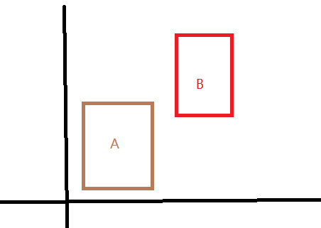
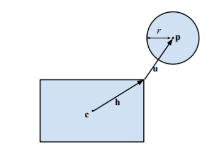
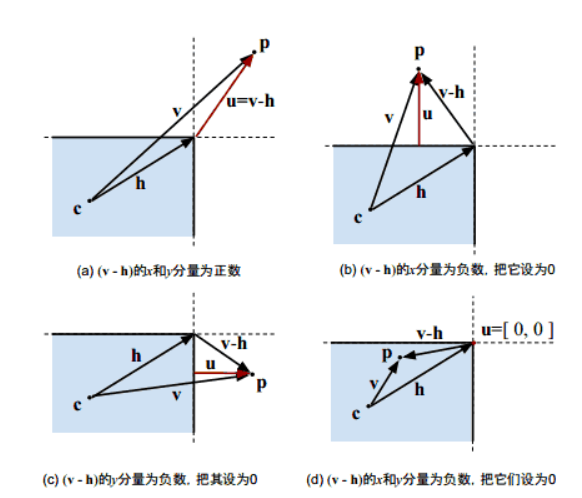

# 图形类

## 平面图形相交问题

### 直线相交

判断**斜率**

### 线段相交

**叉积**。取其中一条线段的某一个端点，向另一个端点做向量记为$p_1$，向另一线段的两个端点做向量记为$p_2$和$p_3$，那么$p_1$必定夹在$p_2$和$p_3$中间，即$p_1$叉积$p_2$的结果，与$p_1$叉积$p_3$的结果，符号相异。同理，再取另一线段的某一个端点，重复上述步骤，结果的符号也相异，那么就相交。

### 两个矩形相交

其中一个矩形的一个或者多个顶点，必然在另一个矩形内部，包括边界。

**AABB**：



在程序中做二维游戏的AABB碰撞检测时，只需验证物体A与物体B是否满足如下条件：

- 物体A的Y轴方向最小值大于物体B的Y轴方向最大值；

- 物体A的X轴方向最小值大于物体B的X轴方向最大值；

- 物体B的Y轴方向最小值大于物体A的Y轴方向最大值；

- 物体B的X轴方向最小值大于物体A的X轴方向最大值；

若满足上述一个条件，则证明物体A与物体B并未发生重合，反之，则证明物体A与物体B重合。

### 圆形和矩形相交

> [怎样判断平面上一个矩形和一个圆形是否有重叠？ - 知乎 (zhihu.com)](https://www.zhihu.com/question/24251545/answer/27184960)

设**c**为矩形中心，**h**为矩形半長，**p**为圆心，r为半径。



1. 将圆移动至第一象限

2. 求圆心至矩形的最短距离矢量$u$，减法出现负数分量后置为$0$

   

3. 最后要比较 **u** 和 半径*r* 的长度，若距离少于 *r*，则两者相交。可以只求 **u** 的长度平方是否小于 *r* 的平方。

```cpp
//                      c矩形中心(原点) h矩形半长    p圆形    r半径
bool BoxCircleIntersect(Vector2 c, Vector2 h, Vector2 p, float r){
    Vector2 v = abs(p - c);
    Vector2 u = max(v-h, 0);
    return dot(u, u) <= r * r;
}
```

## 点在多边形内外问题

### 点是否在矩形内

### 点是否在三角形内

- **面积法**

  $S=\sqrt{p(p-a)(p-b)(p-c)}$

  $p=1/2(a+b+c)$

- **叉积法**

### 点是否在凸多边形内部

多边形**化为三角形**