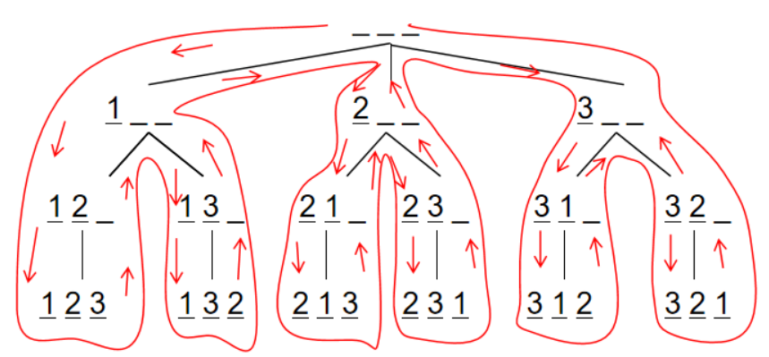
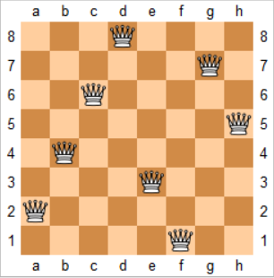

# 搜索与图论

| 序号 | BFS                                                          | DFS                                                          |
| ---- | ------------------------------------------------------------ | ------------------------------------------------------------ |
| 1    | BFS代表宽度优先搜索                                          | DFS代表深度优先搜索                                          |
| 2    | BFS（宽度优先搜索）使用**队列**数据结构来查找最短路径        | DFS（深度优先搜索）使用**栈**数据结构                        |
| 3    | BFS更适合搜索更接近给定源的顶点                              | 如果有**远离源**的解决方案，则DFS更适合                      |
| 4    | BFS首先考虑所有邻居，因此不适合用于游戏或拼图中的决策树。    | DFS更适用于游戏或拼图问题。我们做出决定，然后探索有关该决定的所有路径。如果这一决定带来获胜局面，我们将停止。 |
| 5    | 当使用邻接表时，BFS的时间复杂度为$O(V+E)$；当使用邻接矩阵时，BFS的时间复杂度为$O(V^2)$，其中$V$表示顶点，$E$表示边。 | 当使用邻接表时，DFS的时间复杂度也是$O(V+E)$，当使用邻接矩阵时，DFS的时间复杂度也是$O(V^2)$，其中$V$表示顶点，$E$表示边。 |

## DFS

- **stack**

- **回溯**：(恢复现场)，回到父节点

- **剪枝**：判断当前分支(子树)不合要求，不再继续`dfs`，剪掉此分支

### [练习 - 842. 排列数字(全排列)](https://www.acwing.com/problem/content/description/844/)

**题目**：给定一个整数$n$，将数字$1∼n$排成一排，将会有很多种排列方法。现在，请你按照字典序将所有的排列方法输出。

**解决办法**：



- 用`path`数组保存排列，当排列的长度为`n`时，是一种方案，输出。
- 用`state`状态数组表示数字是否用过。
- `dfs(i)`表示的含义是：在`path[i]`处填写数字，然后递归的在下一个位置填写数字。
- 回溯：第`i`个位置填写某个数字的所有情况都遍历后， 第`i`个位置填写下一个数字

```cpp
int q[N];       //保存序列
bool state[N];  //状态数组，记录是否当前序列是否已经占用某个数字
int n; 

//深搜，u代表树的第u层
void dfs(int u){
    if(u == n){     //当序列已满，输出
        for(int i = 0;i<n;i++)  cout << q[i] << ' ';
        cout << endl;
        return ;
    }
    //枚举
    for(int i=1;i<=n;i++){
        if(!state[i]){      //如果i未存入序列中
            q[u] = i;       
            state[i] = true;        
            dfs(u+1);       //递归深搜
            state[i] = false;   //恢复现场，取出i，回溯
        }
    }
}
int main(){
    cin >> n;
    dfs(0);
    return 0;
}
```

### [练习 - 843. n-皇后问题](https://www.acwing.com/problem/content/845/)

**题目**：$n$−皇后问题是指将$n$个皇后放在$n×n$的国际象棋棋盘上，使得皇后不能相互攻击到，即任意两个皇后都不能处于同一行、同一列或同一斜线上。现在给定整数$n$，请你输出所有的满足条件的棋子摆法。



**解决办法1**：(DFS按行枚举)，时间复杂度$O(n!)$

类似于**全排列**，但需要**剪枝**。$DFS$操作中**标记数组**记录了棋盘格的列、对角线、斜对角线是否被占用，按行枚举，占用以上标记数组的可以直接**剪枝**。

> 对角线`dg[u+i]`，反对角线`udg[n−u+i]`中的下标`u+i`和`n−u+i`表示的是截距

```cpp
//标记数组 列    对角线   斜对角线    
bool   col[N],  dg[N], udg[N];
char res[N][N]; //保存路径
void dfs(int u){
    //已经搜索了n行，打印
    if(u == n){
        for(int i=0;i<n;i++)    puts(res[i]);
        puts("");
        return ;
    }
    //按行搜索
    for(int i = 0; i<n;i++){
        // 剪枝(对于不满足要求的点，不再继续往下搜索) 
        //此列、对角线、斜对角线均未占用
        //斜对角线udg[n-u+i]中+n保证下标>0
        if(!col[i] && !dg[i+u] && !udg[n-u+i]){ 
            res[u][i] = 'Q';                    
            col[i] = dg[i+u] = udg[n-u+i] = true;
            dfs(u+1);
            //回溯 并 恢复现场
            col[i] = dg[i+u] = udg[n-u+i] = false;
            res[u][i] = '.';
        }
    }
}
int main(){
    cin >> n;
    for (int i = 0; i < n; i ++ )
        for (int j = 0; j < n; j ++ )
            res[i][j] = '.';
    dfs(0);
    return 0;
}
```

**解决办法2**：（DFS按每个元素枚举）时间复杂度$O(2^{n^2})$
**时间复杂度分析**：每个位置都有两种情况，总共有$n2$个位置

```cpp
char g[N][N];
bool row[N], col[N], dg[N], udg[N]; // 因为是一个个搜索，所以加了row
// s表示已经放上去的皇后个数
//x横坐标，y纵坐标
void dfs(int x, int y, int s)
{
    // 处理超出边界的情况
    if (y == n) y = 0, x ++ ;
    if (x == n) { // x==n说明已经枚举完n^2个位置了
        if (s == n) { // s==n说明成功放上去了n个皇后
            for (int i = 0; i < n; i ++ ) puts(g[i]);
            puts("");
        }
        return;
    }
    // 分支1：放皇后
    if (!row[x] && !col[y] && !dg[x + y] && !udg[x - y + n]) {
        g[x][y] = 'Q';
        row[x] = col[y] = dg[x + y] = udg[x - y + n] = true;
        dfs(x, y + 1, s + 1);
        row[x] = col[y] = dg[x + y] = udg[x - y + n] = false;
        g[x][y] = '.';
    }
    // 分支2：不放皇后
    dfs(x, y + 1, s);
}
int main() {
    cin >> n;
    for (int i = 0; i < n; i ++ )
        for (int j = 0; j < n; j ++ )
            g[i][j] = '.';

    dfs(0, 0, 0);

    return 0;
}
```

## BFS

> 利用**queue**，解决**最短路问题**

### [练习 - 844. 走迷宫](https://www.acwing.com/problem/content/846/)

**题目**：给定一个$n×m$的二维整数数组，用来表示一个迷宫，数组中只包含$0$或$1$，其中$0$表示可以走的路，$1$表示不可通过的墙壁。

最初，有一个人位于左上角$(1,1)$处，已知该人每次可以向上、下、左、右任意一个方向移动一个位置。

请问，该人从左上角移动至右下角$(n,m)$处，至少需要移动多少次。

数据保证$(1,1)$处和$(n,m)$处的数字为$0$，且一定至少存在一条通路。

**解决办法**：利用**队列**，每次枚举当前队首周围的所有元素并将，如果符合能够到达，则**距离+1**并且**入队**

```cpp
typedef pair<int,int> PII;
int n, m;
//迷宫数据   点到(0,0)最短距离
int g[N][N], d[N][N];

int bfs(){
    queue<PII> q;               //队列
    d[0][0] = 0, q.push({0,0}); //顶点入队
    
    int dx[4] = {-1, 0, 1, 0}, dy[4] = {0, 1, 0, -1};   //x点周围4个点的横纵坐标偏移量
    while(q.size()){
        auto t = q.front();     //操作队头元素，出队
        q.pop();                                        

        for (int i = 0; i < 4; i ++ ){      //枚举周围4个点
            int x = t.first + dx[i], y = t.second + dy[i];
            //      (x0,y0)紧挨的点(x,y)在迷宫范围内  (x,y)处有道路  (x,y)的最短距离未被计算
            if (x >= 0 && x < n && y >= 0 && y < m && g[x][y] == 0 && d[x][y] == -1){
                d[x][y] = d[t.first][t.second] + 1;     //求得最短距离
                q.push({x, y});                         //(x,y)入队
            }
        }
    } 
    return d[n-1][m-1];
}
int main(){
    cin >> n >> m;
    memset(d,-1,sizeof(d));     //最短距离置为-1
    
    for(int i=0;i<n;i++)
        for(int j=0;j<m;j++)    
            cin >> g[i][j];     
    cout << bfs();
    return 0;
}
```

## 树与图的存储

1:17:00

