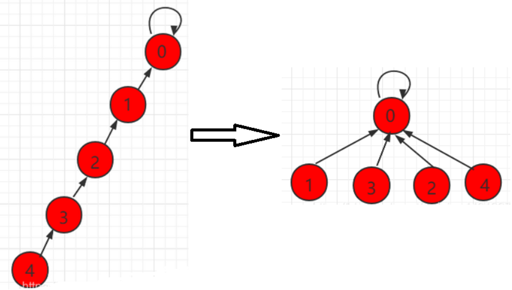

# 数据结构

## 单链表

> 笔试时多用数组模拟链表，因为动态链表的方法过慢.
>
> 使用数组进行链表操作时，删除节点会不会释放空间（笔试算法非工程项目无需考虑此多余空间）

```cpp
int head, e[N], ne[N], idx;
// 头指针  值    指针  索引
void init()     //初始化
{ 
    head = -1;   //头指针指向链尾
    idx = 0;    //索引为0
}
void add_to_head(int x)   // 在头指针后插入元素x
{
    e[idx] = x;             //先将下标为idx的节点中存入x的值
    ne[idx] = head;        //idx的指向头结点指向
    head = idx;             //头结点指向idx
    idx++;                  //索引自增
}
//将x插到下标是k的点的后面
void add(int k, int x)   
{  
    e[idx] = x;             //将下标为idx的节点中存入x
    ne[idx] = ne[k];       //idx节点中指针指向k节点所指向的节点
    ne[k] = idx;          //k节点指向idx节点
    idx++;                  //索引自增
}
//将下标是k的后面的点删掉
void remove(int k)          
{
    ne[k] = ne[ne[k]];  //k节点指向后面的后面节点
}
```

> **邻接表**：多用于存储图和树

## 双链表

> 多用来优化问题

```cpp
int l[N],r[N],a[N],idx;
// 0是左端点，1是右端点
r[0] = 1, l[1] = 0;
idx = 2;
// 在节点k的右边插入一个数x
void insert(int k, int x){
    a[idx] = x;
    l[idx] = k;
    r[idx] = r[k];
    l[r[k]] = idx;
    r[k] = idx;
    idx++;
}
//删除位置k的数
void del(int k){
    l[r[k]] = l[k];
    r[l[k]] = r[k];
}
```

## 栈

> 先进后出；数组模拟；

```cpp
//  栈      栈顶
int stk[N],idx = 0;

void push(int x){stk[++idx] = x;}
void pop(){idx--;}
bool empty(){
    if(idx <= 0) return true;
    else return false;
}
int query(){
    return stk[idx];
}
```

## 队列

```cpp
//  队列  队头 队尾
int q[N], hh = 0, tt = -1;

void push(int x){ q[++tt] = x; }

void pop(){ hh++; }

bool empty(){
    if(hh > tt) return true;
    else return false;
}

int query(){ return q[hh]; }
```

## 单调栈

> 栈中元素是单调的，解决特定问题

### [练习-830. 单调栈](https://www.acwing.com/problem/content/832/)

**题目**：给定一个长度为`N`的整数数列，输出每个数左边第一个比它小的数，如果不存在则输出 $-1$。

**主要思想**：设定一个**单调栈**，每次遍历只会添加比x小的数，或为空直接添加，保证栈的单调性；进而在栈中寻找一个比x小的数。

**时间复杂度**：每个元素**最多**进栈一次，出栈一次，所以算法时间复杂度$O(n)$

```cpp
const int N = 10010;
int stk[N], tt; //栈

int main(){
    int n, x;
    scanf("%d", &n);
    
    while(n--){
        scanf("%d", &x);
        //栈中存在大于x的数，则出栈寻找更小的（x左边比x小的第一个数）
        while(tt && stk[tt] >= x)   tt--;   	//如果删没了，说明没有更小的数了 
        if(tt)  printf("%d ", stk[tt]);
        else printf("-1 ");
        
        stk[++tt] = x;		//入栈的x肯定比x小，或者栈空直接添加
    }
    return 0;
}
```

## 单调队列

解决**滑动窗口**类问题

### [练习-154. 滑动窗口](https://www.acwing.com/problem/content/156/)

**题目**：给定一个大小为$n\leq 10^6$的数组。有一个大小为$k$的滑动窗口，它从数组的最左边移动到最右边。你只能在窗口中看到$k$个数字。每次滑动窗口向右移动一个位置。

确定滑动窗口位于每个位置时，窗口中的最大值和最小值。

**主要思想**：

- 保证**(双端)队列单调**
- **队列中数据都在窗口中**，满足单调性
- 将当前元素下标加入队尾
- 满足条件则输出结果

```cpp
//单调队列,存入的是a[N]的下标
//a[N]数据
int q[N], a[N];
//首，尾
int hh,tt;
int n, k;

int main(){
	...
    hh = 0, tt = -1;
    for(int i=0;i<n;i++){
        scanf("%d", &a[i]); 
        if(hh <= tt && i-k+1 > q[hh])   hh++;   //若队首出窗口，则队首hh++
        while(hh <= tt && a[q[tt]] >= a[i]) tt--;   //若队尾不单调，tt--
        q[++tt] = i;                            //存入队尾，且a[i]一定大于q[tt]
        
        if(i+1 >= k) printf("%d ", a[q[hh]]);	//输出最小
    }
   ...
}
```

## KMP

**字符串匹配算法**：设定短串**模板串为p[M]**，长串**模式串为s[N]**，在每次失配时，不是把p串往后移一位，而是把p串往后移动至下一次可以和前面部分匹配的位置，这样就可以跳过大多数的失配步骤。而每次p串移动的步数就是通过查找next[ ]数组确定的。


```cpp
cin >> m >> p+1 >> n >> s+1;

//求next[]数组
for(int i = 2, j = 0; i <= m; i++)
{
    //如果j有对应p串的元素， 且s[i] != p[j+1], 则失配， 移动p串
    //用while是由于移动后可能仍然失配，所以要继续移动直到匹配或整个p串移到后面（j = 0)
    while(j && p[i] != p[j+1]) j = ne[j];
    //当前元素匹配，j移向p串下一位
    if(p[i] == p[j+1]) j++;
    ne[i] = j;
}
//匹配操作
for(int i = 1, j = 0; i <= n; i++)
{
    while(j && s[i] != p[j+1]) j = ne[j];
    if(s[i] == p[j+1]) j++;
    if(j == m)  //满足匹配条件，打印开头下标, 从0开始
    {
        //匹配完成后的具体操作
        //如：输出以0开始的匹配子串的首字母下标
        //printf("%d ", i - m); (若从1开始，加1)
        j = ne[j];            //再次继续匹配
    }
}
```

## Trie树(字典树)

**`Trie`树**，又叫**字典树**、**前缀树（Prefix Tree）**、**单词查找树** 或 **键树**，是一种多叉树结构。

- 根节点不包含字符，除根节点外的每一个子节点都包含一个字符。
- 从根节点到**某一个节点**，路径上经过的字符连接起来，为该节点对应的字符串。
- 每个节点的所有子节点包含的字符互不相同。
- 通常在实现的时候，会在节点结构中设置一个**标志**，用来标记该结点处是否构成一个单词（关键字）。

> `Trie`树的核心思想是空间换时间，利用字符串的公共前缀来减少无谓的字符串比较以达到提高查询效率的目的。

```cpp
//数组模拟指针
int son[N][26]; //Tire树，因为最多26字母，所以数组纵列最多26
int count[N];   //计数
int idx = 0;        //指针
void insert(char* str){
    int q = 0;                              //根节点
    for(int i=0;str[i];i++){
        int u = str[i] - 'a';               //字符数字化
        if(!son[q][u])  son[q][u] = ++idx;  //节点为空，则置为idx
        q = son[q][u];                      //将q置为当前字符的节点指针
    }
    count[q]++;                             //此指针位置表示为一个字符串
}
//查询此字符串是否存在
int query(char* str){
    int q = 0;
    for(int i=0;str[i];i++){
        int u = str[i] - 'a';
        if(!son[q][u]) return 0;
        q = son[q][u];
    }
    return count[q];
}

```

### [练习-143. 最大异或对](https://www.acwing.com/activity/content/problem/content/884/)

## 并查集

并查集是一种**树型**的数据结构，用于处理一些**不相交集合的合并及查询**问题。
并查集的思想是用一个数组表示了整片森林（parent），树的根节点唯一标识了一个集合，我们只要找到了某个元素的的树根，就能确定它在哪个集合里。

每个集合用一棵树来表示，树根的编号就是整个集合的编号。每个节点存储它的父节点，p[x]表示x的父节点

- 判断树根： `p[x] == x`
- 如何求x的集合编号：`while( p[x] != x) x = p[x];`
- 如何合并两个集合：`p[x]`是`x`的集合编号，`p[y]`是`y`的集合编号，`p[x]  = y;`

并查集**路径优化**(路径压缩)：在搜索时，将一个集合的上的节点全部直接指向根节点，下次寻找只需要O(1)；



```cpp {5}
//返回x的祖先节点 + 路径压缩
int find(int x){
    //祖先节点的父节点是自己本身
    if(p[x] != x)    
        p[x] = find(p[x]);	//将x的父亲置为x的祖先，路径压缩
    return p[x];
}

int main(){
    scanf("%d%d",&n,&m);
    for(int i=1;i<=n;i++)	//初始化，让数x的父节点指向自己
        p[i] = i;
    while(m--){
        int a, b;
        char op[2];
        scanf("%s%d%d",op,&a,&b);
        
        if(op[0] == 'M')   p[find(a)] = find(b);	//将a的祖先节点置为b的祖先节点（合并集合）
        else{
             if(find(a) == find(b))   puts("Yes");
             else puts("No");
        }
    }
    return 0;
}
```

### [练习-837. 连通块中点的数量](https://www.acwing.com/problem/content/839/)

**题目**：给定一个包含$n$个点（编号为$1∼n$）的无向图，初始时图中没有边。

现在要进行$m$个操作，操作共有三种：

1. `C a b`，在点$a$和点$b$之间连一条边，$a$和$b$可能相等；
2. `Q1 a b`，询问点$a$和点$b$是否在同一个连通块中，$a$和$b$可能相等；
3. `Q2 a`，询问点$a$所在连通块中点的数量；

> 上述操作实际上是：将$a$,$b$合并为一个集合；判断是否为同一集合；求集合中元素数量。使用并查集

**解决办法**：[837. 连通块中点的数量 - 题解](https://www.acwing.com/activity/content/code/content/45295/)

## 堆

**完全二叉树**，每个节点的值都大于或等于其子节点的值，为**最大堆**；反之为**最小堆**。

**基本操作** (下标从1开始) ：

- `down(x)`：向下调整（如果是最大堆，堆顶元素$A$变小为$a$，需进行`down(1)`，将$a$移到合适位置）
- `up(x)`：向上调整

|      插入一个元素      |            heap[++size] = x; up(size);             |
| :--------------------: | :------------------------------------------------: |
| **求集合当中的最小值** |                    **heap[1];**                    |
|     **删除最小值**     |     **heap[1] = heap[size]; size--;down(1);**      |
|  **删除任意一个元素**  | **heap[k] = heap[size]; size--; down(k) / up(k);** |
|  **修改任意一个元素**  |         **heap[k] = x; down(k) / up(k);**          |

### 堆操作

#### 数组形式

```cpp
int h[N], cnt;    //堆数组，下标从1开始
int n, m;
//下降操作
void down(int u)
{
    int t = u;
    if(u*2 <= cnt && h[u*2] < h[t]) t = u*2;
    if(u*2+1 <= cnt && h[u*2+1] < h[t]) t = u*2+1;  //要最小的
    if(u!=t){
        swap(h[u],h[t]);
        down(t);
    }
}
void up(int u)
{
    while( u/2 && h[u/2] > h[u]){
        swap( h[u/2], h[u]);
        u /=2;
    }
}
// 删除最小值
void del(){
    h[1] = h[cnt];
    cnt --;
    down(1);
}

int main(){
    
    cin >> n >> m;
    cnt =  n;
    for(int i = 1; i <= n; i++) cin >> h[i];
    //建堆
    for(int i = n/2; i ; i--)   down(i);
    
    while(n--){
        cout << h[1] << " ";
        del();
    }
    return 0;
}
```

## 哈希表（散列表）

提供了**快速的插入操作**和**查找操作**，无论哈希表总中有多少条数据，插入和查找的时间复杂度都是为$O(1)$，因为哈希表的查找速度非常快，所以在很多程序中都有使用哈希表，例如拼音检查器。

**冲突解决办法：**

- **开放寻址法**

  在开放地址法中，若数据不能直接存放在哈希函数计算出来的数组下标时，就需要寻找其他位置来存放。在开放地址法中有三种方式来寻找其他的位置，分别是**「线性探测」**、**「二次探测」**、**「再哈希法」**

  - **线性探测**

    在线性探测哈希表中，数据的插入是线性的查找空白单元，例如我们将数88经过哈希函数后得到的数组下标是16，但是在数组下标为16的地方已经存在元素，那么就找17,17还存在元素就找18，一直往下找，直到找到空白地方存放元素。

    ```cpp
    //hash表范围N扩充为两倍大
    const int N = 200003, null = 0x3f3f3f3f;	
    //0x3f3f3f3f = 1061109567 10^9级别，一般场合下的数据都是小于10^9
    //可以作为无穷大使用而不致出现数据大于无穷大的情形
    int h[N];	
    int find(int x){
        int t = (x % N + N) % N;
        //线性探测
        while (h[t] != null && h[t] != x){
            t ++ ;
            if (t == N) t = 0;
        }
        return t;
    }
    
    int main(){
        memset(h, 0x3f, sizeof h);		//将h数组每个字节全置为0x3f，每个数4字节相当于0x3f3f3f3f
    
        int n;
        scanf("%d", &n);
    
        while (n -- ){
            char op[2];
            int x;
            scanf("%s%d", op, &x);
            if (*op == 'I') h[find(x)] = x;
            else{
                if (h[find(x)] == null) puts("No");
                else puts("Yes");
            }
        }
        return 0;
    }
    ```

  - **二次探测**

    次探测是防止聚集产生的一种尝试，思想是探测相隔较远的单元，而不是和原始位置相邻的单元。在线性探测中，如果哈希函数得到的原始下标是x,线性探测就是x+1,x+2,x+3......，以此类推，而在二次探测中，探测过程是x+1,x+4,x+9,x+16,x+25......,以此类推，到原始距离的步数平方

  - **再哈希法**

    > 双哈希的哈希表写起来来线性探测差不多，就是把探测步长通过**「关键字」**来生成

    双哈希是除了第一个哈希函数外再增加一个哈希函数用来根据关键字生成探测步长，这样即使第一个哈希函数映射到了数组的同一下标，但是探测步长不一样，这样就能够解决聚集的问题。

    第二个哈希函数必须具备如下特点

    - 和第一个哈希函数不一样
    - 不能输出为0，因为步长为0，每次探测都是指向同一个位置，将进入死循环，经过试验得出`stepSize = constant-(key%constant);`形式的哈希函数效果非常好，`constant`是一个质数并且小于数组容量

- **链表法**

  开放地址法中，通过在哈希表中再寻找一个空位解决冲突的问题，还有一种更加常用的办法是使用**「链表法」**来解决哈希冲突。**「链表法」**相对简单很多，**「链表法」**是每个数组对应一条链表。当某项关键字通过哈希后落到哈希表中的某个位置，把该条数据添加到链表中，其他同样映射到这个位置的数据项也只需要添加到链表中，并不需要在原始数组中寻找空位来存储。

  ```cpp
  const int N = 100003;		//取值 = 比数据大的第一个质数
  // hash表  链表数据  下一节点下标    指针
  int h[N],   e[N],    ne[N],      idx;
  //插入
  void insert(int x){
      //必须保证寻址为整数
      int k = (x % N + N) % N;
      //头插法
      e[idx] = x;
      ne[idx] = h[k];
      h[k] = idx ++ ;
  }
  
  bool find(int x){
      int k = (x % N + N) % N;
      //遍历k处链表
      for (int i = h[k]; i != -1; i = ne[i])
          if (e[i] == x)
              return true;
  
      return false;
  }
  ```
